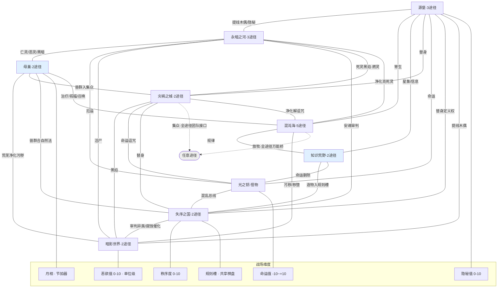

# 九大源质总览（22 途径 · 773 卡 · 跨系联动网络）

> 本文件是 9 份分系设定的**索引与收敛层**。分系细节见各自文件：\
>     《源堡系》《混沌海系》《永暗之河系》《灾祸之城系》《知识荒野系》《光之钥系》《母巢系》《失序之国系》《暗影世界系》技能设定。
>
> **依据**：《诡秘之主职业路径与能力对照表（修订版 v2）》。本总览已按 v2 的 12 条修订全部对齐（秘祈人→混沌海、战士→永暗之河、母巢旧日→根源之神、暗影世界旧日→恶魔之父等）。

---

## 0. 九系速览

| # | 源质 | 旧日 | 途径（卡数） | 卡数 | 本系新增核心机制 | 跨系线数 |
| --- | --- | --- | --- | --- | --- | --- |
| 1 | **源堡** | 诡秘之主 | 占卜家(34) 学徒(34) 偷盗者(37) | **105** | **隐秘值**（战场量表 0–10） | 7 |
| 2 | **混沌海** | 上帝 / 全知全能者 | 观众(36) 歌颂者(35) 阅读者(34) 水手(36) 秘祈人(33) | **174** | **放牧**（动态能力槽） | 7 |
| 3 | **永暗之河** | 永恒之暗 | 不眠者(34) 收尸人(35) 战士(33) | **102** | （隐秘值主消费方） | 7 |
| 4 | **灾祸之城** | 毁灭天灾 | 猎人(37) 刺客(36) | **73** | **集众**（全途径团队接口） | 7 |
| 5 | **知识荒野** | 知识之妖 / 疯狂奥秘 | 通识者(36) 窥秘人(38) | **74** | — | 5 |
| 6 | **光之钥** | 命运化身 | 怪物(35) | **35** | **命运值**（双极量表 −10↔+10） | 5 |
| 7 | **母巢** | 根源之神 | 药师(34) 耕种者(34) | **68** | **月相**（五相位节拍器） | 6 |
| 8 | **失序之国** | 失序者 / 秩序阴影 | 仲裁人(36) 律师(33) | **69** | **规则槽**（共享棋盘）+ **秩序度**（0–10） | 8 |
| 9 | **暗影世界** | 恶魔之父 · 异类之主 · 诅咒之源 | 囚犯(36) 罪犯(37) | **73** | **恶欲值**（单位量表 0–10）+ 诅咒链接网 + 异类谱系 | 6 |
|  |  |  |  | **773** |  | **58**（去重后 29 条边） |

---

## 1. 全局机制层：六种"咬合器"
改造前，跨途径只有一种咬合方式——**同一张卡放进两个池**（复刻，181 张 / 23.4%）。改造后引入了六种结构不同的咬合器：

| # | 咬合器 | 类型 | 作用范围 | 出处 | 强度 |
| --- | --- | --- | --- | --- | --- |
| ① | **隐秘值**（0–10） | 战场量表 | 全体 | 源堡 | ★★★★ 全 9 系可读写 |
| ② | **秩序度**（0–10） | 战场量表 | 全体 | 失序之国 | ★★★ 仲裁人推高 / 律师压低 |
| ③ | **命运值**（−10↔+10） | 战场量表（双极） | 全体 | 光之钥 | ★★★ 怪物专用，他人可触发 |
| ④ | **恶欲值**（0–10） | **单位**量表 | 每单位一条 | 暗影世界 | ★★★★ 罪犯产 / 囚犯消 / 律师拧 |
| ⑤ | **月相**（满/血/银/红/缺） | **节拍器** | 药师全场 | 母巢 | ★★ 本途径内串四轴 |
| ⑥ | **规则槽**（Rule Slots\[3\]） | **共享棋盘** | 全体 | 失序之国 | ★★★★★ 仲裁人写 / 律师改 |

**另有两个"万能接口"**：

| 接口 | 归属 | 语义 |
| --- | --- | --- |
| **放牧**（Grazing） | 秘祈人（混沌海） | 存储任意途径的灵魂 → 使用其能力。全局唯一"跨系借技能"机制 |
| **集众**（Gathering） | 猎人（灾祸之城） | 集中队伍力量/灵性 → 使用队友能力。全局唯一"团队资源池"机制 |

> 这两条是**兜底保险**：即便某两个系之间没有任何主题同源的共享状态，仍可通过放牧/集众产生联动。当前跨系网络覆盖率 29/36 = **80.5%**，剩余 7 条缺口（§4）正需要靠它们兜底。

---

## 2. 跨系联动矩阵（9×9）
行为「本系提供的联动」，列头为「受益系」。同格标注联动介质。

| ↓ 提供 \\ 受益 → | 源堡 | 混沌海 | 永暗之河 | 灾祸之城 | 知识荒野 | 光之钥 | 母巢 | 失序之国 | 暗影世界 |
| --- | --- | --- | --- | --- | --- | --- | --- | --- | --- |
| **源堡** | — | 寄生·血肉寄生 | **提线木偶**·灵体之线·**隐秘** | 替身 | 星象·信息修改 | 命运 | — | 替身 | **提线木偶** |
| **混沌海** | 寄生 | — | 净化·雷霆 克死灵 | 净化解诅咒 | 规律 | — | 治疗·祝福·召唤 | — | 污秽·秽堕 |
| **永暗之河** | 提线木偶·隐秘 | 死灵（被克制方） | — | — | — | 厄运 | 亡灵·恶灵·黑暗 | 安魂审判 | 活尸·亡灵 |
| **灾祸之城** | 替身 | 净化解诅咒 | 死灵黑焰·燃灵 | — | — | 命运诅咒 | 兽群入集众 | 替身 | 黑焰·地狱之火 |
| **知识荒野** | 星象·信息修改 | 规律 | — | — | 命运删除/信息改写 | — | 造物入规则槽 | — |  |
| **光之钥** | 命运 | — | 厄运 | 命运诅咒 | 命运删除/信息改写 | — | — | **混乱**总线 | — |
| **母巢** | — | 治疗·召唤 | 亡灵·恶灵·黑暗 | 兽群入集众 | — | — | — | 兽群合自然法 | 荒芜净化污秽 |
| **失序之国** | 替身（定义权） | 腐蚀·催化 | 安魂审判 | 替身（定义权） | 造物审判/豁免 | 混乱总线 | 兽群审判/豁免 | — | 审判异类·腐蚀催化 |
| **暗影世界** | 提线木偶 | 污秽·秽堕 | 活尸·亡灵 | 黑焰·地狱之火 | — | — | 污秽被净化·丰饶 | 恶欲值·异类抗辩 | — |

**度数排名**：失序之国 8 > 源堡 7 = 混沌海 7 = 永暗之河 7 = 灾祸之城 7 > 暗影世界 6 = 母巢 6 > 知识荒野 5 = 光之钥 5

---

## 3. 五个"多线枢纽"概念
有些状态被 **3 条以上途径共同读写**，它们是整个跨系网络的**承重墙**。改造前这些状态全都存在，但没有任何一张卡去读别人的——这就是原报告里"路通了没车跑"的病根。

| 枢纽 | 参与途径（跨源质数） | 当前已接通的"车" |
| --- | --- | --- |
| **提线木偶** | 占卜家（源堡）/ 收尸人（永暗之河）/ 囚犯（暗影世界）/ 战士 | 源堡↔永暗之河（双向卡）、源堡↔暗影世界（异种秘偶 / 双线同提） |
| **替身** | 占卜家（源堡）/ 刺客（灾祸之城）/ **律师（失序之国·定义权）**/ 囚犯（诅咒转嫁） | 三系共写；律师是唯一"裁判"——能重定义本体/替身身份 |
| **混乱** | 律师（失序之国）/ 怪物（光之钥）/ 仲裁人（审判对象） | 怪物产噪 → 律师导演；秩序度 ≤3 时双系加成 |
| **恶欲值** | 罪犯（暗影世界·产）/ 囚犯（暗影世界·消）/ 律师（腐蚀·拧高）/ 仲裁人（审判·惩罚） | 全局唯一**跨系供需闭环** |
| **命运** | 怪物（光之钥）/ 占卜家 / 偷盗者 / 刺客 | 怪物是"命运总线"，其余三条途径从两侧抽头 |

> **设计判断**：这五个枢纽应该被做成**一等公民状态**（在 `StatusDef` 里显式标注 `crossPathway: true` + 参与途径白名单），而不是散落在 22 个途径池里的同名字符串。这是落地时最该优先做的一件事。

---

## 4. 缺口清单：7 条未开发的边
当前跨系网络 29/36 条边（80.5%）。原两个**孤岛（知识荒野、母巢）已于本轮接入**（见 §4.1，各系 §6），剩余结构性缺口如下：

### 4.1 原两个孤岛（已接入 ✅）

> 本轮已通过各系 §6 实际接通，现各 4 条线，不再是孤岛。原提案如下，供追溯：

| 系 | 改造前 | 本轮接通的线（已在各系 §6 落地） |
| --- | --- | --- |
| **知识荒野** | 只有 2 条线（↔混沌海「规律」、↔源堡「星象/信息修改」） | ① **↔失序之国**（§6.4 / 失序 §6.6）：通识者「造物」入规则槽——律师可争豁免，仲裁人可审判违规造物。② **↔光之钥**（§6.5 / 光之钥 §4.5）：窥秘人用「信息删除」改写怪物预知的命运。 |
| **母巢** | 只有 2 条线（↔永暗之河、↔混沌海） | ① **↔暗影世界**（§6.4 / 暗影 §6.7）：耕种者「荒芜」净化罪犯「污秽」转丰饶。② **↔灾祸之城**（§6.5 / 灾祸 §6.4）：药师「兽群」入猎人「集众」池。 |

### 4.2 其余 7 条（低优先级，交放牧/集众兜底）

| # | 缺口边 | 主题可挖性 | 兜底方案 |
| --- | --- | --- | --- |
| 1 | 源堡 ↔ 母巢 | 弱（愚者 vs 母亲，无直接同源状态） | **放牧兜底**：源堡「秘祈人」纳管母巢兽群 |
| 2 | 知识荒野 ↔ 永暗之河 | 中（禁忌知识复刻亡灵法术、记录死灵） | 放牧兜底，或单独立项 |
| 3 | 知识荒野 ↔ 灾祸之城 | 中（法师解析黑焰原理 / 规律克诅咒） | 放牧兜底，或单独立项 |
| 4 | 知识荒野 ↔ 母巢 | 中（通识者记录、驯化兽群生物） | 放牧兜底 |
| 5 | 知识荒野 ↔ 暗影世界 | 中（信息删除湮灭污秽痕迹 / 窥秘暗影） | 放牧兜底 |
| 6 | 母巢 ↔ 光之钥 | 弱（丰收 vs 命运预知，无同源） | **集众 / 放牧兜底** |
| 10 | 光之钥 ↔ 暗影世界 | 中（命运改写污秽结局 / 预知暗影行动） | 放牧兜底 |

> 这 7 条不是必须补——29 条边已足够撑起"任意两支队伍都有至少一条联动线"的体感（覆盖率 80.5%）。已开发的 #7 母巢↔失序之国、#8 灾祸之城↔永暗之河、#9 灾祸之城↔混沌海 三条主题线见各系 §6。剩余 7 条缺口建议**优先靠 §1 的「放牧 / 集众」两个万能接口兜底**，不强行编主题线（避免稀释 flavor）。

---

## 5. 全局跨系网络图

> 浅蓝 = 原两个**孤岛**（知识荒野、母巢），已于本轮通过 §4.1 四条线接入网络，见各系 §6。

---

## 6. 落地路线图

### 第一批（结构性前提，必须最先做）

| # | 事项 | 影响面 |
| --- | --- | --- |
| 1 | 把 **5 个枢纽状态**（提线木偶/替身/混乱/恶欲值/命运）在 `StatusDef` 中标注为 `crossPathway: true` + 参与途径白名单 | 全 9 系 |
| 2 | 新增 **2 个战场量表**：`秩序度（0–10）`、`命运值（−10↔+10）`（与已有 `隐秘值` 同族） | 失序之国 / 光之钥 |
| 3 | 新增 **1 个单位量表**：`恶欲值（0–10）` | 暗影世界 + 失序之国 |
| 4 | 新增 **1 个共享棋盘**：`规则槽 Rules[3]`（退化为 3 个具名规则位亦可） | 失序之国 |

### 第二批（轴重建，解决"平铺"与"轴失衡"）

| # | 事项 | 影响面 |
| --- | --- | --- |
| 5 | **律师拆轴**：失序 18 张 → 析出「僭越」轴（扭曲/利用/放大/独享规则/重定义/定义·替身/阶层/独裁者），讼辩+贿腐 合并为「寻隙」。目标 4/4/7/18 → 8/6/8/11 | 失序之国 |
| 6 | **药师装节拍器**：全卡标注月相加成（银月配药 → 满月召唤治疗 → 血月收割） | 母巢 |
| 7 | **囚犯补两台引擎**：`诅咒链接` 改可堆叠网络（分摊系数 1+0.2×(N−1)）；`演出` 改形态回放栈 | 暗影世界 |
| 8 | **罪犯扶正刻印链**：明确「仪式刻印层数 → 恶魔强度/数量」映射 | 暗影世界 |

### 第三批（复刻卡改写，共 181 张 → 逐系展开）

| # | 事项 | 影响面 |
| --- | --- | --- |
| 9 | 按各系 §「复刻改 combo」表改写：暗影世界 19 张、失序之国 12 张、源堡/永暗之河/混沌海 等 | 全 9 系 |
| 10 | ✅ 补 **孤岛连线**：知识荒野↔失序之国 / 光之钥；母巢↔暗影世界 / 灾祸之城（§4.1，已写入各系 §6） | 4 条边 |
| 11 | 剩余 7 条缺口交给 **放牧 / 集众** 兜底，不强行编主题线（其中 #7 母巢↔失序之国、#8 灾祸之城↔永暗之河、#9 灾祸之城↔混沌海 已在本轮编为主题线，见各系 §6） | 全 9 系 |

---

## 7. 改造前后对照（全局口径）

| 指标 | 改造前 | 改造后 |
| --- | --- | --- |
| 跨途径"共享"卡 | 181 张（23.4%） | 181 张（**但 100% 改写为 combo，不再是复刻**） |
| 真实类型钩子卡 | 14 张（1.8%） | 每系 3–8 条跨组线，共 **29 条边 / 36 中可能（80.5%）** |
| 有自堆叠引擎的途径 | 9 / 22 | **22 / 22**（每系至少一台引擎：隐秘值 / 月相 / 规则槽 / 刻印链 / 诅咒网 / 谱系栈 等） |
| 跨系网络覆盖 | 0 条边（有状态无联动） | **29 / 36 = 80.5%** |
| 战场级属性维度 | 0 | **5 个**（隐秘值 / 秩序度 / 命运值 / 月相 / 规则槽）+ 1 个单位级（恶欲值） |
| 万能跨系接口 | 0 | **2 个**（放牧 / 集众） |

---

### 一句话总结
9 系 773 卡全部走完一遍：改造前「跨途径共享」181 张全是**复刻**、真实联动仅 14 张（1.8%）、22 条途径里只有 9 条有自堆叠引擎；改造后引入 **6 种咬合器**（隐秘值 / 秩序度 / 命运值 / 恶欲值 / 月相 / 规则槽）+ **2 个万能接口**（放牧 / 集众），跨系网络达到 **29 条边 / 80.5% 覆盖**，并沉淀出 **5 个多线枢纽状态**（提线木偶、替身、混乱、恶欲值、命运）；原两个孤岛（知识荒野、母巢）已于本轮通过四条线接入网络（见 §4.1 与各系 §6），**剩余 7 条缺口建议交给「放牧 / 集众」两个万能接口兜底**，不再强行编主题线。
