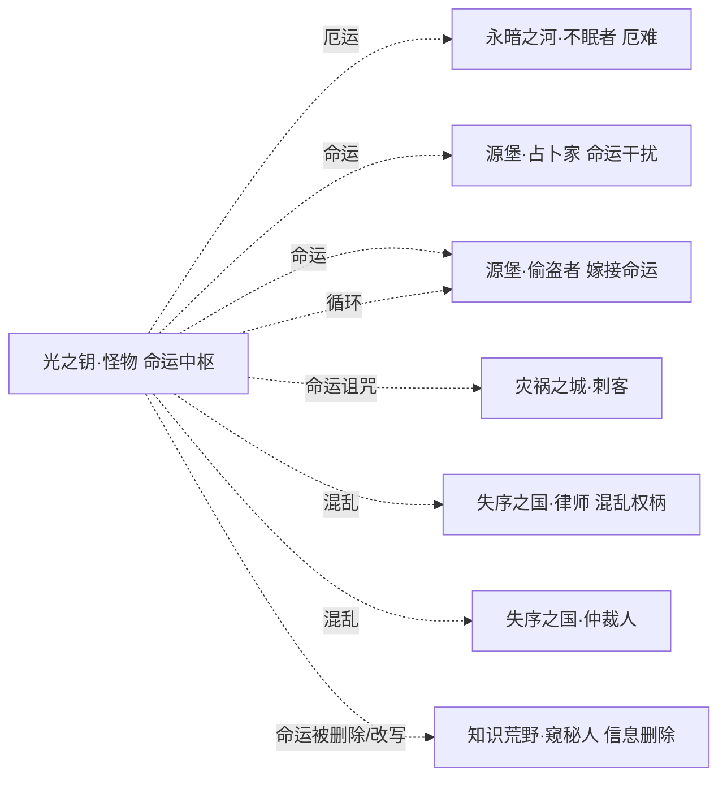

# 光之钥系技能设定（怪物）

> **依据**：《诡秘之主职业路径与能力对照表（修订版 v2）》\
>     **分组**：光之钥系 = **怪物(命运之轮)** 单一途径，对应源质「光之钥」，旧日=命运化身，核心象征：**命运、幸运、厄运、混乱、循环**。
>
> ⚠️ **本系特殊性**：光之钥是全 9 源质中**唯一的单途径源质**——怪物没有相邻途径，**不存在组内联动**。因此本设定的重心必须放在两处：
>
>
> 1. 途径内自洽：4 个轴之间要能自己咬合成闭环（幸运↔厄运互相转化、混乱↔循环互相触发）。
>
>
> 1. 跨系联动最大化：怪物必须靠「命运」这一跨四源质的共享概念接入全局联动网，否则会成为孤岛。
>
> 机制 DSL 沿用总设计稿（`挂载 / 若[ ] / 位移 / 伤害 / 全体敌人`），落地复用现有 `StatusDef`。

---

## 0. 现状与改造动因
本系与全局同源问题（详见《技能机制性分析报告》）：4 个「构筑轴」是内容标签而非机制钩子。

本系的**结构性风险最大**：单途径意味着没有组内 combo 兜底，如果「命运/幸运/厄运」没有做成可交互的状态，怪物会彻底孤立。但反过来，**「命运」恰恰是全 22 途径里跨源质覆盖最广的概念**：

| 途径 | 所属源质 | 命运相关能力 |
| --- | --- | --- |
| 占卜家 | 源堡 | 命运干扰、命运锚点权柄、奇迹师干扰目标命运 |
| 偷盗者 | 源堡 | 嫁接命运（互换短期未来）、命运木马 |
| 刺客 | 灾祸之城 | 命运诅咒（让目标接连遭遇灾难） |
| 不眠者 | 永暗之河 | 厄难（给予敌人厄运） |
| **怪物** | **光之钥** | **命运/概率/循环/混乱权柄——命运中枢** |

> 结论：怪物应被设计成\*\*「命运总线」\*\*——其他途径的命运类操作都读写同一组状态，怪物则是这组状态的放大器与调度器。这是单途径源质唯一的、也是最优的破局方式。

---

## 1. 设计原则

| # | 原则 | 说明 |
| --- | --- | --- |
| P1 | **轴=钩子，不是标签** | 每轴必须有 `enabler（挂载身份状态）→ payoff（读该状态放大）`，状态名即轴身份。 |
| P2 | **状态跨途径可读** | 本系命脉：让 `幸运/厄运/命运` 成为全局可读写的公共状态。 |
| P3 | **自洽闭环优先** | 单途径没有组内 combo，四轴之间必须能互相触发（幸运↔厄运、混乱↔循环）。 |
| P4 | **属性维度兜底** | 沿用「隐秘值」全局属性；本系另建议引入「命运值」作为 `幸运-厄运` 的双极量表。 |
| P5 | **序列 9→0 全覆盖** | 按 10 个序列铺技能，序列0 为终焉旗舰，承担「收束本轴」职责。 |

---

## 2. 光之钥系核心机制层

### 2.1 共享状态池（`StatusDef` 复用）

| 途径 | 四轴身份状态 |
| --- | --- |
| 怪物 monster | `幸运` / **`厄运`** / `混乱` / `循环` |

### 2.2 「命运值」双极量表（本系专属，建议新增）
除全局「隐秘值」外，建议为怪物引入一条 **-10（极厄）↔ +10（极幸）** 的双极量表，让幸运与厄运成为可双向转换的资源：

| 机制 | 说明 |
| --- | --- |
| **积累幸运** | 己方幸运事件 → 命运值 +1 |
| **施加厄运** | 给敌方挂厄运 → 命运值 -1（即从敌方「抽取」运气） |
| **互换** | 命运值可主动倾斜：牺牲自身幸运换敌方重厄，或反之救队友 |

> 这让「幸运/厄运」从随机被动变成**可管理资源**，直接解决原著中幸运者「无法主动控制、被动触发」的设计难题。

### 2.3 跨源质共享状态（本系命脉）

| 状态 | 共享范围 |
| --- | --- |
| `厄运` | 怪物 ↔ 不眠者（厄难骑士）↔ 刺客（命运诅咒） |
| `命运` | 怪物 ↔ 占卜家（命运干扰/锚点）↔ 偷盗者（嫁接命运）↔ 刺客 |
| `混乱` | 怪物（混乱权柄）↔ 律师（混乱权柄）↔ 仲裁人（一定混乱权柄） |
| `循环` | 怪物（循环/保存/选择）↔ 偷盗者（分身替换/重启） |

---

## 3. 怪物途径（序列0：命运之轮）
**定位**：命运的化身，既是好运也是厄运，更擅长预知；操控概率、循环与混乱。\
  **相邻**：无（单途径源质）

### 3.1 四构筑轴

| 轴 | 身份状态 | enabler | payoff | 旗舰卡 |
| --- | --- | --- | --- | --- |
| ① **幸运** | `幸运` | 幸运事件 / 赐福 → 累积 `幸运` | 若\[幸运≥N\] 化解致命危机；消耗运气为友方赐福 | **赢家** |
| ② **厄运** ★核心 | `厄运` | 厄运领域 / 厄运诅咒 → 对敌挂 `厄运` | 若\[厄运\] 目标判定恶化、接连遭遇灾祸 | **厄运法师** |
| ③ **混乱** | `混乱` | 混乱（让既定命运重新混乱）→ 挂 `混乱` | 若\[混乱\] 目标既定命运/行动序列被打乱 | 混乱行者 |
| ④ **循环** | `循环` | 重启循环 / 命运循环 → 挂 `循环` | 若\[循环\] 重启区域内状态、目标陷入时间循环 | 水银之蛇 |

### 3.2 序列 → 技能映射

| 序列 | 名称 | 原著能力 | 卡牌机制 | 轴 |
| --- | --- | --- | --- | --- |
| 9 | 怪物 | 灵感超高、偶尔窥见未来画面、对危险有敏锐直觉预感 | `命运值 +1（幸运侧）；危险预感：揭示敌方意图` | 幸运 |
| 8 | 机器 | 恐怖计算能力和精准控制力、素质增强、占卜和反占卜 | `若[命运值] 精准控制：暴击/命中可控；反占卜` | 幸运 |
| 7 | 幸运者 | 日常幸运事件被动触发（有高低起伏） | `被动：随机触发幸运事件（命运值波动）` | 幸运 |
| 6 | 灾祸教士 | 被动遭遇灾祸但可预见准备、主动引发灾祸波及敌人、自身靠幸运规避、精神风暴 | `主动引发灾祸→敌；自身靠 幸运 规避；精神风暴` | 厄运 |
| 5 | **赢家** | 掌控自身幸运（积累幸运化解致命危机）、超强预感、有限给予敌人厄运 | `若[幸运≥N] 消耗幸运化解致命危机；有限给予 厄运` | 幸运(旗舰) |
| 4 | **厄运法师** | 厄运领域（进入范围自然染厄运）、赐福（消耗运气祝福）、厄运诅咒、精神风暴质变、水银之躯、绝对灵感 | `领域：范围内目标自动挂 厄运；赐福：消耗运气给友方增益` | 厄运(旗舰) |
| 3 | 混乱行者 | 混乱（让既定命运重新混乱）、命运看守者、精神洗礼 | `挂载 混乱→目标：其既定行动/命运被打乱；精神洗礼（洁净）` | 混乱 |
| 2 | 先知 | 命运权柄（好运/厄运/预知）、福祸之言（30公里给予好运或厄运）、命运启示、预言术、水银之躯（10秒不被命中） | `福祸之言：范围给予 幸运 或 厄运；水银之躯：10秒必不被命中` | 厄运/幸运 |
| 1 | 水银之蛇 | 循环权柄（保存/选择）、重启循环（逆转胚胎洗掉疯狂）、命运循环（时间循环往复）、重启区域状态 | `挂载 循环→目标/区域：陷入时间循环；重启区域状态（非逆转时光）` | 循环 |
| 0 | **命运之轮** | 命运/概率/循环/混乱权柄；万事皆可概率化；保存（复刻命运片段替换）+选择（选定命运支流） | `旗舰：万事皆可概率化（强制判定）；保存/选择命运支流` | 终焉 |

**核心 combo 链（自洽闭环）**：怪物(幸运累积) → 机器(精准控制) → 灾祸教士(引灾+自身规避) → 赢家(消耗幸运免死) → 厄运法师(厄运领域) → 混乱行者(打乱命运) → 先知(福祸之言双向) → 水银之蛇(循环重启) → 命运之轮(概率强制)。

> **四轴自洽的关键**：`幸运` 与 `厄运` 通过「命运值」双向转换（赐福消耗幸运、施加厄运抽取运气）；`混乱` 打乱既定命运后，`循环` 可把混乱的状态重启回某一「保存」的命运片段——四轴形成「积累→施加→打乱→重启」的完整闭环，无需组内第二途径。

---

## 4. 跨组联动（本系生命线）
单途径源质没有组内 combo，跨系联动就是唯一出路。四条实线：

### 4.1 怪物 ↔ 永暗之河 —— 「厄运」同源（⇄ 不眠者 厄难骑士）

| 跨组卡 | 归属 | 机制 |
| --- | --- | --- |
| **厄难共鸣** | 怪物 | `若[友方 不眠者 已挂 厄运/厄难] → 我的厄运诅咒直接继承其层数，且持续时间翻倍` |
| **厄运领域·改** | 怪物 | `领域内的 厄运 每回合 +1 层；若目标带 亡灵，则厄运转为「必遭反噬」` |

### 4.2 怪物 ↔ 源堡 —— 「命运」中枢（⇄ 占卜家 命运干扰 / 偷盗者 嫁接命运）

| 跨组卡 | 归属 | 机制 |
| --- | --- | --- |
| **命运干扰·改** | 占卜家（对方视角） | `若[友方 怪物 已挂 厄运] → 命运干扰可直接改写该厄运的目标对象` |
| **嫁接命运·改** | 偷盗者（对方视角） | `与怪物交换命运值：把自身厄运转嫁给怪物（怪物靠幸运池吸收），换取短期好运` |
| **命运锚点** | 占卜家（对方视角） | 为怪物固定一条命运支流，使其 `循环` 重启时必回到该支流（稳定 combo） |

### 4.3 怪物 ↔ 灾祸之城 —— 「命运诅咒」同源（⇄ 刺客）

| 跨组卡 | 归属 | 机制 |
| --- | --- | --- |
| **命运诅咒·改** | 刺客（对方视角） | `若[友方 怪物 已挂 厄运] → 我的命运诅咒借用其厄运层数，目标接连遭遇灾难` |

### 4.4 怪物 ↔ 失序之国 —— 「混乱」同源（⇄ 律师 混乱权柄 / 仲裁人）

| 跨组卡 | 归属 | 机制 |
| --- | --- | --- |
| **熵之加速** | 律师（对方视角） | `若[友方 怪物 已挂 混乱] → 战斗越久，敌人能力/思维/状态混乱速度翻倍` |
| **混乱审判** | 仲裁人（对方视角） | 对带 `混乱` 的目标，审判之剑直接判定为「混乱之物」并加重审判 |

---

### 4.5 怪物 ↔ 知识荒野 —— 「命运」被「信息删除」改写（⇄ 窥秘人）
对应知识荒野系 §6.5。怪物预知到的未来命运，是「命运总线」上唯一能被反向编辑的节点：窥秘人用既有的「删除/修改信息」能力直接改写它——原著里窥秘人能抹除信息痕迹，此处落到机制上就是"预知到的命运可被删除"。

| 跨组卡 | 归属 | 机制 |
| --- | --- | --- |
| **命运删除** | 窥秘人（对方视角） | `若[友方 怪物 已挂 命运/预知] → 我可删除该预知结果，使敌人对其未来一无所知` |
| **篡改未来·改** | 窥秘人（对方视角） | `若[友方 怪物 命运值 ≥ +5] → 直接改写其预知的"有利结局"为对我方有利` |

---

## 5. 落地清单（不动内核）

1. 复用 `StatusDef`：`幸运/厄运/混乱/循环` 走全局状态目录，且必须保证与不眠者、占卜家、偷盗者、刺客、律师读写同一状态名。

1. 新增「命运值」双极量表：-10↔+10，作为怪物专属资源（也可用 `幸运`/`厄运` 两层合成，避免新增属性）。

1. 把怪物定位为「命运总线」：凡涉及命运类状态（厄运/命运/混乱/循环）的卡，都应能读写怪物已挂载的层数——这是单途径源质接入全局的唯一方式，建议在设计规范里写死。

1. 表达层外显：卡面标「跨组联动：可被友方不眠者/占卜家/刺客/律师继承」；HUD 显示命运值进度条。

---

### 一句话总结
光之钥系是全 9 源质中唯一的单途径源质，怪物没有相邻途径，因此本设定用**四轴自洽闭环**（幸运↔厄运经「命运值」双向转换、混乱→循环重启）保证途径内可玩，并把怪物定位为\*\*「命运总线」\*\*——让 `厄运/命运/混乱/循环` 成为跨永暗之河、源堡、灾祸之城、失序之国四系可读写的公共状态，使其从孤岛变成全局联动的枢纽。
