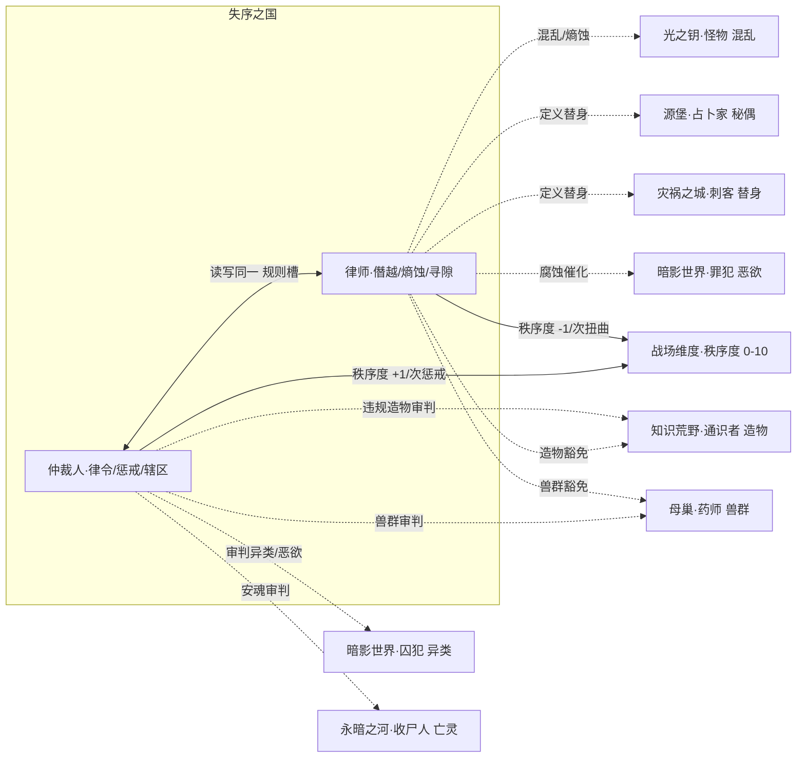

# 失序之国系技能设定（仲裁人 · 律师）

> **依据**：《诡秘之主职业路径与能力对照表（修订版 v2）》§失序之国系\
>     **分组**：失序之国系 = **仲裁人(审判者) / 律师(黑皇帝)** 两条途径，同属源质「失序之国」，旧日：**失序者 / 秩序阴影**。核心象征：**秩序、混乱、审判、规则**。两途径互为唯一相邻。
>
> 机制 DSL 沿用总设计稿（`挂载 / 若[ ] / 位移 / 伤害 / 全体敌人`），落地复用现有 `StatusDef`。「隐秘值」定义见《源堡系技能设定》§2.2。

---

## 0. 现状与改造动因

### 0.1 扫描数据

| 途径 | 卡数 | 轴分布 | 跨途径共享 |
| --- | --- | --- | --- |
| 仲裁人 arbiter | 36 | 辖区 7 / 惩戒 8 / 审讯 8 / **律令 13** | 5 张 → lawyer |
| 律师 lawyer | 33 | 讼辩 4 / 蛮力 4 / 贿腐 7 / **失序 18** | 7 张 → arbiter |

### 0.2 三个真问题
**问题一：律师的「失序」轴吞并了整条途径。** 18/33 = 55% 的卡挤在一个轴里，而讼辩(4)、蛮力(4)、贿腐(7) 三条轴做完低序列就被丢弃。玩家从序列5 开始基本只在玩一个轴——这是全 9 系里**轴分布最失衡**的一条途径。更糟的是，`定义·替身`（序列1 弑序亲王的招牌能力：重新定义什么是"替身"什么是"本体"，让本体瞬间变替身）被埋在失序轴第 18 张里，完全是废牌。

**问题二：12 张共享卡 100% 是复刻。** 仲裁人 →律师：屈服 / 过目不忘 / 察觉异常 / 禁止 / 震慑；律师→仲裁人：诡辩 / 薄弱处 / 贿赂·魅惑 / 贿赂·削弱 / 混乱 / 上位者·威严 / 熵。没有一张是「若友方律师在场，我则……」。而失序之国是 9 系里**唯一一对同硬币两面的途径**（秩序 vs 混乱），机制张力素材最好，却零咬合——这是最可惜的一处浪费。

**问题三：内核里唯一一个「可编程触发器」没被用起来。** 现有 `律令（规则）` 状态带「次数」参数（`挂载 律令（规则）（6t） 次数2`），语义是"立下规则，违背则触发"。这是整个封闭集里**唯一一个能表达「if-then 战场法」的构造**。但目前它只被当成"一个带次数的 debuff"在用，违背条件写死在卡面里，没有任何一张卡去**读、改、或抢**场上已存在的规则。

### 0.3 改造方向
把「律令」从**一张卡的效果**升级为**一块战场级公共棋盘**——**规则槽（Rule Slots）**：

> **仲裁人往槽里写规则，律师改槽里的规则。**\
>     两条途径第一次共享同一块可读写物件，而不是各挂各的 debuff。

这一改动同时解决上述三个问题：律令有了承载结构（不再是第 13 张同构卡）；两途径有了真实咬合；`定义·替身` / `重定义` / `独享规则` / `独裁者` 这批被埋掉的牌全部升格为**棋盘操作权**，成为律师新核心轴的旗舰。

---

## 1. 设计原则

| # | 原则 | 说明 |
| --- | --- | --- |
| P1 | **轴=钩子，不是标签** | 每轴必须有 `enabler（挂载身份状态）→ payoff（读该状态放大）`，状态名即轴身份。律师必须砍掉「失序」的臃肿，重建第四条轴。 |
| P2 | **共享棋盘优先于共享状态** | 本系不靠"你挂个状态我读一下"联动，而靠"我们操作同一个规则槽"联动——比状态共享更强耦合。 |
| P3 | **复刻改 combo** | 12 张复刻卡全部改写为「读取对方已建立的规则/标记后我才获得 Y」。 |
| P4 | **属性维度兜底** | 引入战场级 **秩序度 Order（0–10）**，与「隐秘值」同族，作为本系专属的第三根战场量表。 |
| P5 | **序列 9→0 全覆盖** | 每条途径按 10 个序列铺技能，序列0 为终焉旗舰，承担「收束本轴」职责。 |

---

## 2. 失序之国系核心机制层

### 2.1 四轴身份状态（`StatusDef` 复用）

| 途径 | 四轴身份状态 |
| --- | --- |
| 仲裁人 arbiter | `辖区` / `惩戒` / `过目标记` / **`律令（规则）`** ★ |
| 律师 lawyer | `寻隙` / `蛮力` / `熵蚀` / **`僭越`** ★（新） |

> **律师轴的重建**：原「失序」18 张拆解——`混乱/熵/狂乱` 留在 ③**熵蚀**轴；`扭曲/利用/定义/阶层/独裁` 全部析出为 ④**僭越**轴（对规则本身的夺取权）。`讼辩 + 贿腐` 合并为 ①**寻隙**轴（话术与交易，原本 11 张散卡现在有统一身份）。

### 2.2 【核心新机制】规则槽（Rule Slots）
战场维护一个公共的 **规则槽数组**（上限 3 位），任一方都可读写：

<Code id="V2kgQBD9aHQtWzPYtJFIuw">
  ```
  规则槽[i] = { 违背条件 trigger, 惩戒 punishment, 豁免列表 exemptions }
  ```
</Code>
| 操作 | 归属 | 语义 |
| --- | --- | --- |
| **立规** | 仲裁人 | 写入一条规则到空槽（原 `立规` / `禁制追击` / `律令·神秘减弱，现实增强` / `秩序领域`） |
| **惩戒** | 仲裁人 | 任一单位触发 `违背条件` → 自动执行 `惩戒`（原 `惩戒` / `禁制追击` / `审判`） |
| **扭曲** | 律师 | 修改已存在槽位的 `违背条件`（原 `扭曲` / `扭曲秩序`） |
| **利用** | 律师 | 把某条规则的 `惩戒` 转向/加倍（原 `利用` / `放大`） |
| **独享规则** | 律师 | 把自己加入 `豁免列表`（原 `独享规则`）——同一条规则，只打敌人不打我 |
| **重定义** | 律师 | 重定义槽位的**对象**：把「全体」改写成「友方律师侧除外」（原 `重定义`） |
| **定义·替身** | 律师 | 把某单位的"本体/替身"身份重定义 → 规则作用目标瞬间互换（原 `定义·替身`）★ |
| **秩序崩坏** | 律师 | 清空/打乱全部槽位并重排（原 `秩序崩坏`：重排行动条 + 重排状态） |
| **废止 / 底层规则** | 仲裁人 | 清场重写（原 `废止` / `底层规则`） |

> 仲裁人 = **立法者**（造法、执法）；律师 = **法律掮客**（不废法，而是让法为自己服务）。\
>     两途径的强度都取决于**槽里有几条规则**——仲裁人希望槽满且严苛，律师希望槽满且被自己改写。**利益一致在"槽要满"，利益冲突在"归谁解释"**。这就是组内咬合的发动机。

**示例 combo（改后）**：

<Code id="bRyhBreSB7GgE2YMLq3SVm">
  ```
  仲裁人 立规「禁止施法」          → 槽[0] = {trigger:施法, punish:伤害2（精神）, exempt:[]}
  律师   扭曲「禁止施法」→「禁止位移」→ 槽[0].trigger = 位移    （此时仲裁人的追猎链被打乱）
  律师   独享规则                  → 槽[0].exempt += 律师
  仲裁人 惩戒                      → 所有位移过的敌人（律师除外）吃伤害
  ```
</Code>原本四张互不相关的卡，现在是一次**三方博弈**。

### 2.3 【属性维度】秩序度 Order（0–10）
战场级量表，与「隐秘值」同族，初始 5：

| 秩序度 | 阈值效果 |
| --- | --- |
| **≥7 铁序** | 所有 `律令` 惩戒伤害 +50%；律师 `扭曲/重定义` 的成功判定 −30% |
| **≤3 失序** | 所有 `混乱` 类状态持续 +1 tick；`熵蚀` 每回合自动 +1 层；仲裁人 `辖区` 区域效果 −30% |
| **=10 / =0** | 进入终局态：`底层规则`（仲裁人）/ `秩序崩坏`（律师）才可用的门槛 |

- 仲裁人侧：每次成功惩戒 +1，立规 +1。

- 律师侧：每次扭曲/利用成功 −1，`熵蚀` 每层 −0.5。

- 这是本系与全局的接口：隐秘值（源堡）、秩序度（失序之国）、命运值（光之钥）构成「战场量表族」，月相（母巢）属于「节拍器族」。

### 2.4 共享状态（跨源质）

| 状态 | 共享范围 | 性质 |
| --- | --- | --- |
| `混乱` | 律师 ↔ **怪物（光之钥）** | 同名同族，跨源质总线（§6.1） |
| `替身` | 律师 `定义·替身` ↔ 占卜家 `拟态/秘偶` ↔ 刺客 `替身` | 三系共写（§6.2） |
| `枷锁` | 仲裁人 ↔ 全局 7 条途径 | 已是全局状态，本系是主要产出方之一 |
| `恶欲 / 堕落` | 律师 `腐蚀` ↔ 罪犯（暗影世界） | 跨源质，见 §6.4 |
| `异类` | 仲裁人 `察觉异常` 的克制对象 ↔ 囚犯（暗影世界） | 跨源质，见 §6.3 |

---

## 3. 仲裁人途径（序列0：审判者）
**定位**：秩序的立法者与执法者。铺开辖区、标记目标、立下规则、审判违背者。\
  **相邻**：律师（唯一）

### 3.1 四构筑轴

| 轴 | 身份状态 | enabler | payoff | 旗舰卡 |
| --- | --- | --- | --- | --- |
| ① **辖区** | `辖区` | 展开 zone\_jurisdiction（Ⅰ/Ⅱ/Ⅲ 档）→ 挂 `辖区` | 区域内己方加成、敌方减速；辖区档位越高惩戒越强 | **辖区** |
| ② **惩戒** | `惩戒` | 选定惩戒目标 → 挂 `惩戒` | 对该目标攻击增幅；违背规则时以必定命中姿态攻击 | **惩戒 / 审判之剑** |
| ③ **审讯** | `过目标记` | 过目不忘 / 察觉异常 → 挂 `过目标记` | 破隐匿、优先选敌、追猎标记；所有 `惩戒` 只对被标记目标生效（改后） | **过目不忘 / 混乱感应** |
| ④ **律令** ★核心 | `律令（规则）` | 立规 → 写入规则槽 | 违背触发惩戒；槽位数量决定审判强度 | **立规 / 底层规则** |

> **关键改动**：③ 审讯从「几张侦查卡」变成 ②④ 的**前置闸门**——`惩戒` 与 `律令` 的额外效果一律要求「目标带 `过目标记`」。原本审讯轴是纯辅助废轴，现在成为必过节点。

### 3.2 序列 → 技能映射

| 序列 | 名称 | 原著能力 | 卡牌机制 | 轴 |
| --- | --- | --- | --- | --- |
| 9 | 仲裁人 | 让人信服的魅力与权威；出色格斗；让冲突方不自觉屈服 | `挂载 过目标记 →全体敌人（弱）；攻击 +-1 →全体敌人；屈服（retarget）` | 审讯 |
| 8 | 治安官 | 见过就记住；「辖区」指定区域获超凡实力与环境帮助；察觉不正常、邪恶、混乱 | `展开 辖区（Ⅰ档）；挂载 察觉异常 →自身` | 辖区 |
| 7 | 审讯者 | 精通武器、爆破；精神刺穿（5米内穿刺灵体）；痛苦之鞭 | `若[目标有 过目标记] 则（伤害 4（精神） 穿透灵体）；痛苦之鞭：驱散 buff → 沉默` | 审讯 |
| 6 | 法官 | 权威质变，能影响环境；禁止/囚禁/禁闭/鞭打/流放/死亡/守秘 | `写入 规则槽[空位]（trigger 由卡面选）；挂载 权威质变 →自身` | 律令 |
| 5 | **惩戒骑士** | 「惩戒」选定目标增强对其攻击；「禁止」叠加：违背规则时必定命中 | `挂载 惩戒；若[目标违背规则槽]则（必定命中 + 伤害增幅）` | 惩戒(旗舰) |
| 4 | **律令法师** | 「律令」制定宽泛限制维持30秒~一刻钟；神秘减弱现实增强；剥夺/禁锢/震慑/放逐/处决 | `写入 规则槽（宽泛型：神秘减弱·现实增强 → 全体敌人 耗能加重/攻击-3，全体友军 护甲+3）` | 律令(旗舰) |
| 3 | 混乱猎手 | 部分审判权柄：审判之剑对**混乱**之物直接审判；感应/锁定/追踪混乱并平息；分割战场 | `挂载 追猎标记；若[目标有 混乱/熵蚀/异类/恶欲]则（审判之剑 伤害 ×1.5 且必定命中）` | 惩戒/审讯 |
| 2 | **平衡者** | 部分平衡权柄：分割战场保证实力平衡；单对单强制拉平（五五开）；感应不平衡发现隐秘 | `挂载 分割；若[双方属性差 > 阈值]则（攻击/防御/护甲/行动条速率 = 拉平）` | 辖区 |
| 1 | 秩序之手 | 部分秩序权柄：为战场/城市/国度制定新规则；修改或暂时去除原有规则（非底层）；中止混乱奇异 | `重写 规则槽 任一槽位；废止：驱散界域 → 展开 edict_seal` | 律令 |
| 0 | **审判者** | 秩序权柄（改底层规则/赋予豁免）、审判权柄（违背秩序者皆可审判，世界意志加持）、平衡权柄（含理智与疯狂的平衡）、一定混乱权柄 | `旗舰：展开 order_bedrock；若[规则槽已满3]则（审判：驱散 buff → 重复按状态次 伤害）；强制平衡 →全体单位` | 终焉 |

**核心 combo 链**：

<Code id="E9bgWuo4lKeCIHUGhkoz41">
  ```
  过目标记（审讯·闸门）
     ↓
  立规 → 规则槽写入（律令）
     ↓
  敌方违背 → 惩戒自动触发 → 秩序度 +1（惩戒）
     ↓
  秩序度 ≥7 → 铁序：惩戒伤害 +50%
     ↓
  审判之剑（对混乱/异类/恶欲 ×1.5）→ 审判（终焉，按状态数重复伤害）
  ```
</Code>
> **与律师的咬合点**：仲裁人希望槽满且敌人频繁违背；律师会去改 `trigger` 让敌人**更容易违背**（帮仲裁人刷秩序度），同时把自己塞进 `exempt`（自己免疫）。**两个人玩同一套规则，收益方向一致，收益归属冲突**——这就是失序之国该有的组内张力。

---

## 4. 律师途径（序列0：黑皇帝）
**定位**：混乱的导演与规则的僭越者。不立法，而是夺取、扭曲、利用既有规则。\
  **相邻**：仲裁人（唯一）

### 4.1 四构筑轴（重建后）

| 轴 | 身份状态 | enabler | payoff | 旗舰卡 |
| --- | --- | --- | --- | --- |
| ① **寻隙** | `寻隙` | 诡辩 / 薄弱处 / 贿赂(削/魅/狂/关联) → 挂 `寻隙` 系列 | 对手每带一个 debuff 我的伤害递增；赠予/回扣反哺能量 | **薄弱处 / 腐化回扣** |
| ② **蛮力** | `蛮力` | 野蛮体魄 / 力量解决 / 冲撞 → 挂 `蛮力` | 生命上限/护甲/双抗堆叠；「不能靠法律的就用力量解决」 | **力量解决** |
| ③ **熵蚀** | `熵蚀` | 混乱 / 熵 / 狂乱 → 挂 `熵蚀` 叠层 | 战斗越久敌人能力/思维/状态越随机；层数越高自身越强 | **熵 / 狂乱适应** |
| ④ **僭越** ★新核心 | `僭越` | 扭曲 / 利用 / 放大 / 独享规则 / 阶层 / 重定义 / 定义·替身 → 操作规则槽 | **改写场上已存在的规则**（改 trigger / 转 punish / 加 exempt / 换对象） | **定义·替身 / 独裁者** |

> ④ 是本次重建的关键。原本被埋在「失序」18 张里的五张神卡（`扭曲`、`利用`、`独享规则`、`重定义`、`定义·替身`）现在有了共同身份：**棋盘操作权**。它们不再是"又一个 debuff"，而是**唯一能改仲裁人写下的规则的东西**。

### 4.2 序列 → 技能映射

| 序列 | 名称 | 原著能力 | 卡牌机制 | 轴 |
| --- | --- | --- | --- | --- |
| 9 | 律师 | 出色口才思辨，扭曲/引导目标思维；擅长发现利用规则漏洞与对手薄弱处 | `挂载 寻隙 →自身；若[目标带 ≥1 个 debuff]则（伤害递增）` | 寻隙 |
| 8 | 野蛮人 | 可怕力量体魄与抵抗；不能靠法律的就用力量解决 | `挂载 蛮力 →自身（生命上限+10/护甲+3/双抗+10）；伤害 6（物理）` | 蛮力 |
| 7 | 贿赂者 | 贿赂四种：削弱 / 魅惑 / 狂妄 / 关联 | `挂载 狂妄 / 魅惑 / 关联 / 攻击-3（4t）` | 寻隙 |
| 6 | 腐化男爵 | 「扭曲」扭曲语言/行动/意图含义构建有利秩序；「腐蚀」10米内人心阴暗贪婪做出不理智选择 | `扭曲：改写 规则槽[i].trigger；腐蚀：挂载 腐蚀（贪婪）→ 敌人` | 僭越 |
| 5 | 混乱导师 | 「混乱」目标/区域出现混乱，攻击难落身；「扭曲」（序列5层）扭曲双方概念对半承担伤害 | `挂载 混乱（4t）；对半承担：伤害分摊；若[混乱]则 难落身（自身规避）` | 熵蚀 |
| 4 | **堕落伯爵** | 篡改/增加/利用规则营造有利战斗环境；赠予 / 利用 / 放大 / 混乱 / 扭曲；放大可让普通一击变「处决」 | `利用：改写 规则槽[i].punish（转向/加倍）；放大：下次攻击判定为处决` | 僭越(旗舰) |
| 3 | 狂乱法师 | 部分阶层权柄「上位者」威严实质化为武器，下位者身不由己听从；一定混乱权柄「狂乱」自身能力随机有益变化、敌人不利 | `挂载 阶层 →自身；上位者·威严：若[属性比较 rank]则（眩晕 + 击退）；狂乱（随机增益）` | 熵蚀/僭越 |
| 2 | 熵之公爵 | 部分混乱权柄→「熵」战斗越久敌人越随机混乱；部分利用权柄：对规则利用强化到从地面跳到红月 | `挂载 熵蚀 叠层；若[熵蚀≥N]则（敌人行动随机化）；踏月：挂载 踏月` | 熵蚀(旗舰) |
| 1 | **弑序亲王** | 部分扭曲权柄 + 部分定义权柄；重新定义与扭曲让秩序有利于自身；**定义什么是"替身"什么是"本体"，让本体瞬间变替身** | `重定义：改写 规则槽[i] 的作用对象；定义·替身：交换目标的 本体/替身 身份` | 僭越(旗舰) |
| 0 | **黑皇帝** | 独裁者权柄（含扭曲/利用/定义/阶层）；九座陵寝未全毁则不死；大部分混乱权柄让秩序与规则本身陷入混乱；能让世界底层规则扭曲混乱 | `旗舰：挂载 独裁者（contract）→自身；若[规则槽≥2]则 秩序崩坏（重排行动条 + 重排状态 + 清空槽）；九座陵寝：挂载 次数3（复活）` | 终焉 |

**核心 combo 链**：

<Code id="wQN0Wd7mIpVpAyYWj7B0tc">
  ```
  腐蚀/贿赂（寻隙：给敌人挂 debuff 池）
     ↓
  扭曲 → 改写规则槽 trigger（僭越）
     ↓
  独享规则 → 把自己加入 exempt（僭越）
     ↓
  放大 → 把规则 punish 变「处决」（僭越）
     ↓
  熵（熵蚀：战斗越久敌人越乱）→ 秩序度跌破 3 → 混乱持续 +1tick、熵蚀自动 +1层
     ↓
  定义·替身（僭越旗舰）→ 本体/替身互换，敌方的保命牌变成我的
     ↓
  独裁者（终焉）→ 秩序崩坏：清空全槽重排
  ```
</Code>
> **与仲裁人的咬合点**：律师的 `放大` 只有在**规则槽非空**时才有意义（否则没有"普通一击"可变处决）；`独享规则` 只有场上存在规则才有豁免对象。**律师的全部高序列强度都建立在仲裁人（或敌方）已立规的前提上**——这比"共享一个状态"的耦合强得多。

---

## 5. 组内联动矩阵（2×2）

| 提供方 ↓ \\ 受益方 → | 仲裁人（律令/惩戒/辖区） | 律师（僭越/熵蚀/寻隙） |
| --- | --- | --- |
| **仲裁人** | — | 写满规则槽 → 律师的 `扭曲/利用/放大/独享规则` 全部获得作用对象；每次惩戒 +1 秩序度，为律师 `秩序崩坏` 蓄势 |
| **律师** | 扭曲 trigger 让敌人**更容易违背** → 仲裁人惩戒触发频率翻倍；腐蚀池为 `审判`（按状态数重复伤害）充能 | — |

### 5.1 12 张复刻卡的改写方案（P3）

| 原复刻卡 | 归属 | 改后机制 |
| --- | --- | --- |
| 屈服 | 仲裁人→**双方各一版** | 仲裁人版：`若[友方律师已挂 腐蚀/狂妄] → 屈服改为「下次攻击打向自己人」`；律师版：`若[规则槽非空] → 屈服目标改为「违背规则者」` |
| 过目不忘 | 仲裁人 | `若[友方律师已挂 关联] → 过目标记可通过 关联 链路传染给其关联单位` |
| 察觉异常 | 仲裁人 | `若[友方律师已挂 熵蚀] → 察觉异常可直接读出敌人手牌（熵蚀层数 = 读出张数）` |
| 禁止 | 仲裁人 | 改为**写入规则槽**而非挂沉默（原为 `挂载 沉默（3t）`） |
| 震慑 | 仲裁人 | `若[规则槽 ≥2] → 震慑额外附加「行动条锁定 1t」` |
| 诡辩 | 律师→仲裁人 | `若[友方仲裁人已挂 过目标记] → 诡辩对被标记目标必定命中且不可抵抗` |
| 薄弱处 | 律师 | `若[目标违背过规则] → 薄弱处伤害按违背次数递增` |
| 贿赂·削弱 / 魅惑 | 律师 | `若[友方仲裁人已立规] → 贿赂额外附带「使其更易违背规则」` |
| 混乱 | 律师 | `若[友方仲裁人 辖区 已展开] → 混乱蔓延至辖区内全体敌人` |
| 上位者·威严 | 律师 | `若[友方仲裁人已挂 权威质变] → 阶层判定无条件成立` |
| 熵 | 律师 | `若[场上规则槽 ≥1] → 熵蚀改为每层同时腐蚀一条规则的持续时间` |

> **分工**：仲裁人 = **造法 + 执法 + 提供棋盘**；律师 = **改法 + 逃脱 + 收割棋盘**。\
>     单走时两条途径各自成立（仲裁人靠辖区/惩戒自洽，律师靠蛮力/熵蚀自洽），组队时共享规则槽产生 1+1>2。

---

## 6. 跨组联动

### 6.1 失序之国 ↔ 光之钥 —— 「混乱」总线（律师 ⇄ 怪物）
律师的 `混乱 / 熵蚀` 与怪物（命运之轮）的 `混乱` 轴是**同名同族**，现存的跨源质总线。定位分工：

| 跨组卡 | 归属 | 机制 |
| --- | --- | --- |
| **混乱共鸣·改** | 律师 | `若[友方 怪物 已挂 混乱] → 我的熵蚀每层额外使目标「下次行动随机化」，且我获得 +1 能量` |
| **熵之回响** | 怪物（对方视角） | `若[友方 律师 已挂 熵蚀] → 我的混乱类卡触发时按熵蚀层数追加随机负面状态` |
| **失序共谋** | 律师 | `若[战场 秩序度 ≤3] → 与怪物同时施放混乱时，混乱持续时间 ×2` |

> 怪物是**混乱的发生器**（随机、无序、命运），律师是**混乱的导演**（定向、可收租、可豁免）。两者同队时混乱从"噪声"升级为"武器"。

### 6.2 失序之国 ↔ 源堡 + 灾祸之城 —— 「替身」三系共写（三源质）
`替身` 是少见的**三系共写**状态：占卜家（拟态/秘偶）、刺客（替身）、律师（定义·替身）。三方对同一个概念有**不同的权能**：

| 途径 | 对 `替身` 的权能 | 定位 |
| --- | --- | --- |
| 占卜家（源堡） | **制造**替身（拟态、秘偶） | 生产者 |
| 刺客（灾祸之城） | **使用**替身（镜、魅、形） | 使用者 |
| **律师（失序之国）** | **定义**替身（重定义本体/替身身份） | **裁判** |

| 跨组卡 | 归属 | 机制 |
| --- | --- | --- |
| **定义·替身·改** | 律师 | `若[友方 占卜家 已挂 秘偶] → 我可把任一敌人「定义」为该秘偶的替身，其受到伤害直接转嫁给秘偶` |
| **替身逆转** | 律师 | `若[友方 刺客 已挂 替身] → 我可重定义「本体」，使刺客的替身成为本体，本体的保命与状态全部转移` |
| **唯一本体** | 律师 | `若[场上存在 ≥3 个替身] → 重定义全场：仅保留 1 个本体，其余替身立即消散` |

> 这条线让律师成为全局**唯一一个"概念层"的操作者**——他不造也不用，他**改定义**。这在 9 系里是独一无二的生态位。

### 6.3 失序之国 ↔ 暗影世界 —— 「审判」克制「异类/恶欲」（仲裁人 ⇄ 囚犯/罪犯）
仲裁人序列3 混乱猎手「审判之剑对混乱之物直接审判」在原著里就是针对异类的：

| 跨组卡 | 归属 | 机制 |
| --- | --- | --- |
| **审判·异类** | 仲裁人 | `若[目标有 异类/狼人化/活尸/怨魂/木偶 任一] → 审判之剑 伤害 ×2 且无视护甲` |
| **审判·堕落** | 仲裁人 | `若[目标有 恶欲/欲望/堕落] → 审判之剑 追加「驱散全部 buff」` |
| **秩序枷锁·改** | 仲裁人 | `若[友方 囚犯 已挂 诅咒链接] → 我的枷锁可沿诅咒链接传染给全部链接目标` |

### 6.4 失序之国 ↔ 暗影世界 —— 「腐蚀」催化「堕落」（律师 ⇄ 罪犯）

| 跨组卡 | 归属 | 机制 |
| --- | --- | --- |
| **腐蚀·堕落催化** | 律师 | `若[目标已挂 恶欲/欲望] → 腐蚀（贪婪）层数翻倍，且直接推进为 堕落` |
| **污秽契约** | 律师 | `若[友方 罪犯 已挂 污秽/侵蚀] → 我的赠予可把 debuff 转赠给敌人（原为增益友方）` |

### 6.5 失序之国 ↔ 永暗之河 —— 「审判」对「亡灵」（仲裁人 ⇄ 收尸人）

| 跨组卡 | 归属 | 机制 |
| --- | --- | --- |
| **安魂审判** | 仲裁人 | `若[目标有 亡灵/奴役] → 审判之剑改为直接「超度」（无视复活与不死特性）` |



---

### 6.6 失序之国 ↔ 知识荒野 —— 「造物」入「规则槽」（仲裁人/律师 ⇄ 通识者）
对应知识荒野系 §6.4。通识者的「造物」进入规则槽约束范围：律师可为造物争取豁免，仲裁人可对违规造物直接审判销毁。

| 跨组卡 | 归属 | 机制 |
| --- | --- | --- |
| **违规造物·审判** | 仲裁人 | `若[友方 通识者 已造 造物 且 违反 规则槽] → 对该造物发动审判：直接「销毁」并反噬制造者` |
| **造物豁免** | 律师 | `若[友方 通识者 的 造物 已挂 规则槽] → 我可为该造物争取「豁免」，使其免受仲裁人审判` |

---

### 6.7 失序之国 ↔ 母巢 —— 「兽群」合「自然法」规则槽（仲裁人/律师 ⇄ 药师）
对应母巢系 §6.6。药师的「兽群」召唤生物类比知识荒野的「造物」入规则槽：律师争取豁免，仲裁人审判违规兽群。

| 跨组卡 | 归属 | 机制 |
| --- | --- | --- |
| **兽群审判** | 仲裁人 | `若[友方 药师 已挂 兽群 且 违反 规则槽] → 对该兽群发动审判：直接「驱逐」并反噬召唤者` |
| **兽群豁免** | 律师 | `若[友方 药师 的 兽群 已挂 规则槽] → 我可为其争取「自然法豁免」，使其免受仲裁人审判` |

---

## 7. 落地清单（不动内核）

1. 新增战场级物件 `规则槽 Rules[3]`：这是本系改造的结构性前提。仲裁人写、律师改，两途径共享读写权限。若内核暂不支持数组型战场物件，可退化为 3 个具名规则位（rule\_a / rule\_b / rule\_c）。

1. 新增战场维度 `秩序度 Order（0–10）`：与「隐秘值」同族，仲裁人 +1/次惩戒，律师 −1/次扭曲，阈值 7/3 触发铁序/失序，0/10 解锁终局卡。

1. 律师拆轴：从「失序」18 张中析出 `扭曲/利用/放大/独享规则/重定义/定义·替身/阶层/独裁者` 归入新轴 僭越，把 `讼辩+贿腐` 合并为 寻隙。目标：四轴卡数从 4/4/7/18 拉平到 ~8/6/8/11。

1. 重做 `定义·替身`：升格为律师序列1 旗舰，作为「替身」三系共写的裁判位（§6.2）。

1. 改写 12 张复刻卡：按 §5.1 表逐张改为「读取对方已建立的规则/标记后我才获得 Y」。

1. 审讯轴设为闸门：`惩戒`/`律令` 的额外效果统一要求「目标带 `过目标记`」，把废轴变成必过节点。

---

### 一句话总结
失序之国是 9 系里**唯一一对同硬币两面**的途径，却因 12 张共享卡全是复刻而零咬合；本设定把内核里唯一的可编程构造 `律令（规则）` 升级为**战场级公共棋盘「规则槽」**——仲裁人立法执法、律师扭曲利用，两者共享读写同一块棋盘，并引入战场量表 **秩序度（0–10）** 作为拔河绳；跨系上，律师是全局唯一「概念层操作者」（`定义·替身` 裁判三系替身），并与光之钥怪物共组「混乱总线」、与暗影世界互喂「腐蚀↔恶欲」。
