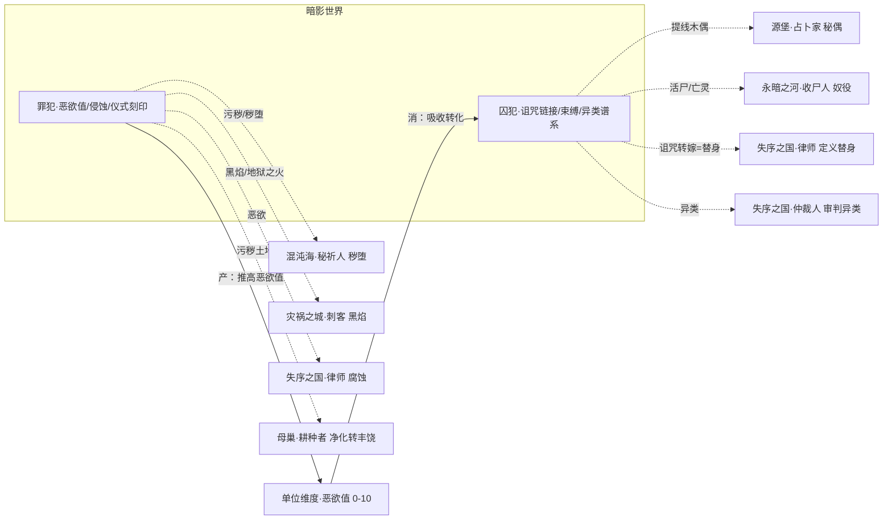

# 暗影世界系技能设定（囚犯 · 罪犯）

> **依据**：《诡秘之主职业路径与能力对照表（修订版 v2）》§暗影世界系\
>     **分组**：暗影世界系 = **囚犯(被缚者) / 罪犯(深渊)** 两条途径，同属源质「暗影世界」（**地球部分**），旧日：**恶魔之父 · 异类之主 · 诅咒之源**。核心象征：**欲望、堕落、诅咒、深渊**。两途径互为唯一相邻。
>
> **v2 修订**：本系旧日由「**欲望母树**」修订为「**恶魔之父·异类之主·诅咒之源**」（v2 修订记录 #10）；暗影世界**星空部分**（→ 主父 / 吝啬鬼途径）的旧日方为「欲望母树」，见外神途径章节，不属本系 22 条经典途径范围。
>
> 机制 DSL 沿用总设计稿（`挂载 / 若[ ] / 位移 / 伤害 / 全体敌人`），落地复用现有 `StatusDef`。「隐秘值」定义见《源堡系技能设定》§2.2，「秩序度」见《失序之国系技能设定》§2.3。

---

## 0. 现状与改造动因

### 0.1 扫描数据

| 途径 | 卡数 | 轴分布 | 跨途径共享 |
| --- | --- | --- | --- |
| 囚犯 prisoner | 36 | 诅咒 8 / 束缚 7 / **异类 13** / 物品 8 | **10 张** → criminal |
| 罪犯 criminal | 37 | 恶欲 9 / 污秽 8 / 领域 9 / **恶魔 11** | **9 张** → prisoner |

### 0.2 四个真问题
**问题一：19 张共享卡，是 9 系里共享最密集的一对，而且 100% 是复刻。** 囚犯→罪犯：随手物品 / 犯罪技巧 / 爆发欲望 / 黑暗恐惧 / 毒性傀儡 / 灵体化 / 怨魂附身 / 诅咒之源 / 无反噬之咒 / 邪物。罪犯→囚犯：犯罪能力 / 武器上手 / 迟缓 / 深渊召唤 / 恶魔仪式 / 干扰占卜与通灵 / 恶意感知 / 鲜血主宰 / 身体权柄。**没有一张是 combo**。密集共享本该是好事（说明两池主题高度同源），但全部做成"同一张卡放进两个池"就完全浪费了。

**问题二：囚犯的「诅咒」轴没有自堆叠引擎。** 8 张诅咒卡几乎全是「挂载 X 状态」——`怨灵之缠`(易伤+伤害)、`诅咒之源`(挂诅咒链接)、`变形诅咒`、`无反噬之咒`(延长链接)、`诅咒权柄`、`侵蚀诅咒`、`万咒加身`(全场挂四种 debuff)。**没有一张卡去读「我已挂了几条诅咒链接」**。原著里囚犯的核心是「诅咒之源：变成秘术木偶诅咒目标，**伤害反映在另一方**」——这是伤害转嫁网络，本该是天然的堆叠引擎（链接越多网络越强），现在只是一个 3t 的 link 状态。

**问题三：囚犯的「异类」轴 13 张是最重的轴，却是四个互不相干的形态。** 狼人化 / 活尸 / 怨魂 / 木偶 各写各的，转换完就没了。原著里序列4「**演出**：表演前序角色，将其能力提升到弱序列4层次」其实是一个\*\*"回放自己历史形态"\*\*的机制——这是全 22 条途径里都罕见的机制，现在只实现成 `攻击/防御 至少None（4t）`，等于没实现。

**问题四（反面）：罪犯的「恶魔」轴藏着现存最好的一条链，但没人认出来。** `恶魔仪式`（生命 −6 → 能量 +8 → 挂载 仪式刻印 叠加1层）→ `深渊召唤`（召唤 unit\_demon → 挂载 仪式刻印 消耗all层）。**这是一条完整的 enabler→payoff 链**，而且是全 773 张卡里少见的「自我献祭换资源 → 资源决定召唤强度」结构。它藏在恶魔轴第 2 张和第 3 张之间，没有任何一张卡去强调它。

### 0.3 改造方向
两途径的天然咬合点原著已经写好了：**囚犯 = 节制（束缚/封印疯狂欲望），罪犯 = 放纵（身心处于恶欲统治下）**。

> **罪犯是"恶欲的产能方"，囚犯是"恶欲的消纳方"。**\
>     引入**单位级量表「恶欲值 Lust（0–10）」**：罪犯不断把它堆高（越强但越失控），囚犯吞下它（转化为诅咒与异类化）。

这是真正的**供需关系**——比"共享一个状态"强一个量级，而且是暗影世界「欲望 / 节制」主题的机制化表达。同时给囚犯补上 **诅咒链接网络**（自堆叠引擎）与 **异类谱系**（形态回放栈），给罪犯把 **仪式刻印→深渊召唤** 扶正为轴心。

---

## 1. 设计原则

| # | 原则 | 说明 |
| --- | --- | --- |
| P1 | **轴=钩子，不是标签** | 每轴必须有 `enabler（挂载身份状态）→ payoff（读该状态放大）`，状态名即轴身份。诅咒轴与异类轴必须补上 payoff。 |
| P2 | **供需耦合优先于状态共享** | 本系不靠"你挂个状态我读一下"，而靠"罪犯产、囚犯消"的**资源闭环**。 |
| P3 | **复刻改 combo** | 19 张复刻卡全部改写为「读取对方的恶欲值/诅咒链接后我才获得 Y」。 |
| P4 | **属性维度兜底** | 引入**单位级** `恶欲值（0–10）`，写入全局 `StatusDef`，任意途径均可读写。 |
| P5 | **序列 9→0 全覆盖** | 每条途径按 10 个序列铺技能，序列0 为终焉旗舰，承担「收束本轴」职责。 |

---

## 2. 暗影世界系核心机制层

### 2.1 四轴身份状态（`StatusDef` 复用）

| 途径 | 四轴身份状态 |
| --- | --- |
| 囚犯 prisoner | **`诅咒链接`** ★ / `束缚` / `异类谱系` / `附身物体` |
| 罪犯 criminal | **`恶欲值`** ★ / `侵蚀` / `领域` / `仪式刻印` |

### 2.2 【核心新机制一】恶欲值 Lust（0–10，单位级）

> 与「隐秘值 / 秩序度」等**战场级**维度不同，恶欲值是**单位级**量表——战场上每个单位各自持有一条，写入全局 `StatusDef`，任意途径均可读写。

| 恶欲值 | 效果 |
| --- | --- |
| 0–3 | 正常 |
| 4–6 | **躁动**：造成伤害 +20%；每回合有 20% 概率改为攻击最近单位（含友军） |
| 7–9 | **失控**：造成伤害 +50%；每回合 35% 概率攻击友军；无法被治疗 |
| **=10** | **欲望爆炸**：立即受到等同于自身最大生命 25% 的精神伤害，恶欲值归零，并对相邻全体单位各传 3 点恶欲值 |

- 罪犯侧（产能）：`掌控欲望`、`欲望爆炸`、`堕落` 等卡挂载并推高恶欲值；恶欲值越高，罪犯的 `欲望/恶欲` 轴伤害越高——这是一条自愿承担失控风险的力量曲线。

- 囚犯侧（消纳）：`束缚/节制` 类卡吸收目标的恶欲值，每吸收 1 点转化为自身 1 层 `诅咒链接` 或 1 点异类谱系深度。

- 跨系读写：律师 `腐蚀（贪婪）` 可直接推高目标恶欲值（见《失序之国系》§6.4）；仲裁人 `审判·堕落` 对恶欲值 ≥7 目标追加驱散。

> **这就是"在属性维度下加联动"**：恶欲值是一根**任何途径都能拧的阀门**——罪犯拧高、囚犯拧低、律师偷偷拧高敌人、仲裁人惩罚被拧高的。

### 2.3 【核心新机制二】诅咒链接网络（囚犯专属）
把原 `诅咒链接（3t）` 从"一个 link 状态"升级为**可堆叠的伤害共享网**：

<Code id="hOOA9cdJjjQM88Fo2wKSZU">
  ```
  诅咒链接 N = 同时链接 N 个目标（含自身作为"源头"）
  ├─ 任一被链接单位受到伤害 → 全网分摊（每单位承受 原始伤害 × 分摊系数）
  ├─ 分摊系数 = 1 + 0.2 × (N − 1)   ← 链接越多，网络越痛
  └─ 囚犯自身作为源头时：自身受到的伤害按比例转嫁给网络
  ```
</Code>
| 卡 | 原机制 | 改后 |
| --- | --- | --- |
| 诅咒之源 | `挂载 诅咒链接（3t）→自身` | `挂载 诅咒链接 →目标 + →自身；若[链接数 ≥3] 则（分摊伤害 ×1.4）` |
| 无反噬之咒 | `挂载 诅咒链接（5t）→自身` | `若[链接数 ≥2] → 自身转嫁比例提升至 100%（伤敌不再伤己）` |
| 万咒加身（终焉前置） | 全场挂四种 debuff | `若[链接数 ≥4] → 四种 debuff 全部沿链接网络二次传染` |
| 侵蚀诅咒 | `挂载 灵性囚笼（4t）` | `若[目标 恶欲值 ≥4] → 灵性囚笼持续时间 ×2` |

> 这让囚犯第一次有了\*\*"我在养一张网"\*\*的构筑感——原来诅咒轴是八张互不相关的挂载卡，现在是一张越编越大的网。

### 2.4 【核心新机制三】异类谱系 Lineage（囚犯专属）
把原著「演出：表演前序角色，将其能力提升到弱序列4层次」做成**形态历史栈**：

<Code id="uMTEygj4xsA1sevybiOdXK">
  ```
  异类谱系 = 囚犯已历形态的有序列表  [狼人 → 活尸 → 怨魂 → 木偶 …]
  ├─ 每次形态转换 → push 入栈，谱系深度 +1
  ├─ 「演出」：弹出/回放栈中任一前序形态，以弱序列4 强度重现其能力
  └─ 谱系深度 D → 异类之王的压制力 = 对谱系内已收录形态的目标 伤害 +20% × D
  ```
</Code>
> 这同时解决：异类轴 13 张从"四个孤立形态"变成一条**可回放、可堆叠的形态链**；`演出` 从空壳变成真正的旗舰机制；囚犯的终焉 `异类之王`（异类之王，转化掌控所有异种，天然压制）有了可量化的强度来源。

### 2.5 共享状态（跨源质）

| 状态 | 共享范围 | 性质 |
| --- | --- | --- |
| `提线木偶` | 囚犯（毒性傀儡 / 怨魂附身）↔ **占卜家（源堡）** 秘偶 | **跨源质，已有卡在写但无车跑**（§6.1） |
| `亡灵 / 活尸` | 囚犯（活尸 / 唤醒死尸）↔ 收尸人（永暗之河） | 跨源质主题同源（§6.2） |
| `污秽 / 秽堕` | 罪犯（污秽之王 / 侵蚀者）↔ 秘祈人（混沌海，秽堕轴） | 跨源质同名同族（§6.3） |
| `黑焰 / 地狱之火` | 罪犯（地狱之火 / 深渊之火）↔ 刺客（灾祸之城，黑焰轴） | 跨源质同源（§6.4） |
| `恶欲值 / 堕落` | 罪犯 ↔ **律师（失序之国）** 腐蚀 | 跨源质（§6.5） |
| `替身` | 囚犯 `诅咒之源`（伤害转嫁）↔ 律师 `定义·替身` ↔ 占卜家/刺客 | 三系共写（§6.6） |

---

## 3. 囚犯途径（序列0：被缚者）
**定位**：被束缚的异类之王。以诅咒链接成网、以束缚节制欲望、以异类形态谱系作战。\
  **相邻**：罪犯（唯一）

### 3.1 四构筑轴

| 轴 | 身份状态 | enabler | payoff | 旗舰卡 |
| --- | --- | --- | --- | --- |
| ① **诅咒** ★核心 | `诅咒链接` | 诅咒之源 / 变形诅咒 → 挂链接 | **链接数决定分摊放大系数**；伤害转嫁、反噬免疫 | **诅咒之源 / 万咒加身** |
| ② **束缚** | `枷锁` / `灵性囚笼` / `被缚者` | 束缚/封印 → 挂枷锁 | **吸收恶欲值**转化为诅咒链接；封印疯狂欲望物品生物 | **侵蚀诅咒 / 被缚者** |
| ③ **异类** ★形态谱系 | `狼人化` / `活尸` / `怨魂` / `木偶` | 形态转换 → push 谱系 | **演出：回放前序形态**；谱系深度决定异类之王压制力 | **演出 / 异类之王** |
| ④ **物品** | `附身物体` / 无生命物品 | 随手物品 / 操纵物品 / 附身物体 | 操纵全部无生命物品；物品权柄增幅 | **物品权柄** |

### 3.2 序列 → 技能映射

| 序列 | 名称 | 原著能力 | 卡牌机制 | 轴 |
| --- | --- | --- | --- | --- |
| 9 | 囚犯 | 体魄强化、知觉敏锐；掌握犯罪技巧，擅长用随手物品杀人 | `伤害 4（物理）+ 挂载 枷锁（1t）（30%）；行动条速率 +6 →自身` | 物品 |
| 8 | 疯子 | 牺牲理智换力量：爆发欲望换取全方面提高；对精神干扰强抵抗 | `挂载 爆发欲望（3t）→自身；疯癫：精神抗 +20；**吸收自身恶欲值 2 → 攻击 +2**` | 束缚 |
| 7 | 狼人 | 恐怖力量/敏捷/速度/自愈，爪牙带毒；驱光、黑暗恐惧；控制被毒性浸入者转化为傀儡；初步反占卜 | `挂载 狼人化（兽形 4t）→ 谱系 push[狼人]；若[目标有 中毒≥1]则（挂载 提线木偶（6t））；挂载 反占卜` | 异类 |
| 6 | 活尸 | 身体如钢铁硬挡炮弹；掌握死亡/腐烂之力与冰的掌控；操纵活尸、唤醒死尸、培养傀儡、控制幽魂 | `挂载 活尸 → 谱系 push[活尸]；护甲 +3 / 物理抗 +15；召唤 unit_ghoul（100%）；**死寒之握：伤害 3（冰）+ 中毒**` | 异类 |
| 5 | 怨魂 | 灵体化穿墙、藏身镜子、直击灵魂；怨灵之缠、怨魂附身、怨魂尖啸、镜面闪现；自由出入灵界 | `挂载 怨魂（灵体化 3t）→ 谱系 push[怨魂]；怨魂附身：挂载 提线木偶（5t）次数2；怨灵之缠：易伤 + 精神伤害` | 异类 |
| 4 | **木偶** | 操纵全部无生命物品；**诅咒之源：变成秘术木偶诅咒目标，伤害反映在另一方**；**演出：表演前序角色提升至弱序列4** | `挂载 木偶 → 谱系 push[木偶]；**演出：回放 谱系[i] 形态（弱序列4 强度）**；诅咒之源：挂载 诅咒链接 →目标+自身` | 异类/诅咒(旗舰) |
| 3 | 沉默门徒 | 可附身物体，长久沉默中酝酿极致诅咒；变形诅咒（变成其他生物，失去绝大部分特质）；诅咒之源强化（伤敌不再伤己） | `挂载 长久沉默 →自身；附身物体（3t）；变形诅咒（3t）；**无反噬之咒：若[链接数≥2] 转嫁比例 100%**` | 诅咒/物品 |
| 2 | 古代邪物 | 部分诅咒权柄：直接攻击影响灵体；变形诅咒（天使层，映入眼眸即变形）；邪物：靠近者产生强邪念、疯狂 | `挂载 邪物（aura）→自身；若[目标有 灵体化≥1]则（诅咒伤害 ×1.5）；邪物之眼：变形诅咒 →全体敌人` | 诅咒 |
| 1 | 神孽 | 部分异类权柄；**侵蚀诅咒：让敌人灵性凝固，身体成灵的囚笼**；**转化：将生物转化为狼人/活尸/木偶等异种傀儡** | `挂载 灵性囚笼（4t）；**若[目标 恶欲值≥4]则（灵性囚笼 持续 ×2）**；转化：→ 召唤 unit_ghoul 并将目标 push 入我方谱系` | 束缚/异类 |
| 0 | **被缚者** | 诅咒权柄（完成所有类型诅咒，本身极难被诅咒）；异类权柄（异类之王，转化掌控所有异种，天然压制）；束缚/节制权柄（束缚封印疯狂欲望物品生物）；物品权柄 | `旗舰：挂载 异类之王 →自身；**若[谱系深度 D≥3]则（对谱系内已收录形态目标 伤害 +20%×D）**；万咒加身：全场 debuff 沿链接网络二次传染` | 终焉 |

**核心 combo 链**：

<Code id="EMTDKuXTv2pTsaMpzfB2U9">
  ```
  狼人（谱系 push） → 活尸（push） → 怨魂（push + 提线木偶） → 木偶（push）
     ↓                                                              ↓
  恶欲值吸收（束缚） ────→ 转化为 诅咒链接层 ────→ 演出：回放谱系形态
     ↓
  诅咒链接 N≥3 → 分摊 ×1.4 → 无反噬之咒（转嫁 100%）
     ↓
  异类之王（谱系深度 D → 压制力 +20%×D）→ 万咒加身（沿网二次传染）
  ```
</Code>
> **与罪犯的咬合点**：罪犯把全场恶欲值推高（产能），囚犯的束缚/侵蚀诅咒**吸收**恶欲值（消纳）。罪犯越放纵，囚犯越强——且囚犯顺手把失控风险（欲望爆炸）拆掉了。这是 9 系里唯一一对**资源供需型**的组内关系。

---

## 4. 罪犯途径（序列0：深渊）
**定位**：恶欲的产能方与深渊的代行者。以仪式献祭召唤恶魔，以污秽腐蚀穿透壁垒。\
  **相邻**：囚犯（唯一）

### 4.1 四构筑轴

| 轴 | 身份状态 | enabler | payoff | 旗舰卡 |
| --- | --- | --- | --- | --- |
| ① **恶欲** ★核心 | `恶欲值` | 掌控欲望 / 欲望爆炸 → 推高恶欲值 | **恶欲值越高伤害越高**（4-6 +20% / 7-9 +50%），但失控风险同步上升 | **欲望使徒 / 欲望爆炸** |
| ② **污秽** | `侵蚀` / `中毒` / `深渊之咒` | 污秽之语 / 侵蚀者 → 挂侵蚀 dot | **无视护甲持续穿透**；对已中毒/burn 目标追加同类 | **污秽之王 / 侵蚀者** |
| ③ **领域** | 界域 + 火/毒 AOE | 深渊化界域 / 强酸沼泽 / 腐蚀毒雾 | 领域内敌人减速 + 持续伤害；岩浆之剑 / 地狱之火 / 深渊之火 | **深渊化 / 深渊之火** |
| ④ **恶魔** ★现存最佳链 | `仪式刻印` | **恶魔仪式**（生命 −6 → 能量 +8 → 刻印 +1 层） | **深渊召唤**（消耗全部刻印层 → 恶魔强度/数量） | **恶魔仪式 / 深渊召唤** |

> ④ 是**唯一一条在现有设计中已经成立**的 enabler→payoff 链，本次改造不动其结构，只把它扶正为轴心，并补上「刻印层数 → 召唤物具体数值」的映射表。

### 4.2 序列 → 技能映射

| 序列 | 名称 | 原著能力 | 卡牌机制 | 轴 |
| --- | --- | --- | --- | --- |
| 9 | 罪犯 | 强壮身体与敏锐直觉，身心处于恶欲统治下；掌握各类犯罪能力与武器 | `伤害 4（物理）+ 易伤（30%）；**自身恶欲值 +1**；武器上手` | 恶欲 |
| 8 | 折翼天使 | 失去良知与恶欲同流；获得恶魔类法术（毒火/诅咒/黑烟因人而异）；共通能力「迟缓」 | `挂载 失去良知 →自身；恶魔类法术：伤害 3（火）+ 中毒；迟缓：行动条速率降低` | 恶欲/污秽 |
| 7 | 连环杀手 | 掌握涉及恶魔的知识与仪式；从深渊召唤恶魔投影获得帮助；有效干扰占卜和通灵 | `**恶魔仪式：生命 −6 → 能量 +8 → 挂载 仪式刻印 +1层**；深渊召唤：召唤 unit_demon（**强度按刻印层**）；干扰占卜与通灵：占卜遮蔽 + 通灵阻断` | 恶魔(旗舰) |
| 6 | 恶魔 | 恶魔化（3米、山羊角、巨翅、硫磺味）；恶意感知（预知危险并扼杀）；火焰/毒素/污秽三领域法术 | `挂载 恶魔化（5t）→自身；恶意感知：行动条速率 +5 + 反伤；岩浆之剑 / 硫磺火球 / 污秽之语（行动条速率 ×0.6）` | 恶魔/领域 |
| 5 | **欲望使徒** | 掌控欲望（操纵情绪欲望，诱使堕落/情绪失控/欲望爆炸）；精神冲击（燃烧恶魔角）；欲望化身（黑色液体规避/隐匿） | `**恶欲值 +2 →目标**；若[目标有 欲望≥1]则（挂载 魅惑（2t））；欲望化身：位移 + 挂载 欲望化身（conceal）` | 恶欲(旗舰) |
| 4 | 魔鬼 | 擅长精神层面交锋，高智商；声音/眼神/动作让目标迷幻、欲望膨胀；强酸沼泽 / 地狱之火 / 腐蚀毒雾 | `**恶欲值 +2 →全体敌人**；迷幻：挂载 幻觉（4t）次数2 + 欲望；地狱之火：伤害 6（火）+ burn` | 恶欲/领域 |
| 3 | 呓语者 | 一定污染权柄（心灵精神）；声音和单词能让非凡者失控/重创/精神混乱/诅咒；可远距离传声让目标暴毙 | `挂载 呓语（3t）；**若[目标 恶欲值≥7]则（远距离传声 伤害 8（精神）而非 6）**；污染权柄 →自身` | 污秽 |
| 2 | 鲜血大公 | 一定恶意与身体权柄；恶意化身（恶意不灭魔鬼不死，可在目标心里复活）；鲜血主宰（掌握自身与他人鲜血体液） | `挂载 恶意化身 →自身（**可在我方任一「恶欲值≥4」单位身上复活**）；鲜血主宰：吸取生命 7 + 失血` | 恶魔 |
| 1 | **污秽君王** | 一定污秽/污染/腐蚀/火焰权柄；污秽之王（肮脏罪恶不净物的掌控者）；**侵蚀者（再坚固的壁垒持续腐蚀也会穿透）**；深渊之火（燃烧/腐蚀/毒素/污染四合一） | `**侵蚀者：挂载 侵蚀（5t）——每回合无视护甲扣血且护甲持续下降**；污秽之王：若[目标有 中毒≥1]则（追加中毒层）；深渊之火：全体 火伤 + 护甲-2 + 中毒 + 呓语` | 污秽(旗舰) |
| 0 | **深渊** | 部分堕落/污秽/污染/欲望/诅咒/异类权柄；深渊即我，我即深渊；下位含腐蚀、恶意、部分毒素/火焰/身体 | `旗舰：挂载 深渊即我 →自身；**若[全场恶欲值总和 ≥15]则（深渊即我：展开 domain_abyssal 且自身免疫失控）**；堕落：挂载 堕落（6t）；深渊之咒（5t）` | 终焉 |

**核心 combo 链**：

<Code id="Ui7n80M9M2DsFPA6EyPSCn">
  ```
  恶魔仪式（生命 −6 → 能量 +8 → 刻印 +1 层）  ← 献祭换资源
     ↓
  刻印 N 层 → 深渊召唤（unit_demon 强度/数量 = f(N)）
     ↓
  欲望使徒（恶欲值 +2）→ 魔鬼（恶欲值 +2 全体）→ 恶欲值 ≥7「失控」
     ↓
  呓语者（对恶欲值≥7 追加伤害） / 污秽之王（中毒层追加）
     ↓
  侵蚀者（无视护甲穿透）→ 深渊即我（终焉：恶欲值总和 ≥15 解锁免疫失控）
  ```
</Code>
> **与囚犯的咬合点**：囚犯的 `束缚/侵蚀诅咒` 会**吸走**恶欲值。表面上削弱了罪犯，实际上（a）拆掉了罪犯的失控风险，让罪犯可以无限堆恶欲值而不爆炸；（b）囚犯吸收的量转化为诅咒链接，反过来又给罪犯的 AOE 提供了更多"已带 debuff"的目标（`深渊之火`、`污秽之王` 都读 debuff）。**两人互相解锁对方的上限**。

---

## 5. 组内联动矩阵（2×2）

| 提供方 ↓ \\ 受益方 → | 囚犯（诅咒链接/束缚/谱系） | 罪犯（恶欲值/侵蚀/刻印） |
| --- | --- | --- |
| **囚犯** | — | 吸收恶欲值 → 拆掉罪犯的失控风险，让罪犯可无限堆恶欲值；诅咒链接给敌人挂 debuff，喂饱 `深渊之火`/`污秽之王` 的追加条件 |
| **罪犯** | 推高全场恶欲值 → 囚犯的 `侵蚀诅咒`（恶欲值≥4 时灵性囚笼 ×2）与 `束缚` 吸收量翻倍；`转化` 可把被欲望击垮的敌人 push 入囚犯谱系 | — |

### 5.1 19 张复刻卡的改写方案（P3，摘录 8 条代表性）

| 原复刻卡 | 归属 | 改后机制 |
| --- | --- | --- |
| 爆发欲望 | 囚犯 / 罪犯 各一版 | 囚犯版：`自身恶欲值 +3 → 全部转 absorb（束缚轴吸收演示）`；罪犯版：`自身恶欲值 +3 → 攻击 +3，但失控阈值提前` |
| 毒性傀儡 | 囚犯 | `若[友方 罪犯 已挂 中毒/侵蚀] → 提线木偶层数 +1 且持续 +2t` |
| 灵体化 | 囚犯 | `若[友方 罪犯 已挂 恶魔化] → 灵体化期间可共享恶魔化的火焰抗性` |
| 怨魂附身 | 囚犯 | `若[目标 恶欲值 ≥4] → 提线木偶控制无需判定（失控者无法抵抗）` |
| 诅咒之源 | 囚犯 | `若[友方 罪犯 已挂 仪式刻印] → 每 2 层刻印额外提供 1 条诅咒链接` |
| 邪物 | 囚犯 | `若[友方 罪犯 恶欲值 ≥7] → 邪物 aura 范围翻倍` |
| 深渊召唤 | 罪犯 | `若[友方 囚犯 已挂 诅咒链接] → 召唤恶魔与被链接目标共享伤害（喂链接网）` |
| 恶魔仪式 | 罪犯 | `若[友方 囚犯 已挂 束缚] → 生命代价由被束缚目标分摊` |

> **分工**：囚犯 = **消纳 + 网络 + 形态库**（越持久越强）；罪犯 = **产能 + 爆发 + 召唤**（越放纵越强，但有失控代价）。\
>     单走时各自成立（囚犯靠谱系自洽，罪犯靠刻印链自洽），组队时靠恶欲值形成**闭环**。

---

## 6. 跨组联动

### 6.1 暗影世界 ↔ 源堡 —— 「提线木偶」：路终于有车了
囚犯已有两张卡在**写** `提线木偶`（`毒性傀儡`：中毒→提线木偶；`怨魂附身`：挂载提线木偶 次数2），而占卜家是 `提线木偶` 的**定义者**。目前在《源堡系技能设定》§7.1 的诊断是「路通了没车跑」——**这里是补车的正面**：

| 跨组卡 | 归属 | 机制 |
| --- | --- | --- |
| **毒性傀儡·改** | 囚犯 | `若[友方 占卜家 已挂 提线木偶] → 我挂的提线木偶层数并入占卜家的秘偶池，共享其「秘偶强化」类加成` |
| **异种秘偶** | 占卜家（对方视角） | `若[友方 囚犯 已挂 提线木偶] → 我的秘偶可临时"异类化"（获得囚犯谱系中已收录形态的能力）` |
| **双线同提** | 囚犯 | `若[目标同时被我与占卜家挂 提线木偶] → 控制不可抵抗，且每次受控额外 +1 层诅咒链接` |

### 6.2 暗影世界 ↔ 永暗之河 —— 「活尸 / 亡灵」（囚犯 ⇄ 收尸人）

| 跨组卡 | 归属 | 机制 |
| --- | --- | --- |
| **操纵活尸·改** | 囚犯 | `若[友方 收尸人 已挂 奴役] → 我操纵的活尸继承收尸人的「不死」特性（死亡后立即复活一次）` |
| **异种亡灵** | 收尸人（对方视角） | `若[友方 囚犯 谱系含 活尸] → 我的不死大军可披上活尸外皮（物理抗 +15）` |

### 6.3 暗影世界 ↔ 混沌海 —— 「污秽 / 秽堕」（罪犯 ⇄ 秘祈人）
秘祈人的 `秽堕` 轴与罪犯的 `污秽` 轴同名同族，且秘祈人序列3「牧魂」本身就能放牧异种灵魂：

| 跨组卡 | 归属 | 机制 |
| --- | --- | --- |
| **污秽同源** | 罪犯 | `若[友方 秘祈人 已挂 秽堕] → 我的侵蚀 dot 每层额外降低目标 1 点护甲（叠加无上限）` |
| **放牧恶魔** | 秘祈人（对方视角） | `若[友方 罪犯 已挂 仪式刻印] → 我可放牧罪犯召唤的恶魔投影，临时获得其火焰法术` |

### 6.4 暗影世界 ↔ 灾祸之城 —— 「黑焰 / 地狱之火」（罪犯 ⇄ 刺客）

| 跨组卡 | 归属 | 机制 |
| --- | --- | --- |
| **双焰交汇** | 罪犯 | `若[友方 刺客 已挂 黑焰] → 我的地狱之火改为「黑焰·深渊版」：燃烧不可被驱散，且每次跳伤 +1 层恶欲值` |
| **疫毒之火** | 刺客（对方视角） | `若[友方 罪犯 已挂 侵蚀/中毒] → 我的疫病类效果附加护甲穿透` |

### 6.5 暗影世界 ↔ 失序之国 —— 「恶欲 ↔ 腐蚀 / 审判」（双向）
见《失序之国系技能设定》§6.3 / §6.4，此处回写本侧卡：

| 跨组卡 | 归属 | 机制 |
| --- | --- | --- |
| **恶欲共鸣** | 罪犯 | `若[友方 律师 已挂 腐蚀（贪婪）] → 我的恶欲值推高效果 +1，且律师获得等量能量` |
| **异类抗辩** | 囚犯 | `若[友方 律师 已挂 独享规则] → 我方「异类」状态单位共享该规则的豁免` |

### 6.6 暗影世界 ↔ 源堡 / 失序之国 —— 「替身」三系共写（囚犯侧）
囚犯的 `诅咒之源`（伤害反映在另一方）本质是**伤害转嫁型替身**，与律师 `定义·替身`、占卜家 `拟态/秘偶` 构成三系共写：

| 跨组卡 | 归属 | 机制 |
| --- | --- | --- |
| **诅咒木偶·改** | 囚犯 | `若[友方 律师 已对目标挂 定义·替身] → 我的诅咒链接转嫁目标改为律师定义的「替身」（本体免疫，替身全额承担）` |



---

### 6.7 暗影世界 ↔ 母巢 —— 「污秽」被「荒芜」净化（罪犯 ⇄ 耕种者）
对应母巢系 §6.4。罪犯的「污秽」污染地块，全 773 张卡里只有耕种者的「荒芜/炼成」能净化，且净化所得转成「丰饶」——与"母巢↔永暗之河 亡灵"对称（一个管死、一个管土）。

| 跨组卡 | 归属 | 机制 |
| --- | --- | --- |
| **秽土净化** | 耕种者（对方视角） | `若[战场存在 罪犯 的 污秽 地块] → 我的 荒芜 改为「净化」该地块，净化所得转为「丰饶」层数` |
| **荒芜侵蚀·改** | 罪犯 | `若[友方 耕种者 已挂 丰饶] → 我的污秽地块对其丰饶区域持续侵蚀（-1 层/回合）` |

---

## 7. 落地清单（不动内核）

1. 新增单位级维度 `恶欲值（0–10）`：写入全局 `StatusDef`，阈值 4/7/10 触发躁动/失控/欲望爆炸。这是本系乃至全局的通用阀门——任何途径都能读写（律师拧高、仲裁人惩罚、囚犯吸收）。

1. 重做 `诅咒链接` 为可堆叠网络：分摊系数 = 1 + 0.2×(N−1)，并让 `诅咒之源/无反噬之咒/万咒加身` 三张卡按链接数递进。

1. 重做 `演出` 为形态回放：实现「异类谱系」形态栈（push / 回放 / 深度→压制力），这是原著里罕见且当前完全空转的机制。

1. 扶正 `仪式刻印 → 深渊召唤`：明确「刻印层数 → 恶魔强度/数量」映射表，把这条现存唯一的完整链做成罪犯的轴心。

1. 改写 19 张复刻卡：按 §5.1 思路逐张改为「读取对方恶欲值/诅咒链接/刻印后我才获得 Y」。

1. 补 `提线木偶` 的跨源质车：囚犯已有两张卡在写该状态，与占卜家打通即可兑现《源堡系》§7.1 的欠账。

---

### 一句话总结
暗影世界两途径共享 19 张卡（9 系最密集）却 100% 复刻；本设定抓住原著「囚犯=节制 / 罪犯=放纵」的对立，引入**单位级量表「恶欲值（0–10）」建立罪犯产能 → 囚犯消纳**的资源闭环（也是全局通用的可读写阀门），并给囚犯补上**诅咒链接网络**（链接数放大分摊伤害）与**异类谱系形态栈**（演出回放前序形态）两台自堆叠引擎、把罪犯已有的**仪式刻印→深渊召唤**扶正为轴心；跨系上以 `提线木偶`（↔源堡占卜家，兑现源堡系的"欠车"）、`活尸/亡灵`（↔收尸人）、`污秽/秽堕`（↔秘祈人）、`黑焰/地狱之火`（↔刺客）、`恶欲↔腐蚀/审判`（↔失序之国）五条线接入全局。
