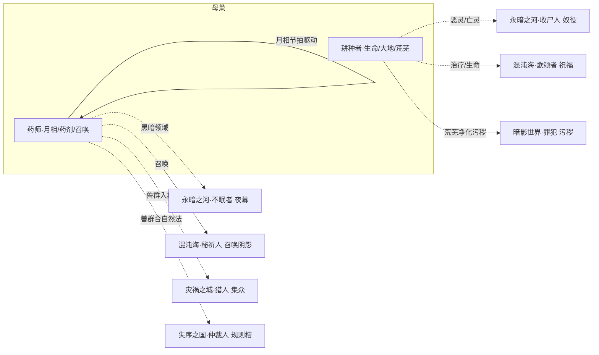

# 母巢系技能设定（药师 · 耕种者）

> **依据**：《诡秘之主职业路径与能力对照表（修订版 v2）》\
>     **分组**：母巢系 = **药师(月亮) / 耕种者(母亲)** 两条途径，同属源质「母巢」，核心象征：**生命、月亮、大地、自然**。两途径互为相邻。
>
> **v2 修订**：本系旧日由「**堕落母神**」修订为「**根源之神**（地球部分）」（v2 修订记录 #9）。分组与相邻关系未变。
>
> 机制 DSL 沿用总设计稿（`挂载 / 若[ ] / 位移 / 伤害 / 全体敌人`），落地复用现有 `StatusDef`。「隐秘值」维度定义见《源堡系技能设定》§2.2。

---

## 0. 现状与改造动因
本系与全局同源问题（详见《技能机制性分析报告》）：4 个「构筑轴」是内容标签而非机制钩子；「跨途径共享」多为同一张卡复刻。

**药师是本报告中最典型的「平铺」案例**：其 4 个构筑轴（药剂 / 兽群 / 血月 / 月相）在现有设计里是**四组互不咬合的独立效果**——没有任何一张卡是「因你堆了药剂而变强」的 payoff。药剂调出来是药剂，兽群召出来是兽群，月相切了是月相，四者各算各的，玩家感知不到「我在构筑一套药剂流」。

改造重点：**给药师的每个轴装上 enabler→payoff 链，并让「月相」成为驱动其余三轴的节拍器**——这是最贴合原著（五种月相状态）也最能解决平铺问题的方案。

---

## 1. 设计原则

| # | 原则 | 说明 |
| --- | --- | --- |
| P1 | **轴=钩子，不是标签** | 每轴必须有 `enabler（挂载身份状态）→ payoff（读该状态放大）`，状态名即轴身份。 |
| P2 | **状态跨途径可读** | 本系要主动去读永暗之河的 `亡灵`、混沌海的 `祝福`。 |
| P3 | **复刻改 combo** | 两池的「治疗/生命」复刻卡应改为「友方另一途径触发 X 时我获得 Y」。 |
| P4 | **属性维度兜底** | 沿用「隐秘值」全局属性（药师的黑暗领域参与累积）。 |
| P5 | **序列 9→0 全覆盖** | 每条途径按 10 个序列铺技能，序列0 为终焉旗舰，承担「收束本轴」职责。 |

---

## 2. 母巢系核心机制层

### 2.1 共享状态池（`StatusDef` 复用）

| 途径 | 四轴身份状态 |
| --- | --- |
| 药师 apothecary | `药剂` / `兽群` / **`月相`** / `召唤` |
| 耕种者 planter | **`生命`** / `大地` / `炼成` / `荒芜` |

### 2.2 「月相」节拍器（药师专属核心机制）
把原著「血月 / 红月 / 银月 / 满月 / 缺月」五种月相做成一个**轮转的全局节拍**，让药师的所有轴都跟着月相走——这是解决「四轴平铺」的关键：

| 月相 | 对药师各轴的加成 |
| --- | --- |
| **满月** | 治疗与恢复效果 +100%；`召唤` 生物强度提升 |
| **血月** | 吸血/腐蚀类攻击强化；`兽群` 获得嗜血 |
| **银月** | `药剂` 效果翻倍；闪现距离提升 |
| **红月** | 黑暗领域法术强化；蝙蝠分解重组更快 |
| **缺月** | 自身防御提升；对方治疗效果削弱 |

> 月相每 N 回合轮转一次，药师的每张卡都标注「在 X 月相下额外获得 Y」——这样玩家必须围绕月相编排出牌节奏，**四轴被同一个节拍器串成一套真正的 combo**。

### 2.3 组内与跨源质共享状态

| 状态 | 共享范围 | 性质 |
| --- | --- | --- |
| `亡灵 / 恶灵` | 耕种者（抬棺人恶灵化）↔ 收尸人（永暗之河） | **跨源质联动（见 §6.1）** |
| `生命 / 治疗` | 耕种者 ↔ 药师 ↔ 歌颂者（混沌海，神圣/治疗） | 跨系主题同源 |
| `黑暗` | 药师（吸血鬼/巫王黑暗领域）↔ 不眠者（永暗之河） | 跨系主题同源 |
| `召唤` | 药师（召唤灵界生物）↔ 秘祈人（召唤阴影生物） | 跨系机制同源 |

---

## 3. 药师途径（序列0：月亮）
**定位**：月亮与灵性的化身，以药剂与召唤增益团队，以兽群与月相作战。\
  **相邻**：耕种者

### 3.1 四构筑轴

| 轴 | 身份状态 | enabler | payoff | 旗舰卡 |
| --- | --- | --- | --- | --- |
| ① **药剂** | `药剂` | 调配药剂 / 分辨灵性材料 → 产出 `药剂` | 预服药水后极难应付；隐身/无味等特殊效果；毒抗 | **魔药教授** |
| ② **兽群** | `兽群` | 驯化驱使动物 → 挂 `兽群` | 分享感官、协同攻击；超凡生物亦可驯化 | 驯兽师 |
| ③ **月相** ★核心 | `月相` | 满月 / 月光化 → 切换 `月相` | 各月相驱动其余三轴（见 §2.2）；闪现、月光化重组 | **深红学者** |
| ④ **召唤** | `召唤` | 召唤之门 → 产出 `召唤` | 从灵界召唤强大生物；可与天使签订契约 | 召唤大师 |

### 3.2 序列 → 技能映射

| 序列 | 名称 | 原著能力 | 卡牌机制 | 轴 |
| --- | --- | --- | --- | --- |
| 9 | 药师 | 调配药剂、驯化植物治病、毒素抗性强、健康领域灵视 | `产出 药剂（基础治疗）；自身毒抗；灵视诊断` | 药剂 |
| 8 | 驯兽师 | 驯化驱使活着的动物（含超凡生物）、动物感官（读懂/驱使/分享感官） | `挂载 兽群→自身；分享感官（侦查）；驱使攻击` | 兽群 |
| 7 | 吸血鬼 | 生命提升（300岁）、颜值魅力、体质速度敏捷自愈、深渊枷锁、黑暗之翼、腐蚀之爪、血仆转化 | `若[月相=血月] 吸血攻击+自愈；腐蚀之爪` | 月相 |
| 6 | **魔药教授** | 分辨灵性材料、调配超凡药剂与香水（隐身/无味）、预服药水后极难应付 | `若[药剂] 预服药水：下次判定/防御大幅强化（银月下效果翻倍）` | 药剂(旗舰) |
| 5 | **深红学者** | 可怕速度与恢复、满月（范围处于满月）、闪现（月光范围）、月光化（虚化为红鳞消散重组） | `切换 月相=满月；月光化：受击后消散重组（规避致命）` | 月相(旗舰) |
| 4 | 巫王 | 活1000岁、精通月亮与黑暗领域法术、月亮纸人（替身）、黑暗凝视、蝙蝠分解重组 | `若[月相=红月] 黑暗领域法术强化；蝙蝠分解（除非全杀否则重组）` | 月相 |
| 3 | 召唤大师 | 部分召唤权柄、召唤之门（灵界生物降临）、人缘好可与天使签约 | `若[月相=满月] 召唤之门：灵界生物降临（强度提升）` | 召唤 |
| 2 | 创生者 | 创造之力（生命延长/缩短/爆发）、直接治疗无需药剂、自我治愈最高、给予土地生命清理污秽、部分灵性权柄 | `若[召唤] 直接治疗（无需药剂）；给予土地生命` | 召唤/生命 |
| 1 | 美神 | 男性变女性、美之权柄（看到者震撼）、部分月亮/植物/动物/人类/超凡生物权柄、召唤权柄 | `美之震撼：范围内目标行动受阻；召唤无人可拒` | 召唤 |
| 0 | **月亮** | 灵性权柄（灵性根源）、部分生命/黑暗/诡异/美权柄、五种月相状态 | `旗舰：灵性根源（灵性类效果全幅强化）；自由切换五 月相` | 终焉 |

**核心 combo 链**：药师(药剂) → 驯兽师(兽群) → 吸血鬼(血月吸血) → 魔药教授(预服药水) → 深红学者(满月+月光化) → 巫王(红月黑暗) → 召唤大师(满月召唤) → 创生者(治疗) → 美神 → 月亮(五相位自由切换)。

> **月相驱动的节拍 combo**：玩家先切「银月」配药（药剂翻倍）→ 再切「满月」召唤（生物强化）+ 治疗翻倍 → 敌方残血时切「血月」让兽群嗜血收割。四轴被月相串成一条完整节奏链，不再是四组孤立效果。

---

## 4. 耕种者途径（序列0：母亲）
**定位**：大地与生命的主宰，以治疗与炼成支撑团队，以荒芜与恶灵收割战场。\
  **相邻**：药师

### 4.1 四构筑轴

| 轴 | 身份状态 | enabler | payoff | 旗舰卡 |
| --- | --- | --- | --- | --- |
| ① **生命** ★核心 | `生命` | 治疗 / 生命炼成 → 挂 `生命` | 治疗恶疾创伤、缝合灵魂、触碰即痊愈 | **医师 / 古代炼金师** |
| ② **大地** | `大地` | 催化种子 / 大地系法术 → 挂 `大地` | 藤蔓纠缠、地底潜行、沼泽、化身为巨熊 | 德鲁伊 |
| ③ **炼成** | `炼成` | 生命炼成 → 产出 `炼成` | 创造普通人类或战斗魔像；人偶材质扩展到泥土/植物/岩浆/矿石/金属 | 古代炼金师 |
| ④ **荒芜** ★跨系 | `荒芜` | 恶灵化 / 剥夺生命 → 挂 `荒芜` | 范围内生命飞快流逝至死；死者化为恶灵为己而战 | 抬棺人 / 荒芜主母 |

### 4.2 序列 → 技能映射

| 序列 | 名称 | 原著能力 | 卡牌机制 | 轴 |
| --- | --- | --- | --- | --- |
| 9 | 耕种者 | 力气很大、通过自然现象预测天气、擅于分辨培育种子 | `力气强化；预测天气（环境预判）` | 大地 |
| 8 | **医师** | 治疗（核心）：灵视判断病情、出色外科手术、治疗恶疾创伤、缝合灵魂、给予生命 | `挂载 生命→友方：治疗恶疾/创伤；缝合灵魂` | 生命(旗舰) |
| 7 | 丰收祭司 | 促进繁衍生长带来丰收、催化种子（30米植物加速/藤蔓纠缠）、驱使植物虫豸、祈雨祈晴 | `挂载 大地→区域：藤蔓纠缠（控场）；驱使植物/虫豸` | 大地 |
| 6 | 生物学家 | 深刻了解生物特性、能杂交生物产生奇怪产物、自身能产生剧毒 | `若[大地] 自身剧毒（近战反伤）；杂交造物` | 大地 |
| 5 | 德鲁伊 | 化身为巨熊战斗、大地系法术（地底潜行、沼泽、自然憎恶、橡树之子） | `若[大地] 化身巨熊（形态转换）；地底潜行` | 大地 |
| 4 | **古代炼金师** | 生命炼成（创造普通人类或战斗魔像）、触碰即痊愈、周围充满生命力 | `产出 炼成：创造战斗魔像；触碰使生灵痊愈` | 炼成(旗舰) |
| 3 | 抬棺人 | 恶灵化（10公里死者变恶灵为自己战斗）、剥夺生命（击中触发死亡考验）、回归大地（死灵类迅速消散） | `挂载 荒芜→区域：死者化为己方恶灵；对死灵类克制` | 荒芜 |
| 2 | 荒芜主母 | 部分大地/荒芜/丰收/生命权柄、荒芜（30公里生命流逝至死）、人偶制造扩展至泥土/植物/岩浆/矿石/金属 | `若[荒芜] 范围内生命飞快流逝；人偶材质扩展` | 荒芜/炼成 |
| 1 | 自然行者 | 部分自然与母亲权柄、自然之子（与大地树林水流山峰矿石一体可穿梭）、创造世界 | `若[大地] 自然之子：与地物一体穿梭；创造世界` | 大地 |
| 0 | **母亲** | 母亲权柄（孕育万物含神灵/概念/世界）、大地/自然权柄、部分死亡与生命权柄 | `旗舰：孕育万物；大地（生命起源与最终回归之地）` | 终焉 |

**核心 combo 链**：耕种者(大地) → 医师(生命治疗) → 丰收祭司(藤蔓控场) → 德鲁伊(巨熊形态) → 古代炼金师(炼成魔像) → 抬棺人(恶灵化) → 荒芜主母(荒芜+人偶) → 母亲(孕育万物)。

---

## 5. 组内联动矩阵（2×2）

| 提供方 ↓ \\ 受益方 → | 药师(月相/药剂/召唤) | 耕种者(生命/大地/荒芜) |
| --- | --- | --- |
| **药师** | — | 满月治疗翻倍叠加其生命轴；召唤生物吸收伤害护住其施法 |
| **耕种者** | 大地/生命供其召唤生物驻留；荒芜后的死者供其（及抬棺人）转化 | — |

> 分工：**药师负责「月相节拍 + 药剂/召唤增益」，耕种者负责「治疗续航 + 大地控场 + 荒芜收割」**。两池的「治疗」复刻卡应改为「药师满月治疗 × 耕种者生命治疗」的乘算 combo，而非各治疗各的。

---

## 6. 跨组联动

### 6.1 母巢 ↔ 永暗之河 —— 「亡灵/恶灵」联动（耕种者抬棺人 ⇄ 收尸人）
耕种者序列3「恶灵化：让死者变恶灵为自己战斗」与收尸人的亡灵体系天然同源，但二者**分属不同源质**，是典型被浪费的共享主题。

| 跨组卡 | 归属 | 机制 |
| --- | --- | --- |
| **恶灵化·改** | 耕种者 | `若[友方 收尸人 已对目标挂 奴役] → 该目标死亡时直接化为我的恶灵（无需重新挂载）` |
| **亡者之王·恶灵** | 收尸人（对方视角） | `若[友方 耕种者 已挂 荒芜] → 荒芜区域内死亡者自动纳入我的不死大军` |

### 6.2 母巢 ↔ 混沌海 —— 「治疗/生命」与「神圣/祝福」叠加

| 跨组卡 | 归属 | 机制 |
| --- | --- | --- |
| **神圣治疗** | 耕种者 | `若[友方 歌颂者 已挂 祝福] → 我的治疗额外附加「免疫恐惧」与灵性恢复` |
| **创造之力·改** | 药师 | `若[友方 歌颂者 已挂 祝福] → 创造之力可让友方生命「爆发」而非仅延长` |

### 6.3 母巢 ↔ 永暗之河 —— 「黑暗」同源（药师 ⇄ 不眠者）
药师序列7 吸血鬼/序列4 巫王掌握黑暗领域法术，与不眠者的黑暗权柄同源。

| 跨组卡 | 归属 | 机制 |
| --- | --- | --- |
| **黑暗凝视·改** | 药师 | `若[友方 不眠者 已挂 夜幕] → 黑暗凝视可映射并操作处于夜幕中的任意目标` |

### 6.4 母巢 ↔ 暗影世界 —— 「荒芜」净化「污秽」（耕种者 ⇄ 罪犯）
耕种者的「荒芜/炼成」与罪犯的「污秽」是土地的两极：被污秽污染的土地，全 773 张卡里只有耕种者能净化，且净化所得转化为「丰饶」资源——供需闭环，与"母巢↔永暗之河 亡灵/恶灵"那条边对称（一个管死、一个管土）。

| 跨组卡 | 归属 | 机制 |
| --- | --- | --- |
| **秽土净化** | 耕种者 | `若[战场存在 罪犯 的 污秽 地块] → 我的 荒芜 改为「净化」该地块，净化所得转为「丰饶」层数` |
| **丰饶反哺** | 耕种者 | `若[友方 罪犯 已挂 恶欲值] → 丰饶层数可压制其恶欲值增长（每点丰饶 -0.5/回合）` |

### 6.5 母巢 ↔ 灾祸之城 —— 「兽群」入「集众」（药师 ⇄ 猎人）
药师召唤的兽群是最现成的"可借用单位"，纳入猎人的**集众池**后，等于把召唤物变成团队接口——复用灾祸之城已建好的通用组队核心。

| 跨组卡 | 归属 | 机制 |
| --- | --- | --- |
| **集众·兽群** | 猎人（对方视角） | `若[队伍含 药师] → 集众时可将其 兽群 纳入池，借用兽群能力行动` |
| **兽群指挥·改** | 药师 | `若[友方 猎人 已开 集众] → 我的兽群自动获得「集众」加成（攻击/灵性 +1 档）` |

### 6.6 母巢 ↔ 失序之国 —— 「兽群」合「自然法」规则槽（药师 ⇄ 仲裁人/律师）
对应知识荒野系 §6.4 / 失序之国系 §6.7 的「造物入规则槽」机制：药师的「兽群」作为被召唤的生物单位，类比通识者的「造物」纳入规则槽约束——律师可为兽群争取豁免，仲裁人可对违规兽群直接审判驱逐。复用已有规则槽，零新状态。

| 跨组卡 | 归属 | 机制 |
| --- | --- | --- |
| **兽群审判** | 仲裁人 | `若[友方 药师 已挂 兽群 且 违反 规则槽] → 对该兽群发动审判：直接「驱逐」并反噬召唤者` |
| **兽群豁免** | 律师 | `若[友方 药师 的 兽群 已挂 规则槽] → 我可为其争取「自然法豁免」，使其免受仲裁人审判` |

---

## 7. 落地清单（不动内核）

1. 复用 `StatusDef`：`药剂/兽群/月相/召唤/生命/大地/炼成/荒芜` 走全局状态目录。

1. 优先实现「月相」节拍器：这是解决药师「四轴平铺」的唯一结构性方案，建议做成战场级轮转状态（每 N 回合切一次），所有药师卡标注月相加成。

1. 统一 `亡灵/恶灵` 状态：让耕种者抬棺人与收尸人读写同一状态族，打通 §6.1 的跨源质亡灵线。

1. 治疗类卡改为乘算：药师（月相治疗）与耕种者（生命治疗）的复刻卡改为互相乘算的 combo，避免各治各的。

---

### 一句话总结
母巢系两条途径（药师/耕种者）各以 4 个钩子轴覆盖序列 9→0；**药师是全报告最典型的「平铺」案例**，故本设定引入原著「五 月相」作为**节拍器**，把药剂/兽群/召唤三轴串成一条节奏 combo（银月配药→满月召唤治疗→血月收割）；跨系靠 `亡灵/恶灵`（↔永暗之河收尸人）、`治疗/祝福`（↔混沌海歌颂者）、`黑暗`（↔永暗之河不眠者）三条线接入全局。
