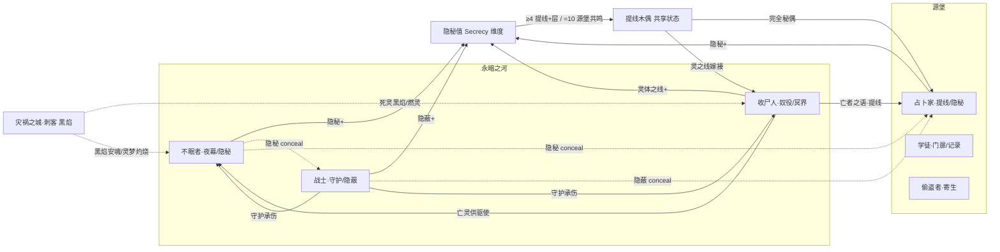

# 永暗之河系技能设定（不眠者 · 收尸人 · 战士）

> **依据**：《诡秘之主职业路径与能力对照表（修订版 v2）》\
>     **分组（v2 已确认）**：永暗之河系 = **不眠者(黑暗) / 收尸人(死神) / 战士(黄昏巨人)** 三条途径，同属源质「永暗之河」，旧日=永恒之暗，核心象征：**黑暗、死亡、恐惧、灵体**。三条途径互为相邻（v2 已将相邻补全为 2 个）。
>
> **v2 修订对本次设定的影响**：
>
>
> - 战士由混沌海移入本系（原稿误归混沌海）。这让不眠者/收尸人/战士整组聚齐，形成「死亡·黑暗·灵体」完整承接组。
>
>
> - 直接后果：本系成为源堡系 `提线木偶 / 灵体之线 / 隐秘` 的天然宿主，两条跨源质联动线（§7.1 提线木偶、§7.2 隐秘）都由本系承接。
>
> 机制 DSL 沿用总设计稿（`挂载 / 若[ ] / 位移 / 伤害 / 全体敌人`），落地复用现有 `StatusDef`。「隐秘值」维度定义见《源堡系技能设定》§2.2，本文只说明本系在其中的角色。

---

## 0. 现状速写与改造动因
从技能总览扫描结果看，永暗之河系 3 途径同样存在「轴是标签、共享是复刻」的问题：

| 途径 | 卡数 | 跨途径共享卡 | 真实形态 | 自堆叠引擎 |
| --- | --- | --- | --- | --- |
| 不眠者 sleepless | — | 大量复刻到 corpse\_collector / thief / warrior… | 复刻为主（如尸体特质、天然灵视、通灵→sleepless） | 夜色/沉眠（有但弱） |
| 收尸人 corpse\_collector | — | 灵之线/提线木偶 与 fool 共用 | **是共享状态，但无卡引用**（路通了没车跑） | 奴役/冥界（有但弱） |
| 战士 warrior | — | 隐秘 conceal 与 sleepless 共用 | 共享状态，同样未被利用 | 守护/衰败（有但弱） |

**根因**：与源堡系同源——4 个「构筑轴」只是内容标签；「跨途径共享」多为同一张卡复刻。**但本系有个关键优势**：`提线木偶` 与 `隐秘` 这两条共享状态已真实跨途径存在，只要设计「读取友方他系状态」的卡，联动立刻成立。

---

## 1. 设计原则

| # | 原则 | 说明 |
| --- | --- | --- |
| P1 | **轴=钩子，不是标签** | 每轴必须有 `enabler（挂载身份状态）→ payoff（读该状态放大）`，状态名即轴身份。 |
| P2 | **状态跨途径可读** | 内核 `StatusDef` 已是全局目录，A 途径挂的状态 B 途径零成本可读——本系要主动去读源堡系的 `提线木偶`。 |
| P3 | **复刻改 combo** | 「同一张卡塞进两个池」只是错觉联动；改为「友方另一途径挂 X 时，我获得 Y」。 |
| P4 | **属性维度兜底** | 沿用源堡系定义的战场级「隐秘值」全局属性，本系既是**主要累积者**也是**主要受益者**。 |
| P5 | **序列 9→0 全覆盖** | 每条途径按 10 个序列铺技能，序列0 为终焉旗舰，承担「收束本轴」职责。 |

---

## 2. 永暗之河系核心机制层

### 2.1 共享状态池（`StatusDef` 复用）

| 途径 | 四轴身份状态 |
| --- | --- |
| 不眠者 sleepless | `夜幕`(黑暗值) / `灵梦`(灵体·梦魇) / `恐惧` / **`隐秘`(conceal)** |
| 收尸人 corpse\_collector | `尸性` / `灵`(通灵) / **`奴役`(亡者之语)** / `冥界`(冥界之门) |
| 战士 warrior | `武技` / **`守护`** / `黎明`(晨曦) / `黄昏`(衰败) |

### 2.2 组内与跨源质共享状态

| 状态 | 共享范围 | 性质 |
| --- | --- | --- |
| `隐秘 / conceal` | 不眠者 + 战士（组内）· 占卜家（跨源质） | **跨源质联动命脉 A** |
| `提线木偶 / 灵体之线` | 收尸人 + 占卜家 + 不眠者 + 囚犯（暗影世界） | **跨源质联动命脉 B** |
| `亡灵 / 灵体` | 收尸人 + 不眠者（灵之统帅 ⇄ 亡者之语） | 组内强咬合 |
| `衰败 / 老化` | 战士（黄昏）+ 收尸人（死亡） | 组内主题叠加 |

### 2.3 本系在「隐秘值」维度中的角色
沿用《源堡系技能设定》§2.2 的 0–10 级战场属性。本系**既累积也受益**：

| 途径 | 如何累积隐秘值 | 如何受益 |
| --- | --- | --- |
| 不眠者 | `隐秘` / 隐秘化 / 隐秘之地 挂载 +1 | ≥4 灵体增益；≥7 隐秘类 +50%；=10 源堡共鸣 |
| 战士 | `隐蔽` / 借光隐藏 挂载 +1 | 同上；猎魔之眼在隐秘中获得先手 |
| 收尸人 | 灵体之线 / 冥界（隐秘型）挂载 +1 | ≥4 提线木偶 +1 层；=10 源堡共鸣（亡灵可被友方操控） |

---

## 3. 不眠者途径（序列0：黑暗）
**定位**：黑暗与精神的大师，夜越深越强，以梦境与恐惧瓦解敌人，执掌隐秘权柄。\
  **相邻**：收尸人、战士 ｜ **源质**：永暗之河

### 3.1 四构筑轴

| 轴 | 身份状态 | enabler | payoff | 旗舰卡 |
| --- | --- | --- | --- | --- |
| ① **夜幕** | `夜幕`(黑暗值) | 夜视 / 黑夜领域 → 累积 `夜幕` | 若\[夜幕≥3\] 力量敏捷思维提升、侵蚀敌人、为灵增益 | **守夜人** |
| ② **灵梦** | `灵梦`(灵体·梦魇) | 入梦/塑梦/安魂 → 挂 `灵梦` | 若\[灵梦\] 拉入梦境击溃精神 / 驱使其灵 | 梦魇 / 灵巫 |
| ③ **恐惧** | `恐惧` | 诗篇 / 恐惧灵光 → 挂 `恐惧` | 若\[恐惧\] 目标失控 / 低心智者即死 | **恐惧主教** |
| ④ **隐秘** ★跨组 | `隐秘`(conceal) | 隐秘化 → 挂 `隐秘` | 不被感应 / 封印于隐秘之地 / 展现被隐秘内容 | 隐秘之仆 |

### 3.2 序列 → 技能映射

| 序列 | 名称 | 原著能力 | 卡牌机制 | 轴 |
| --- | --- | --- | --- | --- |
| 9 | 不眠者 | 无需光照卓越视力、夜越深越强、察觉黑暗危险 | `若[夜幕] 力量/敏捷/思维提升；察觉隐藏目标` | 夜幕 |
| 8 | 午夜诗人 | 格斗/射击/攀爬/感应、诗篇影响（精神恍惚/安静/恐惧） | `挂载 恐惧→敌 / 诗篇：敌精神恍惚 or 友方安静` | 恐惧 |
| 7 | 梦魇 | 入梦、塑梦（引导秘密或击溃精神） | `挂载 灵梦→敌；强行拉入梦；塑梦引导/击溃精神` | 灵梦 |
| 6 | 安魂师 | 安魂（抹平欲望情绪）、看见灵体、强制入梦150m | `安魂：抹平目标欲望与情绪（封增益）；看见灵体` | 灵梦 |
| 5 | 灵巫 | 驱使自然灵（封印于牙齿）、4-5个灵、一心多用、梦魇200m | `若[灵梦] 驱使自然灵：可同时操控数个灵协同` | 灵梦 |
| 4 | **守夜人** | 越黑暗越强（正午削弱）、黑夜领域、发丝缠绕、给予厄运、安魂质变 | `若[夜幕≥3] 黑夜领域：防御+侵蚀+为灵增益；给予厄运` | 夜幕(旗舰) |
| 3 | **恐惧主教** | 黑暗之剑（消融）、恐惧灵光（吓死/失控）、梦魇世界 | `若[恐惧] 恐惧灵光：低心智目标即死/失控；梦魇世界（范围）` | 恐惧(旗舰) |
| 2 | 隐秘之仆 | 隐秘权柄、隐秘化、隐秘之地 | `挂载 隐秘(conceal)→目标/自身；隐秘之地封印` | 隐秘(旗舰) |
| 1 | 厄难骑士 | 厄难（给予厄运）、黑暗仆人（黑夜中几乎不死）、灵之统帅 | `若[夜幕] 黑夜中不死（每次从黑暗回归）；灵之统帅：统御友方亡灵/自然灵` | 夜幕/灵梦 |
| 0 | **黑暗** | 隐秘/黑暗/恐惧/灵体灵性/厄运灾难 权柄 | `旗舰：让目标入梦/永眠/消融；黑暗中不死复活；+2 隐秘值` | 终焉 |

**核心 combo 链**：不眠者(夜幕累积) → 守夜人黑夜领域 → 梦魇/灵巫(灵梦) → 恐惧主教(恐惧失控) → 隐秘之仆(隐秘封印) → 黑暗(永眠 + 黑暗复活)。

---

## 4. 收尸人途径（序列0：死神）
**定位**：死亡与亡灵的主宰，以冥界囚禁魂体、以亡者之语奴役死者。\
  **相邻**：不眠者、战士 ｜ **源质**：永暗之河

### 4.1 四构筑轴

| 轴 | 身份状态 | enabler | payoff | 旗舰卡 |
| --- | --- | --- | --- | --- |
| ① **尸性** | `尸性` | 尸体特质（体温低）→ 自身挂 `尸性` | 避免亡灵袭击 / 承受死息 / 肉体打击非致命 | 不死者 |
| ② **通灵** | `灵` | 灵视 / 死亡之眼 / 通灵 → 挂 `灵` | 借灵施法 / 揭示弱点 / 压制奴役具备灵者 | 通灵者 |
| ③ **奴役** ★跨组 | `奴役`(亡者之语) | 亡者之语 → 对亡者挂 `奴役` | 唤起活尸骷髅参战 / 不死生物大军 | **死灵导师 / 亡者之王** |
| ④ **冥界** | `冥界` | 冥界入口 / 小型冥界 → 挂 `冥界` | 囚禁魂体 / 剥夺生命力 / 即死 | 看门人 / 死亡执政官 |

### 4.2 序列 → 技能映射

| 序列 | 名称 | 原著能力 | 卡牌机制 | 轴 |
| --- | --- | --- | --- | --- |
| 9 | 收尸人 | 尸体特质（体温低、避亡灵袭击）、天然灵视、耐腐烂寒冷死息 | `挂载 尸性→自身；避免亡灵袭击；看见恶灵` | 尸性 |
| 8 | 掘墓人 | 体魄强壮、灵视更强、死亡之眼（灵性世界俯视找弱点）、沟通少量灵 | `若[尸性] 死亡之眼：揭示目标弱点` | 通灵 |
| 7 | 通灵者 | 通灵（与自然灵和亡魂沟通借灵施法）、灵相关仪式、对灵像同类 | `挂载 灵→自身；借灵实现魔法；亡灵对己敌意降低` | 通灵 |
| 6 | **死灵导师** | 复活（唤起活尸和骷髅）、亡者之语（驱使乃至奴役） | `挂载 奴役→亡者；唤起活尸/骷髅参战` | 奴役(旗舰) |
| 5 | 看门人 | 感应冥界入口驱使亡灵、小型冥界（身体为囚笼）、死神使者（血冻生命流逝） | `挂载 冥界→自身（囚笼）；死神使者：目标生命力流逝` | 冥界 |
| 4 | 不死者 | 每60年死而复活（遗忘记忆）、冥界之门、肉体打击非致命 | `若[尸性] 肉体打击非致命（除非完全摧毁）；死亡后复活` | 尸性 |
| 3 | 摆渡人 | 对视即死（神性者重创）、左手不可逆死亡/右手解除、净化外攻击无效 | `即死：对视目标直接死亡（神性者重创）；左右手可逆` | 冥界/死亡 |
| 2 | **死亡执政官** | 完全的死亡（复活/替身无效）、亡者之王（不死大军）、死亡之国 | `若[奴役] 亡者之王：不死生物大军；完全死亡：封禁复活/替身` | 奴役(旗舰) |
| 1 | 苍白皇帝 | 灵之主宰（压制奴役具备灵者）、苍白世界（能力凋零）、死亡宣告、灵魂掌控 | `若[灵] 灵之主宰：压制/奴役一切具备灵者；苍白世界` | 通灵/奴役 |
| 0 | **死神** | 死亡权柄（生命/记忆/联系/烙印皆死）、苍白、奴役、亡灵、终点 | `旗舰：一切联系与烙印皆死（含非凡特性短暂死亡）；终点` | 终焉 |

**核心 combo 链**：收尸人(尸性) → 通灵者(通灵借灵) → 死灵导师(奴役唤起亡者) → 看门人(冥界囚禁) → 死亡执政官(不死大军/完全死亡) → 死神(终点)。

---

## 5. 战士途径（序列0：黄昏巨人）
**定位**：战斗与守护的极致，晨曦净化邪恶、黄昏带来衰败，团队最坚固的壁垒。\
  **相邻**：不眠者、收尸人 ｜ **源质**：永暗之河

### 5.1 四构筑轴

| 轴 | 身份状态 | enabler | payoff | 旗舰卡 |
| --- | --- | --- | --- | --- |
| ① **武技** | `武技` | 武器/格斗精通 → 自身挂 `武技` | 任意武器大师级 / 光之风暴 / 黄昏巨剑 | 武器大师 |
| ② **守护** ★核心 | `守护` | 守护状态 / 黎明铠甲 → 挂 `守护` | 为同伴承担伤害 / 无形墙壁 / 守护实质化 | **守护者 / 银骑士** |
| ③ **黎明** | `黎明`(晨曦) | 晨曦领域 / 猎魔之眼 → 挂 `黎明` | 破幻觉 / 驱散怨魂 / 削弱邪恶 / 克制恶魔亡灵 | 黎明骑士 / 猎魔者 |
| ④ **黄昏** | `黄昏`(衰败) | 黄昏权柄（老化）→ 对敌挂 `黄昏` | 目标逐渐老化至死 / 衰败失控 | 荣耀者 / 黄昏巨人 |

### 5.2 序列 → 技能映射

| 序列 | 名称 | 原著能力 | 卡牌机制 | 轴 |
| --- | --- | --- | --- | --- |
| 9 | 战士 | 超越常人力量敏捷、武器防具精通、格斗术 | `挂载 武技→自身；武器/格斗基础` | 武技 |
| 8 | 格斗家 | 格斗专家、凭身体减弱超自然影响、擅长近战 | `若[武技] 减弱超自然影响；近战强化` | 武技 |
| 7 | **武器大师** | 超强力量体质敏捷、任何武器到手即大师、降低武器负面影响 | `若[武技] 任意武器大师级；降低武器负面` | 武技(旗舰) |
| 6 | 黎明骑士 | 晨曦领域（破幻觉/驱散怨魂/削弱邪恶）、黎明铠甲、晨曦之剑、光之风暴 | `挂载 黎明→领域；黎明铠甲；光之风暴（锐利飓风）` | 黎明/守护 |
| 5 | **守护者** | 对任何怪物造成伤害、不被幻觉迷惑、守护状态（无形墙壁、帮同伴承担伤害） | `挂载 守护→友方；帮同伴承担伤害；竖立无形墙壁` | 守护(旗舰) |
| 4 | 猎魔者 | 夸张力量飓风速度、隐蔽（掩盖意图/干扰占卜/恶魔克星）、猎魔之眼、调配药剂 | `挂载 隐蔽(conceal)→自身；猎魔之眼：揭示弱点/污染` | 黎明/隐蔽 |
| 3 | 银骑士 | 银色全身盔甲（守护实质化）、水银化、银白细剑（传送/体内爆发）、借光隐藏 | `若[守护] 盔甲实质化（超高承伤）；水银化位移；借光隐藏` | 守护 |
| 2 | 荣耀者 | 黄昏权柄（自身老去蒸发灵界重生 / 目标老化至死）、战斗权柄、神圣权柄 | `挂载 黄昏(衰败)→敌（老化至死）；自身老去后灵界重生` | 黄昏/战斗 |
| 1 | 神明之手 | 代行权柄（代表神明降下神罚）、无法获其他权柄、既有序列提升 | `代行：降下神罚（代表效忠神明）；既有序列能力提升` | 武技/神圣 |
| 0 | **黄昏巨人** | 黄昏权柄（物质意志虚空衰败崩溃）、战斗权柄（最强攻守一体）、神圣+部分代行 | `旗舰：让目标飞快衰老/衰败/失控；最强摧毁+最坚固守护` | 终焉 |

**核心 combo 链**：战士/格斗家(武技) → 武器大师(武器大师级) → 黎明骑士(晨曦/铠甲) → 守护者(承担伤害) → 猎魔者(隐蔽/猎魔之眼) → 荣耀者(衰败老化) → 黄昏巨人(衰败崩溃)。

---

## 6. 组内联动矩阵（3×3：谁给谁当 enabler）

| 提供方 ↓ \\ 受益方 → | 不眠者(夜幕/灵梦/恐惧/隐秘) | 收尸人(尸性/通灵/奴役/冥界) | 战士(武技/守护/黎明/黄昏) |
| --- | --- | --- | --- |
| **不眠者** | — | 灵之统帅统御其亡灵；隐秘遮蔽冥界入口不被窥见 | 夜幕掩护其隐蔽；安魂稳定其心志抗失控 |
| **收尸人** | 亡灵/魂体供灵梦驱使；冥界容纳其封印目标 | — | 尸性抗死配合守护承伤；亡者吸引火力护住战士 |
| **战士** | 晨曦驱散怨魂（配合安魂）；守护承担伤害保护其施法 | 守护状态为其承伤；衰败加速死亡触发奴役 | — |

> 三条途径两两互为 enabler/payoff：不眠者控精神、收尸人出亡灵、战士扛伤害，形成「控场→兵力→壁垒」闭环。

---

## 7. 跨组联动（共享状态 + 隐秘值维度）
本系是源堡系 `提线木偶 / 灵体之线 / 隐秘` 的**承接方**。两条实线：

### 7.1 永暗之河 ↔ 源堡 —— 提线木偶 / 灵体之线（收尸人 ⇄ 占卜家）

> **v2 修订让这条线更成立**：战士移入本系后，不眠者/收尸人/战士聚齐，本系成为「死亡·黑暗·灵体」完整承接组。

**共享状态**：`提线木偶 / 灵体之线` 跨 占卜家、收尸人、不眠者、囚犯（暗影世界）四方共用。当前**没有任何卡去读取别家的提线木偶**——路通了没车跑，这正是要补的。

| 跨组卡 | 归属 | 机制 |
| --- | --- | --- |
| **灵之线嫁接** | 收尸人 | `你的 提线木偶 目标若也带占卜家的隐秘标记 → 其死亡时召唤灵体为我方秘偶，+1 隐秘值` |
| **亡者之语·提线** | 收尸人 | `若[友方 占卜家 已对目标挂 提线木偶] → 你的 奴役 直接接管该目标，无需再挂`（省一手） |
| **秘偶大师·改** | 占卜家旗舰（对方视角） | `若[友方 收尸人 已挂 提线木偶] → 升级为完全秘偶（可被远端操控，且继承死灵特性）` |
| **诅咒木偶** | 囚犯（暗影世界） | `对带 提线木偶 的目标施加诅咒之源，伤害同步映射到操控者，+1 隐秘值` |

### 7.2 永暗之河 ↔ 源堡 —— 隐秘 conceal（不眠者/战士 ⇄ 占卜家）
**共享状态**：`隐秘 / conceal` 由不眠者（隐秘之仆）、战士（猎魔者隐蔽）与占卜家（隐秘主题）共用。

| 跨组卡 | 归属 | 机制 |
| --- | --- | --- |
| **隐秘共鸣** | 不眠者 / 战士 | `若[隐秘值≥4] 你的隐秘类技能额外 +1 层且不消耗行动` |
| **借光隐藏·改** | 战士 | `若[友方 不眠者 已挂 隐秘] → 你的隐蔽升级为「不可被定位」，且敌方占卜/预言全部失效` |
| **诡秘之境** | 占卜家（对方视角） | 领域展开时，本系友方 `隐秘/conceal` 类技能效果 +50%（配合隐秘值≥7） |

**维度触发（双向）**：

- 隐秘值 ≥4：所有 `提线木偶` 每回合 +1 层（收尸人的奴役目标更稳）。

- 隐秘值 =10：「源堡共鸣」——本回合所有带 `提线木偶` 的目标可被任意友方操控一次。本系可借此操控占卜家的秘偶，占卜家也可操控本系的亡灵。

### 7.3 永暗之河 ↔ 灾祸之城 —— 「死灵黑焰 / 燃灵」（收尸人/不眠者 ⇄ 刺客）
对应灾祸之城系 §6.5。刺客的「黑焰」点燃本系「亡灵/灵体」即成「死灵黑焰」，是深渊之火与亡者之语的共鸣。

| 跨组卡 | 归属 | 机制 |
| --- | --- | --- |
| **亡灵助燃** | 收尸人 | `若[友方 刺客 已挂 黑焰] → 我的亡灵被点燃后化为「燃灵」临时强化，攻击附带灼烧` |
| **灵梦灼烧** | 不眠者 | `若[友方 刺客 已挂 黑焰] → 黑焰灼烧梦境中灵体，使其永久消散（配合安魂）` |

---

## 8. 落地清单（不动内核）

1. 复用 `StatusDef`：`夜幕/灵梦/恐惧/隐秘/尸性/灵/奴役/冥界/武技/守护/黎明/黄昏` 全部走现有全局状态目录。

1. 补「读取他系状态」的卡：这是本系与源堡系联动的唯一缺口——现有 `提线木偶`、`隐秘` 已跨途径存在，但无卡引用。按 §7 补 4–6 张跨组卡即可跑通。

1. 共享同一 `board.secrecy`：不新增属性，沿用源堡系定义的 0–10 维度，本系按 §2.3 累积与受益。

1. 表达层外显：跨组卡标「跨组联动：友方占卜家的提线木偶 / 友方不眠者的隐秘」；编组界面提示「本系为提线木偶承接组」。

---

### 一句话总结
永暗之河系三条途径（不眠者/收尸人/战士）各以 4 个钩子化构筑轴覆盖序列 9→0，组内「控场→兵力→壁垒」闭环；v2 把战士移入后本系聚齐为「死亡·黑暗·灵体」承接组，正好接住源堡系抛来的 `提线木偶` 与 `隐秘` 两条共享状态——**当前唯一的缺口是没有卡去读取他系状态，补上即可双向跑通**。
