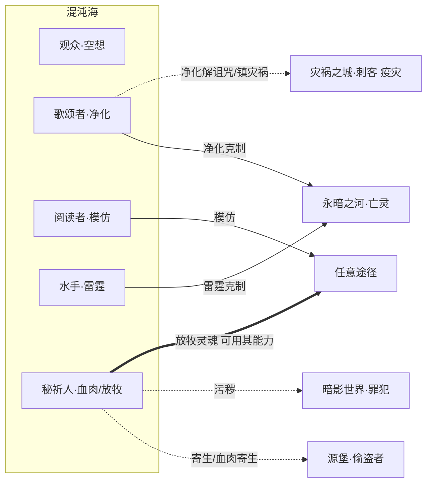

# 混沌海系技能设定（观众 · 歌颂者 · 阅读者 · 水手 · 秘祈人）

> **依据**：《诡秘之主职业路径与能力对照表（修订版 v2）》\
>     **分组（v2 已确认）**：混沌海系 = **观众(空想家) / 歌颂者(太阳) / 阅读者(白塔) / 水手(暴君) / 秘祈人(倒吊人)** 五条途径，同属源质「混沌海」，旧日=上帝/全知全能者，核心象征：**全知全能**。v2 已将五途径补全为**互为相邻**（各 4 个）。
>
> **v2 修订对本次设定的影响**：
>
>
> - 秘祈人由源堡移入本系（原稿误归源堡）。它与源堡偷盗者的「寄生/血肉寄生」因此变成跨源质联动（见 §9.2）。
>
>
> - 战士由本系移出至永暗之河。本系失去「战斗/守护」维度，主题更纯粹地收敛为全知全能（心灵/神圣/知识/自然/堕落五大面向）。
>
> 机制 DSL 沿用总设计稿（`挂载 / 若[ ] / 位移 / 伤害 / 全体敌人`），落地复用现有 `StatusDef`。「隐秘值」维度定义见《源堡系技能设定》§2.2。

---

## 0. 现状与改造动因
本系与源堡系同源问题（详见《技能机制性分析报告》）：4 个「构筑轴」是内容标签而非机制钩子；「跨途径共享」多为同一张卡复刻。

本系额外有两个特征值得注意：

- 秘祈人是「空降」途径：v2 才从源堡移入，其卡牌此前按源堡系设计，需要重新对齐到本系的联动语境。

- 本系天然带跨系主题：歌颂者的「净化」克制死灵/污秽（↔永暗之河、暗影世界），水手的「雷霆」克制亡灵（↔永暗之河），秘祈人的「放牧」可驱使灵魂使用其他途径能力（天然跨系）。这三条是本系最好的联动切入点。

---

## 1. 设计原则

| # | 原则 | 说明 |
| --- | --- | --- |
| P1 | **轴=钩子，不是标签** | 每轴必须有 `enabler（挂载身份状态）→ payoff（读该状态放大）`，状态名即轴身份。 |
| P2 | **状态跨途径可读** | 内核 `StatusDef` 已是全局目录，本系要主动去读源堡的 `寄生`、永暗之河的 `亡灵`。 |
| P3 | **复刻改 combo** | 「同一张卡塞进两个池」只是错觉联动；改为「友方另一途径挂 X 时，我获得 Y」。 |
| P4 | **属性维度兜底** | 沿用「隐秘值」全局属性（本系秘祈人的阴影/血肉参与累积）。 |
| P5 | **序列 9→0 全覆盖** | 每条途径按 10 个序列铺技能，序列0 为终焉旗舰，承担「收束本轴」职责。 |

---

## 2. 混沌海系核心机制层

### 2.1 共享状态池（`StatusDef` 复用）

| 途径 | 四轴身份状态 |
| --- | --- |
| 观众 spectator | `洞察` / `情绪` / `梦境` / **`空想`** |
| 歌颂者 chanter | `祝福` / **`净化`** / `契约` / `秩序` |
| 阅读者 reader | `知识` / **`模仿`** / `预言` / `规律` |
| 水手 sailor | `海洋` / `风暴` / **`雷霆`** / `愤怒` |
| 秘祈人 supplicant | `阴影` / **`血肉`** / `放牧` / `污秽` |

### 2.2 组内与跨源质共享状态

| 状态 | 共享范围 | 性质 |
| --- | --- | --- |
| `寄生 / 血肉寄生` | 秘祈人（本系）↔ 偷盗者（源堡） | **跨源质联动（见 §9.2）** |
| `亡灵 / 死灵` | 歌颂者净化、水手雷霆**克制**；收尸人（永暗之河）承载 | 跨系克制关系 |
| `污秽` | 秘祈人 ↔ 罪犯（暗影世界） | 跨系主题同源 |
| `放牧灵魂` | 秘祈人（可驱使灵魂用其能力） | **天然跨系**：放牧对象决定可用能力 |

---

## 3. 观众途径（序列0：空想家）
**定位**：心灵世界的主宰，观察、读心、操纵潜意识，最终把想象具现为现实。\
  **相邻**：歌颂者、阅读者、水手、秘祈人

### 3.1 四构筑轴

| 轴 | 身份状态 | enabler | payoff | 旗舰卡 |
| --- | --- | --- | --- | --- |
| ① **观察** | `洞察` | 观察/读心 → 给目标挂 `洞察` | 若\[洞察\] 心理暗示生效 / 先手 | 读心者 |
| ② **情绪** | `情绪` | 震慑/狂乱/安抚 → 挂 `情绪` | 若\[情绪\] 精神伤害 / 安抚友方 | 心理医生 |
| ③ **梦境** | `梦境` | 引导/修改/梦境穿梭 → 挂 `梦境` | 若\[梦境\] 拉入梦境 / 日积月累改写 | 织梦人 |
| ④ **空想** ★核心 | `空想` | 操纵/书写 → 累积 `空想` | 若\[空想≥N\] 想象具现 / 篡改潜意识驱使目标 | **空想家** |

### 3.2 序列 → 技能映射

| 序列 | 名称 | 原著能力 | 卡牌机制 | 轴 |
| --- | --- | --- | --- | --- |
| 9 | 观众 | 从表情举止窥见真实想法、间接影响 | `挂载 洞察→目标；获得其意图信息` | 观察 |
| 8 | 读心者 | 观察深入气场/以太体，准确掌握人心 | `若[洞察] 读心：揭示目标手牌/意图` | 观察 |
| 7 | 心理医生 | 震慑（惊慌混乱）、狂乱（引爆情绪）、心理暗示、安抚 | `挂载 情绪→敌（震慑/狂乱）或→友（安抚）` | 情绪 |
| 6 | 催眠师 | 心理暗示质变（改意识/潜意识）、战斗催眠、心理学隐身、龙鳞减伤 | `若[洞察] 战斗催眠：直接改其意识；龙鳞减伤` | 观察/情绪 |
| 5 | 梦境行者 | 引导（说出秘密）、修改（改梦影响）、梦境穿梭 | `挂载 梦境→目标；梦境间跳跃闪现` | 梦境 |
| 4 | **操纵师** | 操纵集体潜意识、虚拟人格、龙化、心智剥夺、心灵风暴、精神瘟疫 | `若[洞察] 操纵：篡改潜意识驱使目标；虚拟人格13抗心灵` | 空想(旗舰) |
| 3 | 织梦人 | 编织梦境拉入、身份分离、瘟疫风暴 | `若[梦境] 编织梦境将目标拉入；心智剥夺+精神瘟疫` | 梦境 |
| 2 | 洞察者 | 心理暗示达权柄、洞察权柄（洞悉漏洞恐惧因果）、梦境迷宫、巨龙 | `若[洞察] 洞察：洞悉其恐惧与过去因果；化为真正巨龙` | 观察 |
| 1 | 作家 | 空想权柄、书写成真、凡有言必被知 | `书写成真：写下的效果变为现实；知道我者我亦知他` | 空想 |
| 0 | **空想家** | 空想/心灵/洞察权柄，可分离序列1特性保持位格 | `旗舰：所想象物品必具现、所宣称未来必上演；心灵世界之主` | 终焉 |

**核心 combo 链**：观众/读心者(洞察) → 心理医生(情绪) → 梦境行者(梦境) → 操纵师(操纵潜意识) → 作家(书写成真) → 空想家(想象具现)。

---

## 4. 歌颂者途径（序列0：太阳）
**定位**：光与秩序的化身，团队增益与净化专家，死灵与污秽的天敌。\
  **相邻**：观众、阅读者、水手、秘祈人

### 4.1 四构筑轴

| 轴 | 身份状态 | enabler | payoff | 旗舰卡 |
| --- | --- | --- | --- | --- |
| ① **祝福** | `祝福` | 歌声/祈光 → 给友方挂 `祝福` | 若\[祝福\] 勇气/力量/灵性恢复/免疫恐惧 | 歌颂者 |
| ② **净化** ★核心 | `净化` | 日照/净化之斩 → 挂 `净化` | 若\[净化\] 对死灵/污秽/黑暗目标伤害倍增、驱散负面 | **无暗者** |
| ③ **契约** | `契约` | 公证/神圣誓约 → 挂 `契约` | 若\[契约\] 增强经公证者、削弱违背者 | 公证人 |
| ④ **秩序** | `秩序` | 正义准则 → 建立 `秩序` 领域 | 若\[秩序\] 符合准则者增强、违背者削弱 | 正义导师 |

### 4.2 序列 → 技能映射

| 序列 | 名称 | 原著能力 | 卡牌机制 | 轴 |
| --- | --- | --- | --- | --- |
| 9 | 歌颂者 | 歌声带来勇气力量虔诚服从、消除恐惧、灵性恢复 | `挂载 祝福→友方；消除恐惧 + 灵性恢复` | 祝福 |
| 8 | 祈光人 | 太阳领域法术克制死尸鬼魂、白昼10米光照、祝福、日照 | `若[祝福] 日照：对不死生物伤害；白昼（驱散黑暗）` | 净化 |
| 7 | 太阳神官 | 召唤圣光、圣水、光明之火、净化之斩、免疫恐惧、神圣誓约、太阳光环 | `挂载 契约（神圣誓约）；净化之斩；免疫恐惧` | 契约/净化 |
| 6 | **公证人** | 公证：对能力真实性公证（有效增强/无效削弱）、擅制契约 | `若[契约] 公证：经公证的友方技能增强、敌方削弱` | 契约(旗舰) |
| 5 | 光之祭司 | 神圣之光（光柱蒸发）、净化光环、污秽死灵克星 | `若[净化] 神圣之光：范围高伤；净化光环` | 净化 |
| 4 | **无暗者** | 净化（堕落/污秽/黑暗/疾病）、无暗之域/之枪、纯白射线、阳炎、神圣盔甲 | `若[净化] 净化一切负面状态；神圣盔甲；无暗之域` | 净化(旗舰) |
| 3 | 正义导师 | 形成正义准则、契约与秩序权柄、正义光环10公里、正义审判 | `建立 秩序 领域：符合者增强/违背者削弱；正义审判` | 秩序 |
| 2 | 逐光者 | 太阳与光权柄、化光飞行、化光承受伤害后重组、太阳使者 | `若[净化] 化光：受击后重组；化身微缩太阳净化` | 净化 |
| 1 | 纯白天使 | 神圣与秩序权柄、神圣之国、纯白之光（毁灭即净化）、信仰之仆 | `若[秩序] 神圣之国（领域）；信仰之仆：免疫伤害` | 秩序/神圣 |
| 0 | **太阳** | 神圣/光/秩序权柄，光极难被彻底摧毁 | `旗舰：一切不谐皆受净化；光之化身（极难摧毁）` | 终焉 |

**核心 combo 链**：歌颂者(祝福) → 祈光人(日照) → 太阳神官(契约) → 公证人(公证增强) → 光之祭司/无暗者(净化爆发) → 正义导师(秩序领域) → 太阳(不谐皆净化)。

---

## 5. 阅读者途径（序列0：白塔）
**定位**：全知的学者，解析并模仿敌人能力，以规律与智慧取胜。\
  **相邻**：观众、歌颂者、水手、秘祈人

### 5.1 四构筑轴

| 轴 | 身份状态 | enabler | payoff | 旗舰卡 |
| --- | --- | --- | --- | --- |
| ① **知识** | `知识` | 阅读/推理 → 累积 `知识` | 若\[知识≥N\] 解析还原事件、推理加成 | 守知者 |
| ② **模仿** ★核心 | `模仿` | 解析对手能力 → 存入 `模仿` 槽 | 若\[模仿槽含X\] 以递增百分比释放 X（20%→100%） | **全知之眼** |
| ③ **预言** | `预言` | 预言 → 挂 `预言` | 看到未来最可能的几种可能，先手/规避 | 预言家 |
| ④ **规律** | `规律` | 洞悉 → 挂 `规律` | 敌人弱点暴露无遗；可撬动规律解决 | 洞悉者 |

### 5.2 序列 → 技能映射

| 序列 | 名称 | 原著能力 | 卡牌机制 | 轴 |
| --- | --- | --- | --- | --- |
| 9 | 阅读者 | 记忆力理解力提升、仪式魔法、知识储备 | `累积 知识 +1；仪式魔法基础` | 知识 |
| 8 | 推理学员 | 观察力逻辑提升、仪式魔法专家 | `若[知识] 推理：揭示敌方意图；仪式魔法强化` | 知识 |
| 7 | 守知者 | 知识推理、武器/格斗精通、解析还原区域事件 | `若[知识≥2] 解析还原：重现该区域发生过的事件` | 知识 |
| 6 | 博学者 | 解析对手能力辨识缺陷、模仿 20%-50%、无次数限制 | `解析 → 存入 模仿槽；以 20-50% 释放` | 模仿 |
| 5 | 秘术导师 | 罕见秘术、自创法术、省略施法、模仿 60% | `若[模仿] 释放效果提升至 60%；省略施法材料` | 模仿 |
| 4 | 预言家 | 预言（未来几种可能）、星界秘术、模仿 80% | `挂载 预言→自身；模仿效果 80%` | 预言/模仿 |
| 3 | 洞悉者 | 规律权柄、洞悉世界规则、敌人弱点暴露 | `挂载 规律→敌：弱点暴露无遗（易伤）；撬动规律` | 规律 |
| 2 | 智天使 | 智慧权柄、提前看清局势做最正确选择、模仿 90% | `若[预言] 先手 + 最优解；模仿效果 90%` | 预言/模仿 |
| 1 | **全知之眼** | 全知权柄（过去现在未来）、模仿 100%、星界导师 | `若[模仿] 以 100% 释放（不含权柄）；触及星界修改目标行为` | 模仿(旗舰) |
| 0 | **白塔** | 全知/创造/星界阶梯/智慧权柄，可模仿任何能力 | `旗舰：对万事万物全知，可模仿任何非权柄能力` | 终焉 |

**核心 combo 链**：阅读者(知识累积) → 博学者(解析入模仿槽) → 秘术导师/预言家(提升模仿率) → 洞悉者(规律/易伤) → 智天使(先手最优) → 全知之眼(100% 模仿) → 白塔(全知全仿)。

---

## 6. 水手途径（序列0：暴君）
**定位**：风暴与雷霆的主宰，以愤怒驱动力量，范围打击与亡灵克星。\
  **相邻**：观众、歌颂者、阅读者、秘祈人

### 6.1 四构筑轴

| 轴 | 身份状态 | enabler | payoff | 旗舰卡 |
| --- | --- | --- | --- | --- |
| ① **海洋** | `海洋` | 海洋眷顾 / 水幕 → 挂 `海洋` | 水中全方位提升、永不迷路、深潜 | 航海家 |
| ② **风暴** | `风暴` | 风之掌控 → 挂 `风暴` | 龙卷/海啸/风刃军团（大范围打击） | 灾难主祭 |
| ③ **雷霆** ★核心 | `雷霆` | 闪电掌控 → 挂 `雷霆` | 麻痹敌人、**克制亡灵**、破坏信息结构 | **雷神** |
| ④ **愤怒** | `愤怒` | 愤怒爆发 → 累积 `愤怒` | 若\[愤怒≥N\] 力量速度暴涨、暴怒一击、威慑恐惧 | 暴怒之民 |

### 6.2 序列 → 技能映射

| 序列 | 名称 | 原著能力 | 卡牌机制 | 轴 |
| --- | --- | --- | --- | --- |
| 9 | 水手 | 卓越力量、水中灵活、平衡+幻鳞（难以抓握） | `挂载 海洋→自身；幻鳞：难以被抓握` | 海洋 |
| 8 | 暴怒之民 | 愤怒爆发（力量速度极大提升）、暴怒一击 | `累积 愤怒 +1；若[愤怒≥2] 暴怒一击` | 愤怒 |
| 7 | 航海家 | 天文地理直觉（永不迷路）、海洋眷顾（海上全方位提升） | `若[海洋] 海上全方位提升；永不迷路` | 海洋 |
| 6 | 风眷者 | 风之掌控（狂风/飓风/风刃）、加速滑翔、深潜百米 | `挂载 风暴→敌；风刃；跑速翻倍+滑翔` | 风暴 |
| 5 | 海洋歌者 | 闪电掌控（麻痹、克亡灵）、歌唱（干扰灵体）、水幕、风之束缚 | `挂载 雷霆→敌：麻痹 + 对亡灵伤害倍增` | 雷霆 |
| 4 | **灾难主祭** | 龙卷风/海啸/暴风雪/暴雨/洪水、风刃军团、连环闪电、真正飞行、披甲 | `若[风暴≥3] 范围灾害（全体敌人）；风刃军团；披甲` | 风暴(旗舰) |
| 3 | 海王 | 领域主宰、闪电风暴、大海之怒、毁灭水滴、音爆 | `若[海洋+雷霆] 闪电风暴（数百米范围）；音爆` | 雷霆/海洋 |
| 2 | 天灾 | 风暴化身、恐惧之音（上百公里恐惧服从）、天灾降临、愤怒之源、电磁紊乱 | `若[愤怒+风暴] 天灾降临；恐惧之音：范围恐惧` | 愤怒/风暴 |
| 1 | **雷神** | 天罚（瓦解/净化/摧毁）、光之化身、风暴地狱、闪电海洋、雷霆之舞（信息克星） | `若[雷霆] 天罚：附带瓦解+净化；雷霆之舞（克信息化）` | 雷霆(旗舰) |
| 0 | **暴君** | 雷霆/暴君/水/物质权柄，掌控电磁 | `旗舰：掌控电磁摧毁信息结构；万王之王（威慑/愤怒/恐惧）` | 终焉 |

**核心 combo 链**：水手(海洋) → 暴怒之民(愤怒累积) → 风眷者(风暴) → 海洋歌者(雷霆克亡灵) → 灾难主祭(范围灾害) → 海王/天灾 → 雷神(天罚) → 暴君(电磁/物质)。

---

## 7. 秘祈人途径（序列0：倒吊人）
**定位**：阴影与血肉的堕落者，以放牧灵魂组合他途径能力，承担罪恶与牺牲。\
  **相邻**：观众、歌颂者、阅读者、水手（v2：本系内互为相邻；与源堡偷盗者为跨源质主题联动）

### 7.1 四构筑轴

| 轴 | 身份状态 | enabler | payoff | 旗舰卡 |
| --- | --- | --- | --- | --- |
| ① **阴影** | `阴影` | 藏入阴影 / 召唤阴影 → 挂 `阴影` | 若\[阴影\] 束缚/压扁/腐蚀；阴影塑形 | 隐修士 |
| ② **血肉** ★核心 | `血肉` | 血肉魔法（液化寄生）→ 挂 `血肉` | 若\[血肉\] 治疗/仆役/血肉不灭 | **蔷薇主教** |
| ③ **放牧** ★跨系 | `放牧` | 放牧：吞噬灵魂入 `放牧` 槽 | 若\[放牧槽\] 驱使该灵魂，使用其途径能力（数量随序列升） | 牧羊人 |
| ④ **污秽** | `污秽` | 秽语 / 堕落 → 累积 `污秽` | 若\[污秽≥N\] 言灵诅咒、诱使堕落 | 秽语长老 |

### 7.2 序列 → 技能映射

| 序列 | 名称 | 原著能力 | 卡牌机制 | 轴 |
| --- | --- | --- | --- | --- |
| 9 | 秘祈人 | 灵感极高察觉神秘存在、祭祀知识与少量仪式魔法 | `灵感：察觉隐秘目标；仪式魔法基础` | 阴影 |
| 8 | 倾听者 | 倾听：直接听到隐秘存在耳语获得强大但扭曲能力 | `倾听：获得强力但附带扭曲代价的临时能力` | 污秽 |
| 7 | 隐修士 | 藏入阴影、召唤阴影、阴影诅咒、操纵阴影、阴影塑形 | `挂载 阴影→敌/自身；召唤阴影生物；阴影塑形为武器` | 阴影 |
| 6 | **蔷薇主教** | 血肉魔法专家（深层掌控细胞）、血肉披风、液化寄生、血肉炸弹、血肉诅咒、血肉仆役 | `挂载 血肉→目标；血肉仆役；液化寄生（规避侦查）` | 血肉(旗舰) |
| 5 | 牧羊人 | 放牧（核心）：吞噬灵魂驱使用其三种能力，最高7个、一次一个；掌控阴影 | `挂载 放牧槽：存储灵魂，可释放其途径能力（1个/次）` | 放牧 |
| 4 | 黑骑士 | 黑甲小巨人（盔甲吸收攻击）、灵肉之刃（腐蚀血肉泯灭灵魂斩破屏障）、堕落之影、统御阴影、放牧9个可外放 | `若[阴影] 灵肉之刃：无视屏障+泯灭灵魂；放牧外放（全能力）` | 阴影/放牧 |
| 3 | 三首圣堂 | 三首各带1/3躯体、同时驱使3灵魂、放牧13、阴影替身术、血肉不灭 | `若[血肉] 血肉不灭（剩一细胞即可重塑）；同时驱使3灵魂` | 血肉/放牧 |
| 2 | 秽语长老 | 秽语（利用回答制造言灵、直接诅咒）、诱使堕落、放牧18 | `若[污秽] 秽语：截取敌方回答制造言灵（囚禁/堕落分裂）` | 污秽 |
| 1 | 暗天使 | 黑暗权柄（黑暗海洋吞噬攻击）、秽语进阶、阴影统治者、堕落眷属（22灵魂外放） | `若[阴影] 黑暗海洋吞噬攻击；22灵魂全部外放为眷属` | 阴影/放牧 |
| 0 | **倒吊人** | 阴影之主、暗、堕落自性、污秽化身、异变、替罪 | `旗舰：阴影世界主宰；替罪（代友方承受伤害/死亡）；异变造怪` | 终焉 |

**核心 combo 链**：秘祈人(灵感) → 隐修士(阴影) → 蔷薇主教(血肉仆役) → 牧羊人(放牧他途径灵魂) → 黑骑士(灵肉之刃) → 三首圣堂(血肉不灭) → 秽语长老(言灵) → 倒吊人(替罪/异变)。

> **放牧轴的独特价值**：放牧槽可存储**其他途径的灵魂并使用其能力**，这使秘祈人天然成为跨系联动的「万能适配位」——放牧一个源堡系灵魂即可临时使用提线/寄生，放牧永暗之河灵魂即可使用亡灵。这是全 22 途径中最强的跨系桥梁，值得在卡池里重点设计「放牧目标决定能力」的 branching。

---

## 8. 组内联动矩阵（5×5）

| 提供方 ↓ \\ 受益方 → | 观众(空想) | 歌颂者(净化) | 阅读者(模仿) | 水手(雷霆) | 秘祈人(血肉) |
| --- | --- | --- | --- | --- | --- |
| **观众** | — | 洞察揭示目标恐惧→供正义审判 | 洞察提供解析样本 | 洞察预知→先手开风暴 | 操纵潜意识配合诱使堕落 |
| **歌颂者** | 祝福稳定其心志抗疯狂 | — | 公证增强其模仿能力 | 祝福+净化附着雷霆 | 净化抵消其污秽代价 |
| **阅读者** | 解析还原供其操纵参考 | 预言提前预警供其布阵 | — | 规律暴露弱点→雷霆命中 | 解析辨识其放牧灵魂 |
| **水手** | 恐惧之音配合心灵打击 | 雷霆麻痹后交其净化 | 雷霆提供模仿样本 | — | 风暴压制→便于阴影束缚 |
| **秘祈人** | 阴影遮蔽供其隐蔽施法 | 替罪为其承担致命伤 | 放牧灵魂供其解析模仿 | 血肉仆役吸收雷霆伤害 | — |

> 五途径互为相邻，任意两条都能咬合；**秘祈人（替罪/放牧）与水手（雷霆）是本系的攻防两端**。

---

## 9. 跨组联动

### 9.1 混沌海 ↔ 永暗之河 / 暗影世界 —— 净化·雷霆 克制 死灵·污秽

| 跨组卡 | 归属 | 机制 |
| --- | --- | --- |
| **净化光环·改** | 歌颂者 | `若[目标带 亡灵/污秽] → 净化伤害翻倍，并驱散其一个增益` |
| **雷击·亡灵克星** | 水手 | `若[目标带 亡灵] → 雷霆附加麻痹且伤害 +100%` |
| **污秽共鸣** | 秘祈人 / 罪犯 | `若[友方 罪犯 已挂 污秽] → 秘祈人的秽语诅咒强度 +1 级` |

### 9.2 混沌海 ↔ 源堡 —— 寄生 / 血肉寄生（秘祈人 ⇄ 偷盗者）

> v2 把秘祈人移入本系后，它与偷盗者的「寄生」主题成为**两个不同源质之间的共享**，天然跨组。

| 跨组卡 | 归属 | 机制 |
| --- | --- | --- |
| **蔷薇主教·改** | 秘祈人旗舰 | `若[友方 偷盗者 已挂 寄生] → 血肉寄生直接接管其寄生目标，二者共享控制` |
| **寄生者·改** | 偷盗者旗舰（对方视角） | `若[友方 秘祈人 已挂 血肉寄生] → 寄生升级为血肉共生（目标死亡后化为仆役）` |

### 9.3 秘祈人「放牧」—— 全途径万能跨系桥梁
`放牧` 槽可存储任意途径的灵魂并释放其能力，因此秘祈人的跨系联动**不依赖预设配对**，而是由玩家放牧目标动态决定：

- 放牧源堡系灵魂 → 临时使用 `提线木偶` / `寄生`

- 放牧永暗之河灵魂 → 临时使用 `亡灵` / `夜幕`

- 放牧本系灵魂 → 临时使用 `雷霆` / `模仿`

### 9.4 混沌海 ↔ 灾祸之城 —— 「净化」解「诅咒 / 灾祸」（歌颂者 ⇄ 刺客/猎人）
对应灾祸之城系 §6.6。刺客的「疫灾(命运诅咒)」与猎人的「征服」正是歌颂者「净化 / 祝福」的克性对象（见 §9.1）。

| 跨组卡 | 归属 | 机制 |
| --- | --- | --- |
| **净化·解诅咒** | 歌颂者 | `若[友方 刺客 已挂 疫灾(命运诅咒)] → 净化直接驱散其诅咒，并反哺祝福层数` |
| **祝福·镇灾祸** | 歌颂者 | `若[友方 猎人 已挂 征服] → 祝福抵消征服的臣服效果，并将其转为「协同增益」` |

---

## 10. 落地清单（不动内核）

1. 复用 `StatusDef`：`洞察/情绪/梦境/空想/祝福/净化/契约/秩序/知识/模仿/预言/规律/海洋/风暴/雷霆/愤怒/阴影/血肉/放牧/污秽` 走全局状态目录。

1. 秘祈人卡牌重新对齐：v2 前按源堡系设计，需把「寄生」相关 combo 的视角从「组内」改为「跨源质（↔源堡偷盗者）」。

1. 重点开发「放牧」branching：放牧目标决定可用能力，这是全 22 途径最强的跨系桥梁，建议做成动态能力槽而非固定卡。

1. 净化/雷霆的克制关系外显：卡面标注「克制：亡灵/污秽」，并在编组界面提示与永暗之河/暗影世界的对位关系。

---

### 一句话总结
混沌海系五条途径（观众/歌颂者/阅读者/水手/秘祈人）各以 4 个钩子轴覆盖序列 9→0，组内五途径互为相邻形成密网；v2 后本系失去战士、空降秘祈人，主题收敛为纯粹「全知全能」，并凭 **净化/雷霆克制死灵**（↔永暗之河）、**寄生**（↔源堡偷盗者）、**放牧灵魂**（←任意途径）三条线成为跨系联动最活跃的一系。
