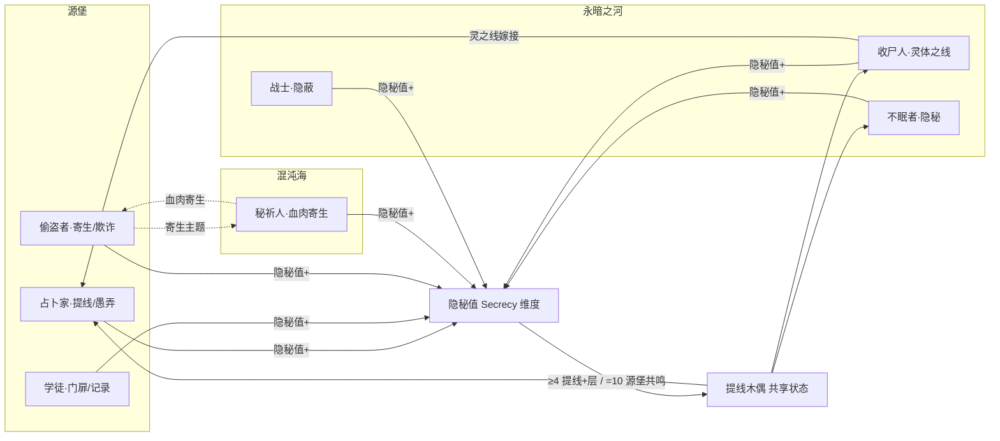

# 源堡系技能设定（占卜家 · 学徒 · 偷盗者）

> **依据**：《诡秘之主职业路径与能力对照表（修订版 v2）》\
>     **分组（v2 已确认）**：源堡系 = **占卜家(愚者) / 学徒(门) / 偷盗者(错误)** 三条途径，同属源质「源堡」，旧日=诡秘之主，核心象征：**隐秘、变化、门、时空**。三条途径互为相邻，原著中可互相晋升。
>
> **v2 修订对本次设定的影响**：
>
>
> - 秘祈人 → 混沌海系（原稿误归源堡）。故「寄生」线由组内 combo 变为 跨源质联动（源堡↔混沌海），见 §7.2。
>
>
> - 战士 → 永暗之河系（原稿误归混沌海）。这让收尸人/不眠者/战士整组聚齐，正好成为「提线木偶/灵体之线/隐秘」的天然承接组，跨组联动反而更干净，见 §7.1。
>
> 机制 DSL 沿用总设计稿（`挂载 / 若[ ] / 位移 / 伤害 / 全体敌人`），落地复用现有 `StatusDef`。

---

## 0. 现状速写与改造动因
从技能总览扫描结果看，源堡系 3 途径当前问题是全局问题的缩影：

| 途径 | 卡数 | 跨途径共享卡 | 真实形态 | 自堆叠引擎 |
| --- | --- | --- | --- | --- |
| 占卜家 fool | 423 | ~100（多为复刻） | 同一张卡塞进 thief/apprentice/reader… | 隐秘/提线（有但弱） |
| 学徒 apprentice | 213 | 大量复刻到 thief/lawyer/hunter… | 复刻为主 | 门/记录（有但弱） |
| 偷盗者 thief | 70 | 卓越观察/窃取→fool | 复刻为主 | 寄生（唯一成型） |

**根因**：4 个「构筑轴」只是内容标签（如「🜁开门」「🜂戏法」），不是机制钩子；所谓「跨途径共享」是**同一张卡在两个池子复刻**，玩家只觉得「这张我也有」，零配合。

这正是本设定要把「轴=标签」改成「轴=钩子」、把「复刻」改成「combo」的原因。

---

## 1. 设计原则

| # | 原则 | 说明 |
| --- | --- | --- |
| P1 | **轴=钩子，不是标签** | 每轴必须有 `enabler（挂载身份状态）→ payoff（读该状态放大）`，状态名即轴身份。 |
| P2 | **状态跨途径可读** | 内核 `StatusDef` 已是全局目录，A 途径挂的状态 B 途径零成本可读——联动的地基建好了，要主动用。 |
| P3 | **复刻改 combo** | 「同一张卡塞进两个池」只是错觉联动；改为「友方另一途径挂 X 时，我获得 Y」。 |
| P4 | **属性维度兜底** | 新增战场级「隐秘值」全局属性，让跨源质的隐秘类效果在同一维度上互相放大。 |
| P5 | **序列 9→0 全覆盖** | 每条途径按 10 个序列铺技能，序列0 为终焉旗舰，承担「收束本轴」职责。 |

---

## 2. 源堡系核心机制层

### 2.1 共享状态池（`StatusDef` 复用）

| 途径 | 四轴身份状态 |
| --- | --- |
| 占卜家 fool | `预兆` / `拟态` / **`提线木偶`** / `愚弄值` |
| 学徒 apprentice | `门扉`(坐标) / `戏法标记` / `记录槽` / `星界锚` |
| 偷盗者 thief | `赃物` / `误判` / **`寄生`** / `时差` |

> 其中 `提线木偶` 与 `寄生` 是**跨源质共享状态**（见 §7），是本设定的两条联动命脉。

### 2.2 「隐秘值」全局属性维度（P4 落地）
战场级属性，0–10 级，独立于力/敏/智/灵/体/魅，属「神秘属性」层。

**累积来源**：隐秘型挂载每张 +1，来源包括——

- 源堡：占卜家愚弄/观诡、学徒星界/门、偷盗者欺诈/寄生

- 永暗之河：不眠者隐秘、收尸人灵之线、战士隐蔽

- 暗影世界：囚犯诅咒之源、罪犯污秽

- 混沌海：秘祈人阴影/血肉

**层级效果**：

| 隐秘值 | 效果 |
| --- | --- |
| ≥ 4 | 所有 `提线木偶` 每回合 +1 层 |
| ≥ 7 | 友方「愚弄/隐秘/conceal」类技能 **+50%** |
| = 10 | **「源堡共鸣」**：本回合所有带 `提线木偶` 的目标可被任意友方（含跨源质）操控一次 |

---

## 3. 占卜家途径（序列0：愚者）
**定位**：隐秘与变化的大师，以灵体之线操控秘偶作战，缺乏直接输出但拥有最强的信息权与操控权。\
  **相邻**：学徒、偷盗者 ｜ **源质**：源堡

### 3.1 四构筑轴

| 轴 | 身份状态 | enabler | payoff | 旗舰卡 |
| --- | --- | --- | --- | --- |
| ① **观诡** | `预兆` | 灵视/占星术/卡牌占卜 → 给目标挂 `预兆` | 若\[预兆≥3\] 获得命运干扰 + 先手 | 占卜家·启 |
| ② **变形** | `拟态` | 变形/制造幻觉/伤害转移 → 自身挂 `拟态` | 若\[拟态\] 复制敌方上一个技能 / 替身承伤 | 无面人 |
| ③ **提线** ★核心 | `提线木偶` | 秘偶 → 对敌挂 `提线木偶` | 若\[提线木偶\] 远端操控其行动、与其调位、替死 | **诡法师** |
| ④ **命运/愚弄** | `愚弄值`(=隐秘值) | 愚弄/命运干扰/愿望 → +1 隐秘值 | 若\[隐秘值≥7\] 弄假成真（判定制胜） | 愚者·权柄 |

### 3.2 序列 → 技能映射

| 序列 | 名称 | 原著能力 | 卡牌机制 | 轴 |
| --- | --- | --- | --- | --- |
| 9 | 占卜家 | 占星术、卡牌占卜、灵摆、灵视 | `挂载 预兆(3t)→目标；每有1个带预兆目标，占卜类 +1 先手` | 观诡 |
| 8 | 小丑 | 协调性、预感下一步、飞牌 | `若[预兆≥2] 预感：下次受击转为闪避 / 飞牌 伤害(物理)` | 观诡 |
| 7 | 魔术师 | 伤害转移、火焰跳跃、空气弹、纸人替身、幻觉 | `挂载 拟态→自身；伤害转移→替身纸人；制造幻觉` | 变形 |
| 6 | 无面人 | 变形、极强观察记忆 | `拟态升级：若[拟态] 复制目标外貌并复刻其上一个技能` | 变形 |
| 5 | 秘偶大师 | 见并操纵灵体之线、克隐身 | `挂载 提线木偶(2t)→敌；揭示 hidden/conceal 目标` | 提线 |
| 4 | **诡法师** | 动物变形、秘偶全能力、1km调位、秘偶活则不死 | `若[提线木偶] 远端操控其行动；1km内与其调位；若有秘偶存活则免疫死亡` | 提线(旗舰) |
| 3 | 古代学者 | 借取过去的力量、召唤历史影像 | `若[友方学徒 记录槽非空] 借取其影像协同攻击` | 历史/协同 |
| 2 | 奇迹师 | 复活4次、干扰命运、愿望即现实 | `若[隐秘值≥7] 愿望：下次判定制胜 / 复活(4次上限)` | 命运 |
| 1 | 诡秘侍者 | 再生灵体之线、诡秘之境、重组 | `提线再生；诡秘之境（领域·隐秘）；重组：重排目标状态定义` | 提线/隐秘 |
| 0 | **愚者** | 愚弄权柄、重组/嫁接、灵界掌控、奇迹、历史、变形、命运锚点 | `旗舰：弄假成真 + 灵界掌控（全场提线） +2 隐秘值` | 终焉 |

**核心 combo 链**：观诡(挂预兆) → 小丑预感闪避 → 提线(秘偶接管) → 诡法师调位/不死 → 愚者弄假成真。

---

## 4. 学徒途径（序列0：门）
**定位**：空间与星界的主宰，以「门」调度战场机动，记录并再现敌方手段。\
  **相邻**：占卜家、偷盗者 ｜ **源质**：源堡

### 4.1 四构筑轴

| 轴 | 身份状态 | enabler | payoff | 旗舰卡 |
| --- | --- | --- | --- | --- |
| ① **门扉** ★核心 | `门扉`(坐标) | 开门 → 标记 `门扉` 坐标 | 若\[有门扉\] 位移/闪现/传送零耗 | **旅行家之门** |
| ② **戏法** | `戏法标记` | 闪光/造雾/冰冻/摔倒术 → 自身挂 `戏法标记` | 若\[戏法标记\] 行动条 +20 / 控场 | 戏法大师 |
| ③ **记录** | `记录槽` | 记录 → 存储目标技能入 `记录槽` | 若\[记录槽非空\] 重现/再现该技能 | 再现·改 |
| ④ **星界** | `星界锚` | 占星术/星相学 → 挂 `星界锚` | 若\[星界锚\] 远程摄物/空间隐藏/放逐 | 漫游者 |

### 4.2 序列 → 技能映射

| 序列 | 名称 | 原著能力 | 卡牌机制 | 轴 |
| --- | --- | --- | --- | --- |
| 9 | 学徒 | 开门穿墙、仪式魔法 | `位移·param→自身 + 伤害(物理)→全体敌人；并标记 门扉(坐标)` | 门扉 |
| 8 | 戏法大师 | 闪光、黑幕、造雾、冰冻、电击、摔倒术、驱物、逃脱 | `挂载 戏法标记→自身；驱物/逃脱戏法` | 戏法 |
| 7 | 占星人 | 危险预感、干扰占卜、占星术 | `挂载 星界锚→敌；干扰敌方占卜类`（反占卜） | 星界 |
| 6 | 记录官 | 记录并存储目标能力（7-9记20个/5-6记8个减半） | `存储 目标最近技能 → 记录槽` | 记录 |
| 5 | **旅行家** | 旅行家之门、闪现、无形之手 | `若[有门扉] 灵界穿梭传送 / 闪现连击 / 远处摄物` | 门扉(旗舰) |
| 4 | 秘法师 | 守秘、空间隐藏、幻化、放逐 | `空间隐藏（自身 conceal）；若[星界锚] 放逐→时空乱流` | 星界/空间 |
| 3 | 漫游者 | 遨游星界、开门破屏障、融入/撕裂空间 | `若[有门扉] 突破屏障；撕裂空间 → 范围伤害` | 门扉/星界 |
| 2 | 旅法师 | 自我符号、维度之视、再现 | `若[记录槽含X] 以80%释放X；维度之视缩小收纳目标` | 记录 |
| 1 | 星之匙 | 定位、时空迷宫、封印、空间破碎 | `自身永不迷失/敌无法定位；时空迷宫（混乱）；封印目标` | 星界/封印 |
| 0 | **门** | 门之概念、空间权柄、封印、无处不在、概念化 | `旗舰：空间牢笼 + 瞬间至任意门扉 + 概念化（闪现极致）` | 终焉 |

**核心 combo 链**：开门(挂门扉) → 旅行家之门传送/闪现 → 记录官记录 → 旅法师再现 → 门·空间牢笼。\
  **跨职协同**：`记录槽` 可被占卜家的古代学者读取（借历史影像），也可被偷盗者的伪装用作样本。

---

## 5. 偷盗者途径（序列0：错误）
**定位**：窃取与欺诈的行家，以「寄生」接管敌人，玩弄规则漏洞与分身本体关系。\
  **相邻**：占卜家、学徒 ｜ **源质**：源堡

### 5.1 四构筑轴

| 轴 | 身份状态 | enabler | payoff | 旗舰卡 |
| --- | --- | --- | --- | --- |
| ① **窃物** | `赃物` | 窃取/卓越观察 → 累积 `赃物` | 若\[赃物≥3\] 窃取其一项能力/属性 | 盗火人 |
| ② **欺诈** | `误判` | 思维误导/精神干扰/骗取 → 敌挂 `误判` | 若\[误判\] 以假代真（伪装/欺诈规则生效） | 欺瞒导师 |
| ③ **寄生** ★核心 | `寄生` | 寄生 → 对敌挂 `寄生` | 若\[寄生\] 接管身体 + 窃取概念(位置/距离) | **寄生者** |
| ④ **时间** | `时差` | 嫁接命运/衰老/分身替换 → +1 `时差` | 若\[时差≥2\] 分身替换/重启 | 时之虫 |

### 5.2 序列 → 技能映射

| 序列 | 名称 | 原著能力 | 卡牌机制 | 轴 |
| --- | --- | --- | --- | --- |
| 9 | 偷盗者 | 窃取物品、敏捷之手、卓越观察 | `累积 赃物 +1；感应目标持有物` | 窃物 |
| 8 | 诈骗师 | 观察微表情、魅力口才、思维误导、精神干扰 | `挂载 误判→敌；话术/迷惑` | 欺诈 |
| 7 | 解密学者 | 神秘学、灵性直觉、解析梦境找出方位 | `解析幻象 → 揭示 hidden 目标方位` | 欺诈/解析 |
| 6 | 盗火人 | 窃取他人能力（50m/10min）、隔空偷取塞入 | `若[赃物≥3] 短暂窃取目标一项能力` | 窃物 |
| 5 | 窃梦家 | 拿走理想/梦境/记忆、80m、伪装盗天机 | `拿走目标记忆/想法→呆滞；伪装成其阵营` | 窃物/欺诈 |
| 4 | **寄生者** | 寄生：隐藏恢复→全面接管、窃取位置距离、精准窃取能力三选一 | `挂载 寄生(2t)→敌；若[寄生] 接管其身体 / 窃取其位置距离` | 寄生(旗舰) |
| 3 | 欺瞒导师 | 欺瞒（甚至欺诈自然规则）、窃取三能力 | `若[误判] 欺诈规则（本次判定/结算逻辑被替换）` | 欺诈 |
| 2 | 命运木马 | 篡改命运、嫁接命运、窃取身份 | `嫁接命运：与目标互换短期状态；+1 时差` | 时间/命运 |
| 1 | 时之虫 | 窃取时间/锚/权柄、衰老、分身替换 | `若[时差≥2] 分身替换（本体死亡时分身窃取一切变本体）` | 时间 |
| 0 | **错误** | 欺诈/窃取/时间/部分空间、错误、混淆分身本体 | `旗舰：以假代真窃取权柄；混淆分身本体（打错目标；分身逃脱即本体逃脱）` | 终焉 |

**核心 combo 链**：窃取(累积赃物) → 盗火人窃取能力 → 寄生(接管) → 欺瞒导师欺诈规则 → 时之虫分身替换 → 错误以假代真。

---

## 6. 组内联动矩阵（3×3：谁给谁当 enabler）

| 提供方 ↓ \\ 受益方 → | 占卜家(提线/愚弄) | 学徒(门扉/记录) | 偷盗者(寄生/欺诈) |
| --- | --- | --- | --- |
| **占卜家** | — | 愚弄赋能「再现」释放 | 提线顺接已「寄生」目标（无缝接管） |
| **学徒** | 门扉坐标供「提线」调位/位移 | — | 记录槽供「伪装/欺诈」样本 |
| **偷盗者** | 寄生目标交「提线」远端操控 | 窃取距离供「门扉」瞬移落点 | — |

> 三条途径两两互为 enabler/payoff，组内形成闭环而非各自平铺。

---

## 7. 跨组联动（共享状态 + 隐秘值维度）
跨组联动的地基：内核 `StatusDef` 全局共享 + 新设「隐秘值」维度。两条实线：

### 7.1 源堡 ↔ 永暗之河（不眠者 / 收尸人 / 战士）—— 提线木偶 · 灵体之线 · 隐秘

> **v2 修订让这条线更成立**：战士由混沌海移入永暗之河，与不眠者、收尸人聚齐，三者共同构成「死亡/黑暗/灵体」承接组，恰好是 `提线木偶 / 灵体之线 / 隐秘` 的天然宿主。

**共享状态**：`提线木偶` 跨 占卜家、收尸人、不眠者、囚犯 四方共用；`隐秘/conceal` 由不眠者与战士共用，并与占卜家的隐秘主题同源。

| 跨组卡 | 归属 | 机制 |
| --- | --- | --- |
| **秘偶大师·改** | 占卜家旗舰 | `若[友方 收尸人 已对目标挂 提线木偶] → 升级为 完全秘偶（可被占卜家远端操控，且继承死灵特性）` |
| **灵之线嫁接** | 收尸人 | `你的 提线木偶 目标若也带占卜家的隐秘标记 → 其死亡时召唤灵体为我方秘偶，+1 隐秘值` |
| **隐秘共鸣** | 不眠者/战士 | `若[隐秘值≥4] 你的隐秘类技能额外 +1 层且不消耗行动` |

**维度触发**：隐秘值 ≥4 所有提线木偶 +1 层；=10 触发「源堡共鸣」——带提线木偶目标本回合可被任意友方（含收尸人/不眠者/战士）操控一次。

### 7.2 源堡 ↔ 混沌海（秘祈人）—— 寄生 · 血肉寄生

> **v2 修订让这条线升级**：秘祈人归入混沌海后，它与偷盗者的「寄生」主题是**两个不同源质之间**的共享，天然就是跨组联动，比原先的组内 combo 更硬核。

**共享状态**：`寄生`（偷盗者·寄生者 序列4）↔ 秘祈人的血肉寄生/蔷薇主教（可藏入宿主体内）。

| 跨组卡 | 归属 | 机制 |
| --- | --- | --- |
| **寄生者·改** | 偷盗者旗舰 | `若[寄生] 接管目标；若[友方 秘祈人 已挂 血肉寄生] → 升级为血肉共生（目标死亡后化为我方仆役）` |
| **蔷薇主教·改** | 秘祈人旗舰 | `若[友方 偷盗者 已挂 寄生] → 血肉寄生直接接管其寄生目标，二者共享控制` |

---

## 8. 改前 / 改后 对照（关键卡）

| 卡 | 改前（现状） | 改后（钩子化） |
| --- | --- | --- |
| **开门** | `位移·param →自身 → 伤害 2(物理) →全体敌人`（纯位移+伤害，轴标签而已） | `位移+伤害；并标记 门扉(坐标)` —— 成为「门扉轴」enabler，喂给学徒闪现/偷盗者窃取距离 |
| **秘偶** | 占卜家池一张复刻卡，收尸人池也有同名卡（零配合） | 占卜家旗舰「秘偶大师·改」：读取友方收尸人的 `提线木偶` 升级为完全秘偶（**跨组 combo**） |
| **寄生** | 偷盗者单挂状态，无后续 | `寄生` enabler + 旗舰「寄生者·改」：与秘祈人 `血肉寄生` 跨源质融合（**源堡↔混沌海**） |

---

## 9. 落地清单（不动内核）

1. 复用 `StatusDef`：`预兆/拟态/提线木偶/愚弄值/门扉/戏法标记/记录槽/星界锚/赃物/误判/寄生/时差` 全部走现有全局状态目录。

1. 新增 1 个全局 attr：`board.secrecy`（0–10），按 §2.2 累积并在结算阶段跑层级效果。

1. 复刻卡改 combo 卡：把现存的源堡复刻卡（约 100 张）字段从「复刻到 X 池」改为「当友方 X 的 Y 状态存在时我获得 Z」。

1. 表达层外显：卡面标「本轴联动」；编组界面显示「轴完成度解锁」；跨组卡标「跨组联动：友方收尸人的提线木偶 / 友方秘祈人的血肉寄生」；HUD 显示隐秘值进度条与「源堡共鸣」提示。

---

### 一句话总结
源堡系三条途径（占卜家/学徒/偷盗者）各以 4 个钩子化构筑轴覆盖序列 9→0，组内互为 enabler/payoff 闭环；再通过 `提线木偶`（↔永暗之河）与 `寄生`（↔混沌海秘祈人）两条共享状态实线，挂到统一的\*\*「隐秘值」属性维度\*\*上——v2 修订让承接组（收尸人/不眠者/战士）与寄生搭档（秘祈人）各自归位，跨组联动比修订前更清晰。
