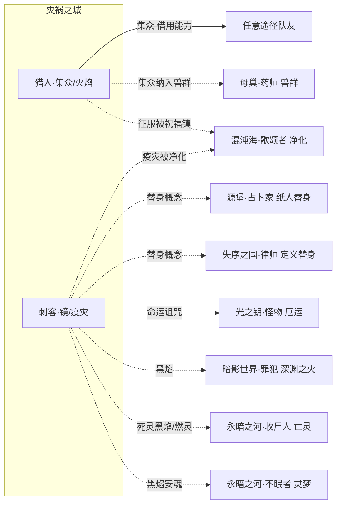

# 灾祸之城系技能设定（猎人 · 刺客）

> **依据**：《诡秘之主职业路径与能力对照表（修订版 v2）》\
>     **分组**：灾祸之城系 = **猎人(红祭司) / 刺客(魔女)** 两条途径，同属源质「灾祸之城」，旧日=毁灭天灾，核心象征：**战争、灾难、火焰、混沌**。两途径互为相邻。
>
> 机制 DSL 沿用总设计稿（`挂载 / 若[ ] / 位移 / 伤害 / 全体敌人`），落地复用现有 `StatusDef`。「隐秘值」维度定义见《源堡系技能设定》§2.2。
>
> v2 未改动本系分组与相邻关系，本次为首次按「轴=钩子」原则重构。

---

## 0. 现状与改造动因
本系与全局同源问题（详见《技能机制性分析报告》）：4 个「构筑轴」是内容标签而非机制钩子；「跨途径共享」多为同一张卡复刻（猎人的「力量爆发于一击/鹰的视力/阴影躲藏/激化矛盾/魅惑/说服/冰霜/灾难/命运诅咒」大量复刻到刺客池，反之亦然）。

本系的特殊性：**两条途径主题差异极大**（猎人=战争/火焰/征服的阳刚团队流，刺客=魅惑/镜中世界/疾病的阴柔诡谲流），组内咬合天然弱于同主题源质（如永暗之河三途径）。因此本系更需要**明确的互补定位**，而不是强行做组内 combo。

---

## 1. 设计原则

| # | 原则 | 说明 |
| --- | --- | --- |
| P1 | **轴=钩子，不是标签** | 每轴必须有 `enabler（挂载身份状态）→ payoff（读该状态放大）`，状态名即轴身份。 |
| P2 | **状态跨途径可读** | 内核 `StatusDef` 已是全局目录，本系要主动去读源堡的 `替身`、光之钥的 `命运`。 |
| P3 | **复刻改 combo** | 猎人/刺客间大量复刻卡（冰霜、魅惑、灾难等）应改为「友方另一途径触发 X 时我获得 Y」。 |
| P4 | **属性维度兜底** | 沿用「隐秘值」全局属性（刺客的阴影躲藏/隐形参与累积）。 |
| P5 | **序列 9→0 全覆盖** | 每条途径按 10 个序列铺技能，序列0 为终焉旗舰，承担「收束本轴」职责。 |

---

## 2. 灾祸之城系核心机制层

### 2.1 共享状态池（`StatusDef` 复用）

| 途径 | 四轴身份状态 |
| --- | --- |
| 猎人 hunter | `火焰` / `挑衅` / **`集众`** / `征服` |
| 刺客 assassin | `魅惑` / **`镜`** / `黑焰` / `疫灾` |

### 2.2 组内与跨源质共享状态

| 状态 | 共享范围 | 性质 |
| --- | --- | --- |
| `替身` | 刺客（镜子替身法）↔ 占卜家（纸人替身）↔ 律师（定义替身/本体） | **跨源质概念联动（见 §6.2）** |
| `命运` | 刺客（命运诅咒）↔ 怪物（命运之轮） | 跨源质主题同源（见 §6.3） |
| `火焰` | 猎人（火焰操控）↔ 罪犯（深渊之火） | 跨系变体 |
| `冰霜` | 刺客 ↔ 猎人（复刻卡） | 组内复刻 → 建议改 combo |

---

## 3. 猎人途径（序列0：红祭司）
**定位**：战争与火焰的化身，以集众汇聚全队力量、以挑衅与收割精准猎杀，最终征服万物。\
  **相邻**：刺客

### 3.1 四构筑轴

| 轴 | 身份状态 | enabler | payoff | 旗舰卡 |
| --- | --- | --- | --- | --- |
| ① **火焰** | `火焰` | 凝聚压缩/注火/武器附火 → 挂 `火焰` | 若\[火焰\] 延时爆炸/范围影响/火焰塑形（鞭、马刀） | 纵火家 |
| ② **挑衅** | `挑衅` | 挑衅（洞察敏感点激怒）→ 挂 `挑衅` | 若\[挑衅\] 目标失去理智、弱点侦察命中一击致命 | 收割者 |
| ③ **集众** ★核心 | `集众` | 团队集众：集中全队力量灵性 → 累积 `集众` | 若\[集众≥N\] 共享视野/分摊伤害/使用队友能力 | **铁血骑士 / 战争主教** |
| ④ **征服** | `征服` | 征服权柄 → 对目标挂 `征服` | 若\[征服\] 目标身心臣服（永久效忠）、以偶为兵 | 征服者 |

### 3.2 序列 → 技能映射

| 序列 | 名称 | 原著能力 | 卡牌机制 | 轴 |
| --- | --- | --- | --- | --- |
| 9 | 猎人 | 身体素质全面超越、感官提升、直观找到结构要点 | `弱点侦察基础：揭示目标结构要点（易伤）` | 挑衅 |
| 8 | 挑衅者 | 挑衅（核心）：洞察敏感点激怒对方失去理智 | `挂载 挑衅→敌：目标强制攻击我且判定降低` | 挑衅 |
| 7 | 纵火家 | 火焰操控七技、火鸦术、炽白之枪、燃烧之墙、巨大火球 | `挂载 火焰→敌/武器；延时爆炸、注火` | 火焰 |
| 6 | 阴谋家 | 误导迷惑欺骗、煽动鼓动、火焰精细化（鞭/马刀） | `若[挑衅] 误导/煽动；火焰塑形为武器` | 挑衅/火焰 |
| 5 | 收割者 | 弱点侦察、收割（命中弱点一击致命）、精准 | `若[挑衅] 收割：命中弱点→ 一击致命` | 挑衅 |
| 4 | **铁血骑士** | 火焰化/钢铁化/武器化/远程轰炸、团队集众（集中全队力量灵性、共享视野、分摊伤害）、钢铁勇气 | `挂载 集众：集中全队力量灵性于自身；共享视野；分摊伤害` | 集众(旗舰) |
| 3 | **战争主教** | 3公里内使用团队成员非凡能力、心灵沟通、战争迷雾、战吼、献祭祈求 | `若[集众≥2] 使用队友一项能力；战争迷雾；战吼` | 集众(旗舰) |
| 2 | 天气术士 | 操纵天气（创造极端天气）、全面升级、10公里内使用队友能力、紫色火焰 | `若[集众+火焰] 极端天气（全体）；火焰升为紫色` | 集众/火焰 |
| 1 | 征服者 | 征服权柄（身心臣服永效忠）、以偶为兵（撒豆成兵）、毁灭之矛、集众质变 | `挂载 征服→目标：臣服后永久效忠；以偶为兵（无生命物转士兵）` | 征服 |
| 0 | **红祭司** | 征服/战争/毁灭/祭祀/魅力/男性权柄，存在即让区域发生战争 | `旗舰：征服物品地域甚至概念；战争领域（区域自动开战）` | 终焉 |

**核心 combo 链**：猎人(弱点侦察) → 挑衅者(挑衅) → 纵火家(火焰) → 收割者(致命收割) → 铁血骑士/战争主教(集众汇聚全队) → 征服者(征服/撒豆成兵) → 红祭司(战争领域)。

> **集众轴的设计价值**：`集众` 是本作少见的「团队资源聚合」机制——把全队力量/灵性集中到自身、共享视野、分摊伤害、甚至直接使用队友能力。这让猎人成为**天然的多职业队伍核心**，也是本系与所有其他源质联动的接口（队伍里任意途径的队友都能被集众）。

---

## 4. 刺客途径（序列0：魔女）
**定位**：魅惑与混沌的化身，以镜中世界穿梭替身、以疾病瘟疫与命运诅咒瓦解敌人。\
  **相邻**：猎人

### 4.1 四构筑轴

| 轴 | 身份状态 | enabler | payoff | 旗舰卡 |
| --- | --- | --- | --- | --- |
| ① **魅惑** | `魅惑` | 教唆/魅惑/欢愉 → 挂 `魅惑` | 若\[魅惑\] 目标敌意降低/可被操纵/诱发恶欲 | 教唆者 |
| ② **镜** ★核心 | `镜` | 镜子魔法/镜中穿梭 → 建立 `镜` 位 | 若\[镜\] 伤害转移替身、任意穿梭、镜中人复活 | **不老 / 绝望** |
| ③ **黑焰** | `黑焰` | 操控黑焰/冰霜 → 挂 `黑焰` | 若\[黑焰\] 黑焰弹/驱除诅咒；冰霜护甲 | 女巫 |
| ④ **疫灾** | `疫灾` | 疾病/瘟疫/命运诅咒 → 挂 `疫灾` | 若\[疫灾\] 持续掉血/感染爆发/接连遭遇灾难 | 痛苦 / 灾难 |

### 4.2 序列 → 技能映射

| 序列 | 名称 | 原著能力 | 卡牌机制 | 轴 |
| --- | --- | --- | --- | --- |
| 9 | 刺客 | 羽毛般轻盈、鹰的视力+黑暗视觉、躲藏阴影、力量爆发于一击 | `挂载 镜（隐蔽）→自身；首次攻击必暴击` | 镜 |
| 8 | 教唆者 | 魅惑、误导、说服、诱发心底恶欲激化矛盾 | `挂载 魅惑→敌：敌意降低/可被操纵` | 魅惑 |
| 7 | 女巫 | 男性变女性容貌魅力提升、隐形、操控黑焰、操控冰霜、镜子魔法（替身法） | `挂载 黑焰→敌；镜子替身：伤害转移给替身` | 黑焰/镜 |
| 6 | 欢愉 | 更美、接触使人欢愉、无形蛛丝（缠绕/横移/结茧）、黑焰子弹、冰霜护甲 | `若[魅惑] 欢愉：接触使其行动受阻；冰霜护甲` | 魅惑/黑焰 |
| 5 | 痛苦 | 疾病（病原体加速感染 2-3 分钟猝死）、魅惑主动化、镜像迷宫、操纵头发 | `挂载 疫灾→敌：持续伤害+感染爆发；镜像迷宫` | 疫灾 |
| 4 | **绝望** | 瘟疫（3公里十几种致命）、镜中世界深入（定位5公里镜子任意穿梭/投影传送）、诅咒无法替身转移 | `若[镜] 任意镜子穿梭/投影传送；诅咒不可被替身转移` | 镜(旗舰) |
| 3 | **不老** | 青春永驻、复活于「镜中人」（不止一个）、石化、强制拉人/房屋入镜中世界 | `若[镜] 死亡后于镜中人身上复活；石化（蛇发女妖）` | 镜(旗舰) |
| 2 | 灾难 | 灾难（天灾+人祸）、延伸至权柄概念诱导系统崩解、命运诅咒 | `挂载 疫灾（命运诅咒）→敌：接连遭遇灾难；诱导系统崩解` | 疫灾 |
| 1 | 末日 | 末日权柄（区域矛盾集中爆发、命运纠缠终结）、欢愉权柄、部分疾病权柄 | `若[疫灾] 末日：指定区域矛盾集中爆发` | 疫灾 |
| 0 | **魔女** | 混沌权柄（万物归混沌、融化事物为未发生的可能性）、原初（静止/石化）、镜中世界、魅力、女性、黑魔法、疾病 | `旗舰：万物归于混沌（融化事物为未发生的可能性）；镜中世界主宰` | 终焉 |

**核心 combo 链**：刺客(隐蔽) → 教唆者(魅惑) → 女巫(黑焰/镜替身) → 痛苦(疫灾) → 绝望(镜中穿梭) → 不老(镜中人复活) → 灾难(命运诅咒) → 魔女(混沌归零)。

---

## 5. 组内联动矩阵（2×2）

| 提供方 ↓ \\ 受益方 → | 猎人(集众/火焰/挑衅) | 刺客(镜/魅惑/疫灾) |
| --- | --- | --- |
| **猎人** | — | 集众把刺客的黑焰/疫伤集中放大；挑衅把目标拉出镜中（破其替身） |
| **刺客** | 魅惑使目标易被挑衅/收割；镜位供集众团队投影传送 | — |

> 两条途径定位互补：**猎人负责「聚」（集众汇聚全队 + 正面强攻），刺客负责「散」（镜中穿梭 + 疾病瘟疫持续消耗）**。建议把复刻到对方池的卡改为这种互补 combo，而不是原样复刻。

---

## 6. 跨组联动

### 6.1 猎人「集众」—— 面向全途径的团队接口
`集众` 可汇聚任意途径队友的力量/灵性并直接使用其能力，因此猎人是**全 22 途径最通用的组队核心**：队伍里带了源堡系就能临时用门/提线，带了永暗之河就能用亡灵。

| 跨组卡 | 归属 | 机制 |
| --- | --- | --- |
| **集众·门** | 猎人 | `若[队伍含学徒] → 集众时可借用其 门扉 进行一次全体位移` |
| **集众·亡者** | 猎人 | `若[队伍含收尸人] → 集众时可将其 奴役 的亡灵纳入分摊伤害` |

### 6.2 刺客 ↔ 源堡 / 失序之国 —— 「替身」概念三系联动
`替身` 概念跨三源质：刺客（镜子替身法/镜中人复活）、占卜家（纸人替身/伤害转移）、律师（定义什么是替身/本体，让本体瞬间变替身）。

| 跨组卡 | 归属 | 机制 |
| --- | --- | --- |
| **镜面替身·改** | 刺客 | `若[友方 占卜家 已挂 纸人替身] → 我的镜替身可同时承伤，且替身破碎不消耗` |
| **替身定义** | 律师（对方视角） | `重新定义「替身」与「本体」：可把刺客的镜中人定义成本体，或把占卜家的本体变成替身` |

### 6.3 刺客 ↔ 光之钥 —— 「命运」诅咒同源
刺客序列2「命运诅咒」与怪物（命运之轮）的命运权柄同源。

| 跨组卡 | 归属 | 机制 |
| --- | --- | --- |
| **命运诅咒·改** | 刺客 | `若[友方 怪物 已挂 厄运] → 我的命运诅咒直接借用其厄运层数，无需重新挂载` |
| **福祸之言** | 怪物（对方视角） | 对已被刺客挂 `疫灾(命运诅咒)` 的目标，福祸之言的厄运判定 +1 档 |

### 6.4 猎人「集众」↔ 母巢 —— 「兽群」入池（猎人 ⇄ 药师）
对应母巢系 §6.5。药师召唤的兽群是最现成的可借用单位，纳入猎人的**集众池**后把召唤物变成团队接口——猎人本就是全 22 途径最通用的组队核心，此处只是把"兽群"正式接入。

| 跨组卡 | 归属 | 机制 |
| --- | --- | --- |
| **集众·兽群** | 猎人 | `若[队伍含 药师] → 集众时可将其 兽群 纳入池，借用兽群能力行动` |
| **兽群指挥·改** | 药师（对方视角） | `若[友方 猎人 已开 集众] → 我的兽群自动获得「集众」加成（攻击/灵性 +1 档）` |

### 6.5 刺客「黑焰」↔ 永暗之河 —— 「死灵黑焰 / 燃灵」（刺客 ⇄ 收尸人/不眠者）
刺客的「黑焰」与永暗之河的「亡灵/灵体」同源——黑焰点燃亡灵即成「死灵黑焰 / 燃灵」，是深渊之火与亡者之语的共鸣。复用双方已有状态 `黑焰` 与 `亡灵/奴役`，零新状态。

| 跨组卡 | 归属 | 机制 |
| --- | --- | --- |
| **死灵黑焰** | 刺客 | `若[友方 收尸人 已奴役 亡灵] → 我的黑焰改为「燃灵」：对亡灵/灵体伤害翻倍且无法被不死特性抵消` |
| **黑焰安魂** | 刺客 | `若[友方 不眠者 已挂 灵梦] → 黑焰灼烧其梦境中的灵体，使其永久消散（配合安魂）` |
| **亡灵助燃** | 收尸人（对方视角） | `若[友方 刺客 已挂 黑焰] → 我的亡灵被点燃后化为「燃灵」临时强化，攻击附带灼烧` |

### 6.6 灾祸之城 ↔ 混沌海 —— 「净化」解「诅咒 / 灾祸」（刺客/猎人 ⇄ 歌颂者）
刺客的「疫灾(命运诅咒)」与猎人的「征服」正是负面侵蚀，正对混沌海歌颂者的「净化 / 祝福」克性（见混沌海系 §9.1 / §9.4）。复用双方已有状态，零新状态。

| 跨组卡 | 归属 | 机制 |
| --- | --- | --- |
| **净化·解诅咒** | 歌颂者（对方视角） | `若[友方 刺客 已挂 疫灾(命运诅咒)] → 净化直接驱散其诅咒，并反哺祝福层数` |
| **祝福·镇灾祸** | 歌颂者 | `若[友方 猎人 已挂 征服] → 祝福抵消征服的臣服效果，并将其转为「协同增益」` |

---

## 7. 落地清单（不动内核）

1. 复用 `StatusDef`：`火焰/挑衅/集众/征服/魅惑/镜/黑焰/疫灾` 走全局状态目录。

1. 清理组内复刻卡：猎人↔刺客的冰霜/魅惑/灾难/阴影躲藏等复刻卡，按 §5 的「聚/散」互补改成 combo。

1. 优先实现「集众」动态能力槽：与秘祈人的「放牧」一样，`集众` 是动态借用队友能力的机制，建议做成运行时能力槽而非固定卡。

1. 「替身」概念统一：把刺客镜替身、占卜家纸人替身、律师替身定义统一到同一状态族，让三系能互相读写。

---

### 一句话总结
灾祸之城系两条途径（猎人/刺客）各以 4 个钩子轴覆盖序列 9→0，组内靠「猎人聚、刺客散」互补而非强咬合；真正价值在跨系——**猎人的「集众」是面向全途径的团队接口**，**刺客的「替身」与「命运」分别与源堡/失序之国、光之钥构成三系概念联动**。
