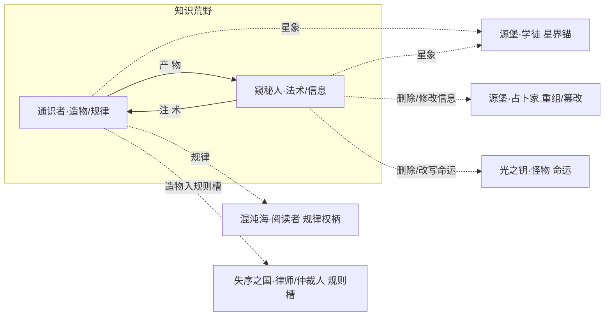

# 知识荒野系技能设定（通识者 · 窥秘人）

> **依据**：《诡秘之主职业路径与能力对照表（修订版 v2）》\
>     **分组**：知识荒野系 = **通识者(完美者) / 窥秘人(隐者)** 两条途径，同属源质「知识荒野」，旧日=知识之妖/疯狂奥秘，核心象征：**知识、学习、制造、解析**。两途径互为相邻。
>
> 机制 DSL 沿用总设计稿（`挂载 / 若[ ] / 位移 / 伤害 / 全体敌人`），落地复用现有 `StatusDef`。「隐秘值」维度定义见《源堡系技能设定》§2.2。
>
> v2 未改动本系分组与相邻关系，本次为首次按「轴=钩子」原则重构。

---

## 0. 现状与改造动因
本系与全局同源问题（详见《技能机制性分析报告》）：4 个「构筑轴」是内容标签而非机制钩子；「跨途径共享」多为同一张卡复刻。

本系的特殊性：**两条途径共享大量「知识/解析/学习」语汇**（通识者的解析、窥秘人的解析；通识者的规律、阅读者的规律），极易做成复刻卡池。改造重点是**给两条途径划清分工**：

- 通识者走「现实知识 → 制造」（把知识变成实物：机械奇物、炼成人偶）。

- 窥秘人走「神秘知识 → 信息」（把知识变成能力与信息操作：法术、卷轴、删除/修改信息）。

这样两条途径虽同言「知识」，产出物完全不同，组内 combo 与跨系联动都能落地。

---

## 1. 设计原则

| # | 原则 | 说明 |
| --- | --- | --- |
| P1 | **轴=钩子，不是标签** | 每轴必须有 `enabler（挂载身份状态）→ payoff（读该状态放大）`，状态名即轴身份。 |
| P2 | **状态跨途径可读** | 内核 `StatusDef` 已是全局目录，本系要主动去读混沌海的 `规律`、源堡的 `星界锚`/`重组`。 |
| P3 | **复刻改 combo** | 两途径的「解析/知识/星象」复刻卡应改为「友方另一途径触发 X 时我获得 Y」。 |
| P4 | **属性维度兜底** | 沿用「隐秘值」全局属性（窥秘人的隐匿/窥秘参与累积）。 |
| P5 | **序列 9→0 全覆盖** | 每条途径按 10 个序列铺技能，序列0 为终焉旗舰，承担「收束本轴」职责。 |

---

## 2. 知识荒野系核心机制层

### 2.1 共享状态池（`StatusDef` 复用）

| 途径 | 四轴身份状态 |
| --- | --- |
| 通识者 savant | `知识` / **`造物`** / `星象` / `规律` |
| 窥秘人 pryer | `窥秘` / **`法术`** / `星象` / `信息` |

### 2.2 组内与跨源质共享状态

| 状态 | 共享范围 | 性质 |
| --- | --- | --- |
| `规律` | 通识者 ↔ 阅读者（混沌海） | **跨源质同源（见 §6.1）** |
| `星象` | 通识者 + 窥秘人（组内）↔ 学徒（源堡，占星人/星界） | **跨源质同源（见 §6.2）** |
| `信息（删除/修改）` | 窥秘人 ↔ 占卜家（源堡，重组/篡改/嫁接） | **跨源质概念操作同源（见 §6.3）** |
| `解析` | 通识者 ↔ 窥秘人 ↔ 阅读者 | 三途径共有 → 建议改 combo |

---

## 3. 通识者途径（序列0：完美者）
**定位**：现实知识与制造的完美者，把知识转化为机械奇物与炼成人偶，以规律改写物理法则。\
  **相邻**：窥秘人

### 3.1 四构筑轴

| 轴 | 身份状态 | enabler | payoff | 旗舰卡 |
| --- | --- | --- | --- | --- |
| ① **知识** | `知识` | 唤醒记忆/鉴定 → 累积 `知识` | 若\[知识≥N\] 快速鉴定物品、直觉把握能力与问题、规避负面 | 鉴定师 |
| ② **造物** ★核心 | `造物` | 制造/炼成 → 产出 `造物` | 机械奇物/临时人偶/器物；可注入灵魂给予生命；负面影响低 | **炼金术士** |
| ③ **星象** | `星象` | 虚假星象/星之祝福 → 挂 `星象` | 伪造星空干扰占星、星光改变重力、星光诅咒（衰弱/变异/创伤） | 天文学家 |
| ④ **规律** | `规律` | 洞悉/规律权柄 → 挂 `规律` | 改变物理规律（如燃烧未必有火焰）、看到天使本质 | 知识导师 |

### 3.2 序列 → 技能映射

| 序列 | 名称 | 原著能力 | 卡牌机制 | 轴 |
| --- | --- | --- | --- | --- |
| 9 | 通识者 | 记忆学习实践非凡化、精通王水硝酸甘油齿轮、唤醒记忆 | `累积 知识 +1；唤醒记忆：回忆全部已见知识` | 知识 |
| 8 | 考古学家 | 历史/野外生存/遗迹禁忌知识、勉强应用仪式魔法、强壮体魄 | `若[知识] 遗迹禁忌知识：揭示封印物背景；体魄强化` | 知识 |
| 7 | 鉴定师 | 快速鉴定神奇物品、直觉把握能力与其问题、规避危险使用 | `若[知识≥2] 鉴定：揭示物品能力与负面，使用时规避负面` | 知识 |
| 6 | 机械专家 | 制造机械奇物和非凡物品、制造大师（负面影响低效果好） | `产出 造物：机械奇物（负面低、效果好）` | 造物 |
| 5 | 天文学家 | 虚假星象（干扰占星）、星之祝福（星光改变重力）、星之诅咒（衰弱/变异/创伤） | `挂载 星象→区域：干扰敌方占卜；星光增益/诅咒` | 星象 |
| 4 | **炼金术士** | 炼成（核心）：就地取材制造临时人偶和器物、注入灵魂给予生命、高序列材料可造对抗天使之物 | `若[造物] 炼成：就地取材造人偶/器物并注入灵魂（给予生命）` | 造物(旗舰) |
| 3 | 奥秘学者 | 汲取（5公里抽取生命力）、解离（光芒破坏物品结构）、环境掌控者、知识妖精（转化为知识进入心智体） | `汲取：抽取范围内生命力；解离：破坏物品结构` | 造物/知识 |
| 2 | 知识导师 | 规律权柄（改变物理规律）、解析权柄增强（看到天使本质）、制造/学习弱化、导师 | `挂载 规律→区域：改变物理规律；解析看穿本质` | 规律 |
| 1 | 启蒙者 | 文明权柄（混沌沉淀秩序/毁灭焕发新生/黑暗迸发光芒）、教化权柄、文明图卷 | `若[造物+规律] 文明图卷：范围秩序化（净化混乱）` | 规律/造物 |
| 0 | **完美者** | 现实知识权柄（掌握并可修改现实全部知识）、文明/教化/规律权柄 | `旗舰：掌握现实世界全部知识并可修改；掌控文明兴衰` | 终焉 |

**核心 combo 链**：通识者(知识累积) → 鉴定师(鉴定) → 机械专家(造物) → 天文学家(星象) → 炼金术士(炼成注入灵魂) → 奥秘学者(汲取/解离) → 知识导师(规律) → 完美者(修改现实知识)。

---

## 4. 窥秘人途径（序列0：隐者）
**定位**：神秘知识与信息的主宰，解析创造法术、以卷轴速发，最终把自身信息化并操作删除/修改。\
  **相邻**：通识者

### 4.1 四构筑轴

| 轴 | 身份状态 | enabler | payoff | 旗舰卡 |
| --- | --- | --- | --- | --- |
| ① **窥秘** | `窥秘` | 窥秘之眼（观察星灵体/以太体/心智体）→ 挂 `窥秘` | 若\[窥秘\] 窥探隐藏秘密/存在/命运、预言最佳选择 | 预言大师 |
| ② **法术** ★核心 | `法术` | 法术解析与创造 → 存入 `法术` 库 | 常见法术（照明/闪电/造风/力场之手）；自创法术 | **巫师 / 神秘学家** |
| ③ **星象** | `星象` | 星之巨柱/星桥/星光囚笼 → 挂 `星象` | 星海穿梭、本我星象、星光囚笼（禁锢） | 星象师 |
| ④ **信息** ★跨系 | `信息` | 信息掌控 → 进入 `信息` 形态 | 灌输知识/知识攻击/同化/虚假信息；删除/修改 | **贤者** |

### 4.2 序列 → 技能映射

| 序列 | 名称 | 原著能力 | 卡牌机制 | 轴 |
| --- | --- | --- | --- | --- |
| 9 | 窥秘人 | 魔法巫术占星全面掌握、窥秘之眼、快速仪式（省仪式物品） | `挂载 窥秘→目标：观察其星灵体/以太体/心智体状态` | 窥秘 |
| 8 | 格斗学者 | 掌握许多流派格斗术、身体素质提升 | `格斗术：近战基础（补足施法者短板）` | 法术 |
| 7 | **巫师** | 法术解析与创造、常见法术（照明/闪电/造风/力场之手）、洒材料实现多种效果 | `产出 法术：解析并创造法术，存入法术库` | 法术(旗舰) |
| 6 | 卷轴教授 | 卷轴制作（念咒后卷轴燃烧释放）、冰冻/麻痹卷轴节约施法时间 | `若[法术库] 卷轴化：预存法术，触发即释放（省施法时间）` | 法术 |
| 5 | 星象师 | 星之巨柱、星海穿梭、星桥、本我星象、星光囚笼 | `挂载 星象→敌：星光囚笼（禁锢）；星海穿梭（位移）` | 星象 |
| 4 | **神秘学家** | 神秘再现（核心）：从神秘学知识汲取力量创造魔法、知识越少人知道法术越强、童话魔法 | `若[法术] 神秘再现：越冷门法术越强；童话魔法（幻觉/变形/强攻）` | 法术(旗舰) |
| 3 | 预言大师 | 窥秘权柄（窥探隐藏秘密/知识/存在/命运）、预言（预见后果/最佳选择/末日） | `若[窥秘] 预言：揭示最佳选择与后果；窥探命运秘密` | 窥秘 |
| 2 | **贤者** | 神秘知识权柄、粗浅删除/修改权柄、信息掌控（自身信息化成信息流）、灌输知识/知识攻击/同化/虚假信息 | `进入 信息 形态：可删除/修改目标状态；知识攻击；同化` | 信息(旗舰) |
| 1 | 知识皇帝 | 神秘知识权柄深化（将力量赋予知识获得其他序列能力）、影响七光、伪造信息沿灵体之线传播、教化+窥秘 | `若[信息] 伪造信息沿灵体之线传播；借知识获得他序列能力` | 信息/窥秘 |
| 0 | **隐者** | 知识（信息）权柄、赋予数字象征力量（0=混沌，1=造物主）、隐匿、窥秘、备份/复制/删除/修改 | `旗舰：信息权柄（备份/复制/删除/修改）；数字象征赋予力量` | 终焉 |

**核心 combo 链**：窥秘人(窥秘) → 巫师(法术库) → 卷轴教授(卷轴速发) → 星象师(星光囚笼) → 神秘学家(神秘再现冷门法术) → 预言大师(预言) → 贤者(信息删除/修改) → 隐者(备份/复制/删除/修改)。

---

## 5. 组内联动矩阵（2×2）

| 提供方 ↓ \\ 受益方 → | 通识者(造物/规律) | 窥秘人(法术/信息) |
| --- | --- | --- |
| **通识者** | — | 造物（人偶/器物）供其注入法术；规律改变物理法则放大法术效果 |
| **窥秘人** | 窥秘揭示目标本质→供其鉴定/解离；信息操作为其造物写入「灵魂」 | — |

> 分工明确：**通识者产「物」（硬件），窥秘人产「术与信息」（软件）**。建议把两池的「解析」复刻卡改成这种「硬件+软件」的咬合 combo。

---

## 6. 跨组联动

### 6.1 知识荒野 ↔ 混沌海 —— 「规律」同源（通识者 ⇄ 阅读者）
两条途径都掌握 `规律` 权柄，可互相叠加。

| 跨组卡 | 归属 | 机制 |
| --- | --- | --- |
| **规律共振** | 通识者 | `若[友方 阅读者 已挂 规律] → 双方规律效果叠加：物理法则改动范围翻倍` |
| **洞悉·规律** | 阅读者（对方视角） | 对已被通识者挂 `规律` 的目标，洞悉的弱点暴露效果 +1 级 |

### 6.2 知识荒野 ↔ 源堡 —— 「星象」同源（通识者/窥秘人 ⇄ 学徒）
通识者「虚假星象」、窥秘人「星象师」与学徒「占星人/星界锚」共享星象主题。

| 跨组卡 | 归属 | 机制 |
| --- | --- | --- |
| **虚假星象·改** | 通识者 | `若[友方 学徒 已挂 星界锚] → 虚假星象直接干扰该锚定目标，使其占卜全部失效` |
| **星光囚笼·改** | 窥秘人 | `若[目标带 学徒 的 星界锚] → 星光囚笼无需命中判定，直接禁锢` |

### 6.3 知识荒野 ↔ 源堡 —— 「信息修改」与「重组篡改」同源（窥秘人 ⇄ 占卜家）
窥秘人的「删除/修改信息」与占卜家的「重组/篡改/嫁接定义」是同一类**概念层操作**。

| 跨组卡 | 归属 | 机制 |
| --- | --- | --- |
| **篡改·信息** | 窥秘人 | `若[友方 占卜家 已对目标发动 重组] → 我的「修改」可直接改写其重组结果` |
| **重组·数据** | 占卜家（对方视角） | `若[友方 窥秘人 已进入 信息 形态] → 重组可作用于「目标的定义与规则」而不仅是实体` |

### 6.4 知识荒野 ↔ 失序之国 —— 「造物」入「规则槽」（通识者 ⇄ 仲裁人/律师）
通识者的「造物」产出实体物件，是最该被**规则槽 Rules\[3\]** 约束的对象——造出来的物一旦"违规"，正好落在仲裁人的审判范围内。借的是失序之国刚立起来的战场级共享棋盘，零新状态。

| 跨组卡 | 归属 | 机制 |
| --- | --- | --- |
| **违规造物·审判** | 仲裁人 | `若[友方 通识者 已造 造物 且 违反 规则槽] → 对该造物发动审判：直接「销毁」并反噬制造者` |
| **造物豁免** | 律师（对方视角） | `若[友方 通识者 的 造物 已挂 规则槽] → 我可为该造物争取「豁免」，使其免受仲裁人审判` |

### 6.5 知识荒野 ↔ 光之钥 —— 「信息删除」改写「命运」（窥秘人 ⇄ 怪物）
窥秘人的「删除/修改信息」直接作用于怪物预知到的未来命运——原著级设定（窥秘人能抹除信息痕迹），也是「命运总线」上唯一能反向编辑命运的节点。

| 跨组卡 | 归属 | 机制 |
| --- | --- | --- |
| **命运删除** | 窥秘人 | `若[友方 怪物 已挂 命运/预知] → 我可删除该预知结果，使敌人对其未来一无所知` |
| **篡改未来·改** | 窥秘人 | `若[友方 怪物 命运值 ≥ +5] → 直接改写其预知的"有利结局"为对我方有利` |

---

## 7. 落地清单（不动内核）

1. 复用 `StatusDef`：`知识/造物/星象/规律/窥秘/法术/信息` 走全局状态目录。

1. 划清「物/术」分工：把两池同名的「解析」类复刻卡，改为通识者产造物、窥秘人产法术的咬合 combo（§5）。

1. 统一 `星象` 与 `规律` 状态：这两条是跨源质共享状态，需保证通识者/窥秘人/学徒/阅读者读写的是同一状态名。

1. 「信息」形态做成独立机制：窥秘人序列2 的「自身信息化」建议做成一个 morph 状态（免疫物理、可被删除/修改），与占卜家的「重组」形成概念层联动。

---

### 一句话总结
知识荒野系两条途径（通识者/窥秘人）各以 4 个钩子轴覆盖序列 9→0，组内按「通识者产硬件（造物/规律）、窥秘人产软件（法术/信息）」分工咬合；跨系靠 `规律`（↔混沌海阅读者）、`星象`（↔源堡学徒）、`信息删除/修改`（↔源堡占卜家重组篡改）三条同源状态接入全局联动网。
